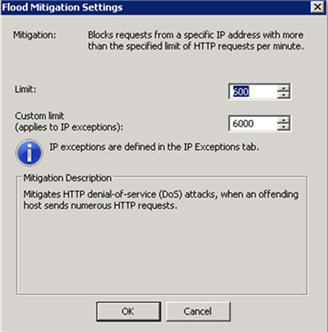

# Mailbox Move to the cloud fail with error when you move mailboxes to Microsoft 365

## Problem

In a hybrid deployment of Microsoft Exchange Online in Microsoft 365 and on-premises Microsoft Exchange Server, you receive the following error message when you move mailboxes from your on-premises environment to Microsoft 365:

> Mailbox Move to the cloud fail with error: Transient error CommunicationErrorTransientException has occurred. The system will retry

## Cause

This issue may occur if the on-premises Microsoft Forefront Threat Management Gateway (TMG) server blocks HTTP requests from servers in the Microsoft 365 environment. This occurs because of the flood mitigation feature in the Forefront TMG. This mechanism helps lessen flood attacks.

To confirm that this is the issue that you are experiencing, examine the alerts that are displayed in the Forefront TMG management console. To do this, follow these steps:

1. Open the Forefront TMG Management console.
2. In the tree, click **Monitoring**, and then click the **Alerts** tab.
3. Check whether a warning that contains the following text is displayed:

   > The number of HTTP requests per minute from the source IP address IPAddress exceeded the configured limit. Forefront TMG will block new HTTP requests sent from this IP address.

   If such a warning is displayed, you are experiencing this issue.

## Solution

To resolve this issue, configure flood mitigation settings in Forefront TMG to increase the custom limit for the maximum number of HTTP requests per minute. To do this, follow these steps:

1. Open the Forefront TMG management console, and then, in the tree, click **Intrusion Prevention System**.
2. Click the **Behavioral Intrusion Detection** tab, and then click **Configure Flood Mitigation Settings**.

   :::image type="content" source="media/mailbox-move-to-cloud-fail-with-error/configure-flood-mitigation-settings.png" alt-text="Screenshot of the Behavioral Intrusion Detection tab, highlighted Configure Flood Mitigation Settings.":::

3. In the **Flood Mitigation** dialog box, follow these steps:
   1. Click the **IP Exceptions** tab, and then type the IP addresses that the Microsoft 365 environment uses to connect during the mailbox move operation. To view a list of the IP address ranges and URLs that are used by Exchange Online in Microsoft 365, see [Microsoft 365 URLs and IP address ranges](/microsoft-365/enterprise/urls-and-ip-address-ranges).
   2. Click the **Flood Mitigation** tab, and then, next to **Maximum HTTP Requests per minute per IP address**, click **Edit**. In the **Custom limit** box, type a number to increase the limit.

      > [!NOTE]
      > The custom limit applies to IP addresses that are listed on the **IP Exceptions** tab. Increase only the custom limit. In the following example screen shot, the custom limit is set to 6,000. Depending on the number of mailboxes that are being moved, this number may not be sufficient. If you still receive the error message, increase the custom limit.

      
   3. Click **OK**.

## More information

For more information about this issue, visit the following Microsoft 365 Community website:

[https://go.microsoft.com/fwlink/?linkid=2003907](https://go.microsoft.com/fwlink/?linkid=2003907)

For more information about flood mitigation in the Forefront TMG, see [Overview of flood mitigation](/previous-versions/tn-archive/cc995196(v=technet.10)).

Still need help? Go to [Microsoft Community](https://answers.microsoft.com/) or the [Exchange TechNet Forums](/answers/topics/office-exchange-server-itpro.html).
