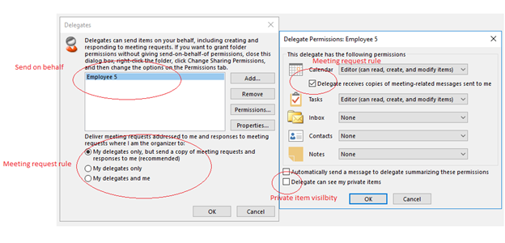

# Overview of delegation in an Office 365 hybrid environment

## Symptoms

Microsoft Exchange Online customers have problems in the functionality of their Full Access, Send As, Send on Behalf of, and Folder permissions.

## Cause

For Office 365 hybrid delegation to work as expected, multiple requirements must be met.

## Resolution

Office 365 hybrid delegation requires a specific configuration in the cloud and in the on-premises Active Directory Domain Services (AD DS) environment. The following list discusses the different permissions and how they work in a hybrid deployment.

This article describes the necessary configuration, administration details, and known issues that are associated with different kinds of permissions. If you need help from Microsoft to investigate a specific issue, collect the following diagnostic data from a user who can reproduce the behavior:

- Detailed description of the issue, including the users who are affected and the error message that they receive
- Relevant screenshots or [Problem Steps Recorder](https://support.microsoft.com/help/3035258) output
- A configuration report from [Microsoft SaRa Support and Recovery Tool](/outlook/troubleshoot/performance/how-to-scan-outlook-by-using-microsoft-support-and-recovery-assistant)
- [Outlook troubleshooting logs](https://support.office.com/article/what-is-the-enable-logging-troubleshooting-option-0fdc446d-d1d4-42c7-bd73-74ffd4034af5)

### Full Access

- Full Access permissions provide access to all mailbox contents.
- Full Access permissions are granted by administrators only by using Exchange Admin Center or Remote PowerShell ([Add-MailboxPermission](/powershell/module/exchange/add-mailboxpermission)).
- Full Access permissions will work cross forest together with the Outlook client for Windows.
- Autodiscover is used to find the mailbox even when it's in another forest (by using the target address redirect).
- The following differences apply, depending on how a user tries to access an additional mailbox:

  - Adding as an additional mailbox requires a mailbox in another forest to be ACLable in the user's forest. For more information, see [Configure Exchange to support delegated mailbox permissions in a hybrid deployment](/exchange/hybrid-deployment/set-up-delegated-mailbox-permissions).
  - Auto-mapping will not work until all mailboxes are moved to Exchange Online. For more information, see [Auto-mapping doesn't work as expected in an Office 365 hybrid environment](https://support.microsoft.com/help/3080561).
  - In some scenarios, a user will see only free/busy information for a calendar to which they have additional permissions. For more information, see [Can't view cross-forest calendar data in Office 365 hybrid environment](../calendars/cannot-view-cross-forest-calendar-data.md).
  - The user cannot send on behalf of another user after they add a mailbox as an additional account. For more information, see [Can't send an email message when Full Access permission is granted to a shared mailbox in Exchange Server](../../ExchangeServer/mailflow/cannot-send-email-with-full-access.md).

- Resource mailboxes have special capabilities and work differently in some scenarios if they're in another forest, as follows:

  - Resource mailboxes cannot be added as additional mailboxes. For more information, see [Can't add a Room or Resource mailbox in an Office 365 hybrid environment](../user-and-shared-mailboxes/cannot-add-room-or-resource-mailbox.md).
  - Customers cannot grant permissions to a resource mailbox. For more information, see [Can't add permissions to a room mailbox in another forest in an Office 365 hybrid environment](../user-and-shared-mailboxes/cannot-add-permissions-to-user-or-room-mailbox-in-another-forest.md).

- Newly provisioned cloud mailboxes cannot access on-premises mailboxes. For more information, see [Can't add an on-premises mailbox as an additional mailbox in Exchange Online](https://support.microsoft.com/help/4051496).
- A new remote mailbox that's created directly in Exchange Online is not ACLable in on-premises Active Directory. For more information, see [A remote mailbox created in on-premises AD DS is not ACLable in Exchange Online](https://support.microsoft.com/help/4051497).
- Customers cannot access a hidden mailbox in Exchange Online. For more information, see [Can't access a hidden mailbox in Outlook after a migration to Office 365 hybrid environment](https://support.microsoft.com/help/4034273).

### Send As

- Send as works in many scenarios, but is not fully supported by Microsoft as outlined in [Permissions in Exchange hybrid deployments](/Exchange/permissions).
- Send As permissions enable mail to be sent from another mailbox that enabled the mail user object's primary email address.
- Permissions are granted by administrators by using the Exchange Admin Center or Remote PowerShell ([Add-ADPermission](/powershell/module/exchange/add-adpermission) in on-premises Active Directory and [Add-RecipientPermission](/powershell/module/exchange/add-recipientpermission) in Exchange Online).
- Permissions must exist in the sending user's forest. For example, if a user's mailbox is moved to Exchange Online, the Send As permissions must be listed on the mail user object that represents the on-premises mailbox.
- Permissions are not synchronized by Azure AD Connect.
- Permissions set in on-premises AD DS must be manually added in the Exchange Online for full functionality. For more information, see [Exchange hybrid deployment considerations](/exchange/exchange-hybrid#exchange-hybrid-deployment-considerations).

### Folder access

- Folders can be accessed cross forest in many scenarios, but they are not fully supported by Microsoft as outlined in [Permissions in Exchange hybrid deployments](/Exchange/permissions).
- Autodiscover is used to find the mailbox even if it's in another forest (by using the target address redirect).
- Folder access can be granted by users by using Outlook or by administrators by using the Remote PowerShell cmdlet [Add-MailboxFolderPermission](/powershell/module/exchange/add-mailboxfolderpermission). The following conditions apply:

  - The Calendar folder works differently in Outlook than other folders do. For more information, see [Can't view cross-forest calendar data in Office 365 hybrid environment](../calendars/cannot-view-cross-forest-calendar-data.md).
  - Private items are viewable only if the user is configured correctly as a delegate. For more information, see [Delegates are not listed correctly in Outlook after a migration to Office 365 hybrid environment](./delegates-not-listed-correctly-in-outlook-after-migration.md).
  - The user cannot view the calendar of a hidden mailbox in Exchange Online. For more information, see [Can't access a hidden mailbox in Outlook after a migration to Office 365 hybrid environment](../user-and-shared-mailboxes/cannot-access-hidden-mailbox-in-outlook-after-migration.md).

### Send on Behalf of

- Send on Behalf of permissions enable mail to be sent on behalf of another email address
- Permissions can be granted by users by using Outlook or by administrators by using Exchange Admin Center or Remote PowerShell ([Set-Mailbox](/powershell/module/exchange/set-mailbox) cmdlet).
- Permissions must exist in the sending user's forest.
- By default, the `PublicDelegates` attribute (also known as the `GrantSendOnBehalfTo` attribute in Exchange on-premises) is synchronized to Exchange Online by Azure AD Connect.
- Additional configuration is required to synchronize the `PublicDelegates` attribute with on-premises AD DS. This configuration requires enabling Exchange hybrid deployment settings in Azure AD Connect.For more information, see [Exchange hybrid writeback](/azure/active-directory/hybrid/reference-connect-sync-attributes-synchronized#exchange-hybrid-writeback).

  

- If Exchange hybrid deployment setting is not enabled, the Send on Behalf of permission has to be added manually by an administrator by using Remote PowerShell. To do this, refer to[Delegate can't send on behalf of after migration to Microsoft 365 hybrid environment](./delegate-cannot-send-on-behalf-of-after-migration.md).

### Delegates

- Delegates can be granted combination of different rights in Outlook:

  - Folder rights
  - Sending on behalf of
  - Meeting request forwarding rules (hidden rules)
  - The ability to see private items (calendar)
    

- Some of these rights can be seen and managed by an administrator (such as Folder and Send on Behalf of rights). However, some are stored only in the Exchange mailbox (such as meeting-related messages, forwarding rules, and private item visibility).
- Basic functionality works cross-forest by using Outlook for Windows. The following conditions apply:

  - Users can access other user folders (Folder rights and Full Access).
  - Users can send on behalf of a user from another forest.
  - Rules to forward meeting invitations will be delivered successfully.
  - New delegates can be added if users exist in different forests.

- In the Scheduling Assistant, no details or limited free/busy information is listed for mailboxes in another forest. The following conditions apply:

  - [Users can't see free/busy information after a mailbox is moved to Office 365](../../ExchangeOnline/move-or-migrate-mailboxes/cannot-see-free-busy-information.md)
  - [Users can see only basic free/busy mailbox information in a remote forest in Office 365](https://support.microsoft.com/en-US/help/3079932)

- Some functionality does not work in Outlook Web App (OWA). For more information, see the following articles:  
  - Delegates cannot accept meeting invitations in OWA if the manager is in another forest during coexistence. For more information, see [Delegate can't accept meeting request in OWA when manager is in another forest during coexistence](https://support.microsoft.com/help/4089867).
  - Delegates can see free/busy information in OWA only if the manager is in another forest during coexistence. For more information, see [Delegate can only see free/busy information in OWA when manager is in another forest during coexistence](https://support.microsoft.com/help/4089865).

- Workflows between the manager and delegate users differ, and problems may be experienced.
- We recommend that you move your manager and delegate users together as much as possible. The following conditions apply:

  - When they're moved separately, delegates may not able to see private calendar items. For more information, see [Delegates are not listed correctly in Outlook after a migration to Office 365 hybrid environment](./delegates-not-listed-correctly-in-outlook-after-migration.md).
  - Misconfigured delegates may result in a non-delivery report. For more information, see [Users receive NDR 5.2.0 when they send meeting invites in Office 365 hybrid environment](../email-delivery/ndr-5-2-0-when-sending-meeting-invites.md).
  - The `LegacyExchangeDN` attribute of objects from Exchange Online and on-premises should be synching as x500 addresses between forests to avoid resolution issues that require enabling Exchange hybrid deployment settings in AD Connect. For more information, see [Exchange hybrid writeback](/azure/active-directory/hybrid/reference-connect-sync-attributes-synchronized#exchange-hybrid-writeback).

    

  - If the Exchange hybrid deployment setting is not enabled, delegates may see a non-delivery report when they update meetings. For more information, see ["550 5.1.11 RESOLVER.ADR.ExRecipNotFound" when delegate sends update to meeting after manager moved to Office 365 hybrid environment](https://support.microsoft.com/help/4039597).

> [!NOTE]
> Be aware that delegation also affects external calendar sharing. For more information, see [Unable to accept an external sharing invitation by using Outlook in a hybrid environment](../calendars/cannot-accept-external-sharing-invitation-in-outlook.md).
