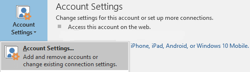

# Can't add a Room or Resource mailbox in an Office 365 hybrid environment

_Original KB number:_ &nbsp; 3161713

## Symptoms

When you try to add a cross-forest Room or Resource mailbox in Outlook, you receive the following error message despite having Full Access permissions:

> The name cannot be resolved. The name cannot be matched to a name in the address list.

:::image type="content" source="./media/cannot-add-room-or-resource-mailbox/name-error.png" alt-text="A screenshot of the name error message.":::

Mail user objects that represent cross-forest Shared and User mailboxes can be successfully added as an additional mailbox in Outlook.

## Cause

Mail user objects that represent a Room or Resource mailbox in another forest aren't considered ACL-able objects by Exchange Server. Therefore, they are not found by Outlook.

> [!NOTE]
> ACL-able objects are objects that can be added to the access control list (ACL) for an object in Active Directory Domain Services (AD DS).

## Workaround 1

Add the mailbox by using the `LegacyExchangeDN` attribute or the X500 email address instead of using the display name or SMTP address.

## Workaround 2

Add the mailbox as an additional email account. To do this, follow these steps:

1. Select **File** > **Info,** and then select **Account Settings**.
2. Select **Account Settings**.

    

3. On the **E-mail** tab, select **New**.

    :::image type="content" source="./media/cannot-add-room-or-resource-mailbox/new-email.png" alt-text="A screenshot of the new option in the Email Accounts dialog box.":::

4. On the Auto Account Setup page, enter the Room mailbox name, e-mail address, and your account password.

    :::image type="content" source="./media/cannot-add-room-or-resource-mailbox/add-account.png" alt-text="A screenshot of enter account setup page.":::

5. Click **Next**.

AutoDiscover will find the mailbox and configure the account.

## Workaround 3

If you only need to manage the calendar of the Room or Resource mailbox, you can add the mailbox calendar. For more information, see [View multiple calendars at the same time](https://support.office.com/article/view-calendars-side-by-side-or-overlaid-831c72ff-f835-4aa1-a879-2cc3ac4aa861).

## Workaround 4

Administrators can change the calendar processing settings to enable automatic management of meeting requests. There are different settings that let you create restriction policies for private or reserved resources. For more information, see [Set-CalendarProcessing](/powershell/module/exchange/set-calendarprocessing).
