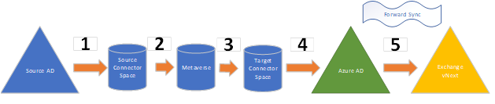

# How Azure AD Connect works in Office 365

_Original KB number:_ &nbsp; 4052070

## Summary

Azure Active Directory (Azure AD) Connect is used to synchronize data to Azure AD. Azure Active Directory Connect checks and validates information along the way. Sync errors may occur, and new objects or updated values may not reach Azure AD.

It's important to understand the flow of data from on-premises to the cloud in Exchange Online. If a failure or error occurs, this article can help determine where the problem is occurring and how to fix it.

## High-level workflow

1. The data flows from source on-premises AD to a source connector space.

    During this process, new objects and changes to existing objects are evaluated and if any conflicts exist, they are flagged. If the object is new and errors are present, the object will not be provisioned.

    If it's an existing object, the conflicting data may not be passed forward. The object may continue to function. However, the desired change, intended or accidental, will not be made. This triggers a DirSync error that has to be corrected in source AD.  

    For more information, see the following articles:

    - [Introduction to the Azure AD Connect Synchronization Service Manager UI](/azure/active-directory/hybrid/how-to-connect-sync-service-manager-ui)
    - [Using the Sync Service Manager Operations tab](/azure/active-directory/hybrid/how-to-connect-sync-service-manager-ui-operations)

2. If a change passes the first stage, it enters the **Metaverse**, and then the change is passed along to the Target Connector Space. For more information, see [Sync Service Manager Metaverse Search](/azure/active-directory/hybrid/how-to-connect-sync-service-manager-ui-mvsearch).

3. If there are no issues, the change is populated into the Target Data Store and Azure AD. At this point, you can use the [Get-MSOLUser](/powershell/module/msonline/get-msoluser) command and other Azure commands against the object to view them in Azure AD.

    If a problem occurs between the Target Connector Space and Azure AD, you may have to remove the object from Azure AD by using the [Remove-MsolUser](/powershell/module/msonline/remove-msoluser) cmdlet. You cannot force Azure AD to reevaluate the object as you can in MMSSPP.

4. Finally, the data synchronizes to Exchange, where the object exists as a Mailbox, MailUser, Resource, and so on. This is known as **Forward Sync**. If there is a problem on an object between Azure AD and Exchange Online (represented by validation errors), ask Microsoft to submit the object for a Forward Sync from Azure AD to Exchange Online to force this action.

## More information

For more information about this topic, see the following article and explore the topics in the left navigation pane:

[What is hybrid identity with Azure Active Directory?](/azure/active-directory/hybrid/whatis-hybrid-identity)

A related topic is Active Directory Federation Services. See the following articles for more information.

- [Azure AD Connect and federation](/azure/active-directory/hybrid/how-to-connect-fed-whatis)
- [Troubleshooting errors during synchronization](/azure/active-directory/hybrid/tshoot-connect-sync-errors)

Here are articles for some common issues:

- [Exchange Online object is not present or updated in Azure AD Connect](https://support.microsoft.com/help/4051392/a-vnext-object-is-not-present-or-updated-in-azure-ad-connect-for)
- [Mailbox not provisioned in Azure AD Connect for Office 365](https://support.microsoft.com/help/4051375/mailbox-is-not-provisioned-in-azure-ad-connect-for-office-365)
- [A user is missing from a group in Azure AD Connect for Office 365](https://support.microsoft.com/help/4052041/a-user-is-missing-from-a-group-in-azure-ad-connect-for-office-365)
- [Mailbox is present in both Office 365 Legacy Dedicated and vNext after license is applied](https://support.microsoft.com/help/3202607/can-t-complete-auto-discover-or-connect-to-a-mailbox-after-the-mailbox)
- [You see validation errors for users in the Office 365 portal or in the Azure Active Directory Module for Windows PowerShell](https://support.microsoft.com/help/2741233/you-see-validation-errors-for-users-in-the-office-365-portal-or-in-the)
- [Validation errors for a mailbox archive GUID for Microsoft 365 users](./validation-errors-for-mailbox-archive-guid.md)