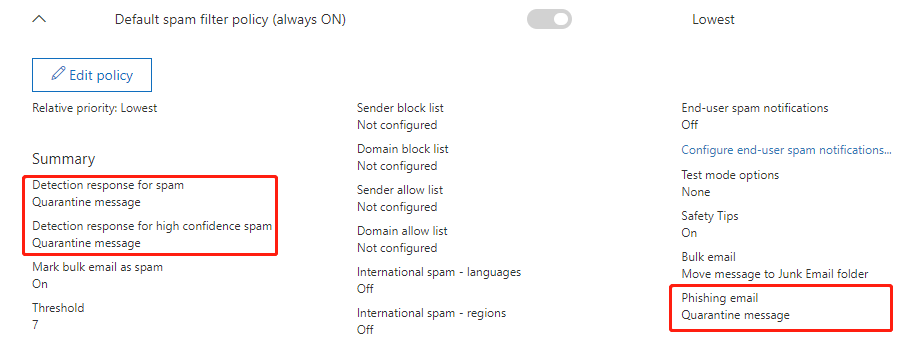

# User Impersonation messages are classified as phishing but not as user impersonation

## Symptoms

You set up an Office 365 Advanced Threat Protection (ATP) [anti-phishing policy](https://docs.microsoft.com/office365/securitycompliance/set-up-anti-phishing-policies) to help protect your organization from malicious impersonation-based phishing attacks and other phishing attacks. However, the policy does not act as expected on impersonation messages.

## Cause

When a message is processed, it may have more than one malicious indicator. When this occurs, the action taken on the message is based on the order in which policies are applied. For more information about the ordering of policies, see [What policy applies when multiple protection methods and detection scans run on your email](https://docs.microsoft.com/office365/securitycompliance/how-policies-and-protections-are-combined).

## Workaround

To work around this problem, change the actions of your anti-spam and anti-phishing policies to **Quarantine message**. To do this, follow these steps:

1. In Security and Compliance Center (SCC), navigate to **Threat Management** > **Policies** > **Anti-spam**
2. Under **Default spam filter policy**, select **Edit policy**
3. Under **Spam and bulk actions**, select **Quarantine message** for **Spam**, **High confidence spam**, and **Phishing email**

    
