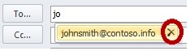

# "550 5.1.1 RESOLVER.ADR.ExRecipNotFound" NDR error message when you send email messages by using Outlook in Office 365

_Original KB number:_ &nbsp; 2784785

## Problem

When you send email messages by using Microsoft Outlook in Office 365, you may experience one or both of the following issues:

### Symptom 1: You receive non-delivery reports (NDRs)

Email messages or meeting invitations are not delivered successfully. For example, you receive an NDR that resembles the following:

> Generating server: \<server name>.local
>
>IMCEAEX-_O=CONTOSO_ou=first+20administrative+20group_cn=Recipients_cn=\<username>@\<server name>.local
>
> #550 5.1.1 RESOLVER.ADR.ExRecipNotFound; not found ##

### Symptom 2: The AutoComplete feature in Outlook does not work as expected

When you create a new email message and then type a name in the **To** line, the user's name is auto-populated. However, when you double-click the name, you experience one of the following issues:

- The dialog box information is not displayed correctly.
- Information is missing from the dialog box.

## Cause

These issues may occur if one of the following conditions is true:

- You reply to messages that were migrated from personal folders (.pst) files or were migrated by using a third-party migration tool.
- The Outlook nickname cache (AutoComplete) contains a bad entry.
- The OfflineAddressBook is not updated or cannot be downloaded.

## Solution

To resolve these issues, follow these steps:

1. Reset the nickname and the autocomplete caches in Outlook. For more information about how to do this, click the following article number to view the article in the Microsoft Knowledge Base:

   > [2199226](https://support.microsoft.com/help/2199226) Information about the Outlook AutoComplete list
1. If you reply to a migrated message, type the whole email address of the recipient again. If the Autocomplete feature tries to input the recipient name or address for you, click the 'X' to delete the entry, and then manually type the whole email address again.

   

1. Make sure that the Offline Address Book is operating correctly. For more information about how to troubleshoot the Offline Address Book, click the following article number to view the article in the Microsoft Knowledge Base:

   > [2429946](https://support.microsoft.com/help/2429946) How to troubleshoot the Outlook Offline Address Book in an Office 365 environment

## More information

This issue most frequently occurs when messages are migrated by using a method that does not correctly update the underlying X.500 distinguished name information for the original recipients of the message. The most common culprits in this scenario are .pst migrations.

For more information, see the following resources:

- [What are Exchange NDRs in Exchange Online and Office 365](https://support.office.com/article/what-are-exchange-ndrs-in-exchange-online-and-office-365-51daa6b9-2e35-49c4-a0c9-df85bf8533c3)
- [Error code 5.1.1 through 5.1.20 in Exchange Online and Office 365](https://support.office.com/article/error-code-5-1-1-through-5-1-20-in-exchange-online-and-office-365-79e91ade-5c83-405b-a37d-d99c7d069b13)

Still need help? Go to [Microsoft Community](https://answers.microsoft.com/).
