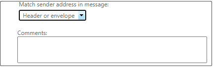

# A transport rule doesn't match if user mailbox rules automatically forward messages

## Symptoms

You create an Exchange transport rule to control the behavior of messages that have been automatically forwarded by users in your organization. If users create a mailbox rule to automatically forward messages, the transport rule doesn't match when the forwarded messages are sent.

## Cause

The transport rule logic to evaluate the sender of an automatic forwarding message was recently changed. The Sender address for forwarded mail is now the original sender and no longer the forwarder.

This change to the logic was made because, under certain circumstances, the Exchange transport rule would match the sender address against the message envelope instead of the message's header. This change makes sure that transport rule matching is always applied correctly whether the sender's address is stored in the message header or in the message envelope.

## Resolution

To maintain the behavior of transport rules, change the **Match sender address in message** setting from **Header** to **Header or envelope**:

1. In the Exchange Admin Center, go to **Mail flow** > **Rules**.
2. Double-click the affected rule in the list, and then locate the **Match sender address in message** heading.
3. In the list under this heading, select **Header or envelope**.

    

> [!NOTE]
> This change also affects the mailbox redirect rule, because the sender that's evaluated by the transport rule is now the original sender, and not the mailbox on which the rule is set. To maintain the behavior of this rule, set the exception in the transport rule based on the recipient instead of the sender. Alternatively, change this rule to an automatic forwarding rule.

## More information

Still need help? Go to [Microsoft Community](https://answers.microsoft.com).
