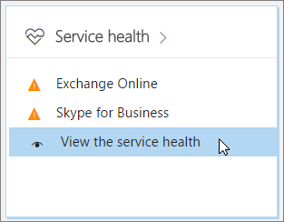
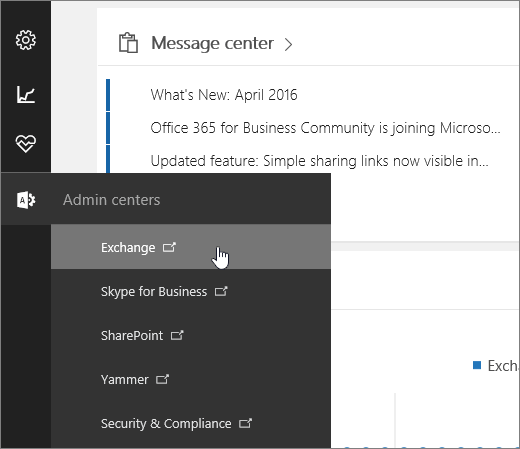
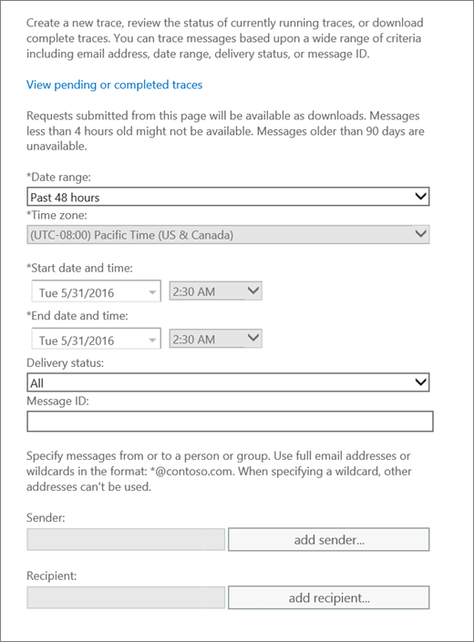
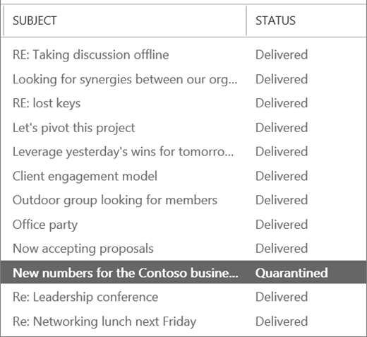
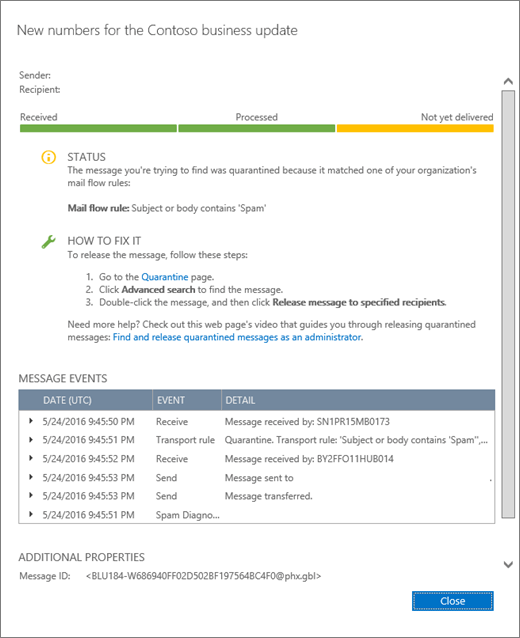
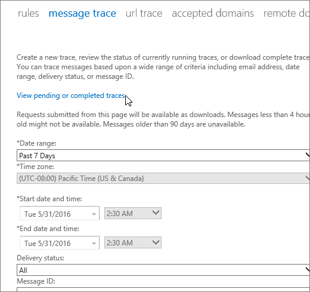

# Find and fix email delivery issues as an Office 365 for business admin

When users report that they aren't getting email, it can be hard to find what's wrong. You might run through several troubleshooting scenarios in your mind. Is something wrong with Outlook? Is the Office 365 service down? Is there a problem with mail flow or spam filter settings? Or is the problem due to something that's outside your control, like the sender is on a global block list? Fortunately, Office 365 provides powerful automated tools that can help you find and fix a variety of problems.

## First things first, check if there's a problem with Outlook or another email app

If only one user is reporting having trouble receiving email, there might be a problem with their email account or their email app. Have the affected user try the following solutions before you move on to admin-specific tasks.

### Use Outlook on the web to look for missing messages - 5 minutes

If a user is receiving email in their Outlook on the web mailbox but not on the email app that's installed on their machine, that could indicate that there's an issue with the users machine or email app. Ask the user with the issue to sign in to Outlook on the web to verify that their Office 365 email account is working correctly.

 **Instructions:** [Sign in to Outlook on the web for business](https://support.office.com/article/e08eb8ac-ac27-49f4-a400-a47311e1ee7e.aspx)

### Run Microsoft Support and Recovery Assistant to fix Outlook problems or account issues - 10 minutes

If a single user in your organization is having trouble receiving email, it could be due to a licensing issue, a profile problem, the wrong version of Outlook, or a mix of other issues. Fortunately, Support and Recovery Assistant finds and helps you fix most issues with Outlook or Office 365. As a first step in troubleshooting email delivery problems for Office 365 for business, we recommend that you download and run Microsoft Support and Recovery Assistant on the affected machine. Note that if you are experiencing issues with Outlook for Mac or are having mobile access issues, you can use the app to check your account settings, but you need to install it on a PC. After you sign in with the affected account, the app will check for issues. Users can typically download and run Support and Recovery Assistant without help from their Office 365 admin.

 **Let us fix your issue** [Download and run Microsoft Support and Recovery Assistant](https://AKA.MS/SaRASetup)

## If the Support and Recovery Assistant app doesn't fix the email delivery issue, try these admin tools

As an Office 365 for business admin, you have access to several tools that can help you investigate why users can't get email. The following video gives a brief overview of the tools available to you.

> [!VIDEO https://www.microsoft.com/videoplayer/embed/8b10af9a-455c-410a-8c17-24d5e5be098a]

The following tools are listed from the quickest to the most in-depth option.

### Check Office 365 service health for Exchange Online issues - 5 minutes

The service health page lists the status of Office 365 services and indicates if there have been any recent service incidents. Use the following steps to check the service health.

1. [Where to sign in to Office 365 for business](https://support.office.com/article/e9eb7d51-5430-4929-91ab-6157c5a050b4) with your work or school account.

2. Select the app launcher icon  in the upper-left and choose **Admin**.

    > [!TIP]
    > **Admin** appears only to Office 365 administrators.

    Can't find the app you're looking for? From the app launcher, select **All apps** to see an alphabetical list of the Office 365 apps available to you. From there, you can search for a specific app.

3. Under **Service health**, go to **View the service health**.

    

If there is an indication that ExchangeOnline service is degraded, email delivery might be delayed for your organization, and CompanyName service engineers are already working to restore service. Check the service health page for progress updates. In this case, you don't need to open a service request because CompanyName is already working to resolve the issue.

### Use message trace for in-depth email delivery troubleshooting - 15 minutes

Sometimes an email message gets lost in transit, or it can take a lot longer than expected for delivery, and your users can wonder what happened. The message trace feature lets you follow messages as they pass through your Exchange Online service. Getting detailed information about a specific message lets you efficiently answer your user's questions, troubleshoot mail flow issues, validate policy changes, and can prevent you from needing to contact technical support for assistance.

#### Open the message trace tool

If you're an Office 365 Midsize Business, Office 365 Business, or Office 365 Enterprise admin, you access and run the message trace tool through the Exchange admin center. To get there, do the following:

1. [Where to sign in to Office 365 for business](https://support.office.com/article/e9eb7d51-5430-4929-91ab-6157c5a050b4) with your work or school account.

2. Select the app launcher icon  in the upper-left and choose **Admin**.

    > [!TIP]
    > **Admin** appears only to Office 365 administrators.

    Can't find the app you're looking for? From the app launcher, select **All apps** to see an alphabetical list of the Office 365 apps available to you. From there, you can search for a specific app.

3. Go to **Exchange**.

    

4. Under **mail flow**, go to **message trace**.

If you're an Office 365 Small Business admin, do the following to find message trace:

1. Go to **Admin** \> **Service settings** \> **Email, calendar, and contacts**.

2. Under **Email troubleshooting**, click **Troubleshoot message delivery**.

#### Run a message trace and view delivery details of messages sent in the last week

By default, message trace is set to search for all messages sent or received by your organization in the past 48 hours. You can choose **Search** at the bottom of the page to generate this report. This report can give you a general idea about what is happening with mail flow in your organization. However, to troubleshoot a specific user's mail delivery issue, you want to scope the message trace results to that user's mailbox and the time frame that they expected to receive the message.

1. From the **Date range** menu, choose the date range that is closest to the time that the missing message was sent.

2. Use **Add sender** and **Add recipient** to add one or more senders and recipients, respectively.

3. Click **Search** to run the message trace.

4. The **message trace results** page shows all the messages that match the criteria that you selected. Typical messages are marked **Delivered** under the status column.

    

5. To see details about a message, choose the message and select  ( **Details**).

6. Details appear with an explanation of what happened to the message. To fix the problem, follow the instructions in the **How to fix it** section.

    

To search for a different message, you can click the **Clear** button on the **message trace** page, and then specify new search criteria.

#### View the results of a message trace that is greater than 7 days old

Message traces for items more than 7 days old are only available as a downloadable .CSV file. Because data about older messages is stored in a different database, message traces for older messages can take up to an hour. To download the .CSV file, do one of the following.

- Click the link inside the email notification that is sent when the trace is completed.

- To view a list of traces that were run for items that are more than 7 days old, click **View pending or completed traces** in the message trace tool.

    

    In the resulting UI, the list of traces is sorted based on the date and time that they were submitted, with the most recent submissions appearing first.

    When you select a specific message trace, additional information appears in the right pane. Depending on what search criteria you specified, this may include details such as the date range for which the trace was run, and the sender and intended recipients of the message.

> [!NOTE]
> Message traces containing data that is greater than 7 days old are automatically deleted. They cannot be manually deleted.

#### Common questions about message trace

 **After a message is sent, how long before a message trace can pick it up?**

Message trace data can appear as soon as 10 minutes after a message is sent, or it can take up to one hour.

 **Why am I getting a timeout error when I run a message trace?**

The search is probably taking too long. Try simplifying your search criteria.

 **Why is my message taking so long to arrive to its destination?**

Possible causes include the following:

- The intended destination isn't responsive. This is the most likely scenario.

- A large message takes a long time to process.

- Latency in the service is causing delays.

- The message was blocked by the filtering service.
