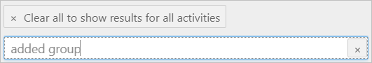

# Microsoft 365 Groups - common tasks

## Summary

Tenant administrators perform many common tasks to manage Microsoft 365 groups. Here's a quick reference for doing these tasks. The tasks are divided into sections to help you sort through them quickly. Select a task to navigate directly to it.

- Microsoft 365 Groups creation & display
  - [Control Microsoft 365 group creation](#control-microsoft-365-group-creation)
  - [Display a Microsoft 365 group associated with a team](#display-a-microsoft-365-group-associated-with-a-team)
- Microsoft 365 group delegation
  - [Enable specific users to "Send As" a Microsoft 365 group](#enable-specific-users-to-send-as-a-microsoft-365-group)
  - [Control user access to specific group resources](#control-user-access-to-specific-group-resources)
  - [Prevent group members from changing a group calendar](#prevent-group-members-from-changing-a-group-calendar)
  - [Microsoft 365 group limits](#microsoft-365-group-limits)
- Microsoft 365 Groups email address management
  - [Remove the onmicrosoft.com email address](#remove-the-onmicrosoftcom-email-address)
  - [Customize email addresses stamped onto new Microsoft 365 groups](#customize-email-addresses-stamped-onto-new-microsoft-365-groups)
  - [Change email addresses of existing groups after adding a domain to a tenant](#change-email-addresses-of-existing-groups-after-adding-a-domain-to-a-tenant)
  - [Add or remove a secondary email address from a Microsoft 365 Group](#add-or-remove-a-secondary-email-address-from-a-microsoft-365-group)
- Microsoft 365 Groups mail flow
  - [Control delivery of group email messages to new members](#control-delivery-of-group-email-messages-to-new-members)
  - [Get a copy of group email messages you send](#get-a-copy-of-group-email-messages-you-send)
  - [Configure automatic replies](#configure-automatic-replies)
  - [Email issues in Microsoft 365 groups](#email-issues-in-microsoft-365-groups)
- Microsoft 365 Groups restoration
  - [Restore a Microsoft 365 Group](#restore-a-microsoft-365-group)
  - [Restore email conversations deleted from a Microsoft 365 group](#restore-email-conversations-deleted-from-a-microsoft-365-group)
- Other tasks
  - [Convert to a Microsoft 365 group](#convert-to-a-microsoft-365-group)
  - [Access Microsoft 365 groups from Exchange clients](#access-microsoft-365-groups-from-exchange-clients)
  - [Microsoft 365 group migration](#microsoft-365-group-migration-between-tenants)
  - [Microsoft 365 group deletion](#microsoft-365-group-deletion)
  - [Export Microsoft 365 Groups information](#export-microsoft-365-groups-information)
  - [Microsoft 365 group mailbox size](#microsoft-365-group-mailbox-size)
  - [Microsoft 365 group usage report](#microsoft-365-group-usage-report)
- Useful scripts for Microsoft 365 Groups management
  - [Sample 1: See all the groups together with created date, owner, and membership count](#sample-1-see-all-the-groups-together-with-created-date-owner-and-membership-count)
  - [Sample 2: Create a report for users in a group](#sample-2-create-a-report-for-users-in-a-group)
  - [Sample 3: Assign "Send As" permissions on a group](#sample-3-assign-send-as-permissions-on-a-group)

## Microsoft 365 Groups creation & display

### Control Microsoft 365 group creation

By default, all users of the tenant are allowed to create Microsoft 365 groups. However, it can result in unaccounted, orphaned, and inactive groups. To avoid this problem, you can [control how users create Microsoft 365 Groups](/microsoft-365/admin/create-groups/manage-creation-of-groups?view=o365-worldwide&preserve-view=true).

You can also use the following tools to control Microsoft 365 group creation:

- Microsoft 365 Groups expiration policy

  This feature makes life easier for users, including admins, group owners, and members by automating the expiration and renewal process. It does so by tracking groups for user activity across different apps that are associated with the group, such as Teams, SharePoint, and Outlook.

  To learn more, see:

  [User Activity based Expiration Policy for Microsoft 365 groups](https://techcommunity.microsoft.com/t5/office-365-blog/user-activity-based-expiration-policy-for-office-365-groups-is/ba-p/942877)

  [Microsoft 365 group expiration policy](/microsoft-365/admin/create-groups/office-365-groups-expiration-policy?view=o365-worldwide&preserve-view=true)

  [Configure the expiration policy for Microsoft 365 Groups](/azure/active-directory/users-groups-roles/groups-lifecycle)

- Microsoft 365 group naming policy

  Worried that users might give offensive names to the Microsoft 365 groups that they create? Use the Microsoft 365 Groups naming policy to block specific words and limit group names to certain criteria, such as department names. See [Microsoft 365 Groups naming policy](/microsoft-365/admin/create-groups/groups-naming-policy?view=o365-worldwide&preserve-view=true).

[Back to top](#summary)

### Display a Microsoft 365 group associated with a team

All new teams have an associated Microsoft 365 group. By default, this Microsoft 365 group is hidden from Exchange clients (Outlook and OWA) and is also hidden from the global address list (GAL). To unhide the group, use Exchange Online PowerShell.

#### Unhide the Microsoft 365 group from the Outlook or OWA address list

1. [Connect to Exchange Online PowerShell](/powershell/exchange/exchange-online/connect-to-exchange-online-powershell/connect-to-exchange-online-powershell?view=exchange-ps&preserve-view=true).
2. Run the following command and specify the required value:

   ```powershell
   Set-UnifiedGroup -Identity <UnifiedGroupIdParameter> -HiddenFromAddressListsEnabled $false
   ```

   > [!NOTE]
   > The value **$false** unhides the group from the address list, and **$true** hides it.

#### Unhide the Microsoft 365 group from an Exchange client

1. [Connect to Exchange Online PowerShell](/powershell/exchange/exchange-online/connect-to-exchange-online-powershell/connect-to-exchange-online-powershell?view=exchange-ps&preserve-view=true).
2. Run the following command and specify the required value:

   ```powershell
   Set-UnifiedGroup -Identity <UnifiedGroupIdParameter> -hiddenFromExchangeClientsEnabled $false
   ```

   > [!NOTE]
   > The value **$false** unhides the group from the Exchange client, and **$true** hides it.

[Back to top](#summary)

## Microsoft 365 group delegation

### Enable specific users to Send As a Microsoft 365 group

You can assign "Send As" permissions to allow specific users to send messages on behalf of a Microsoft 365 group:

1. [Connect to Exchange Online PowerShell](/powershell/exchange/exchange-online/connect-to-exchange-online-powershell/connect-to-exchange-online-powershell?view=exchange-ps&preserve-view=true).
2. Run the following command:

   ```powershell
   Add-RecipientPermission <GroupName> -Trustee <MailboxName> -AccessRights SendAs
   ```

For more information, see [Allow members to send as or send on behalf of a Group](/microsoft-365/admin/create-groups/allow-members-to-send-as-or-send-on-behalf-of-group?view=o365-worldwide&preserve-view=true).

[Back to top](#summary)

### Control user access to specific group resources

A Microsoft 365 group has many more resources, but the following ones are minimum:

- Inbox
- Calendar
- SharePoint site
- OneNote

A user must be the member of the Microsoft 365 group to access any of these resources. You can't delegate access to a group resource individually. However, you can grant access to group conversations, files, calendar invitations, and notebooks to individual guests. See [Adding guests to Microsoft 365 Groups](https://support.microsoft.com/topic/adding-guests-to-microsoft-365-groups-bfc7a840-868f-4fd6-a390-f347bf51aff6).

[Back to top](#summary)

### Prevent group members from changing a group calendar

You can set read-only calendar permissions on group members by specifying the `CalendarMemberReadOnly` parameter.

For example, the following command makes the calendar read-only for all members in Group1.

```powershell
Set-UnifiedGroup Group1 -CalendarMemberReadOnly
```

[Back to top](#summary)

### Microsoft 365 group limits

This table shows the size and membership limits that apply to Microsoft 365 Groups.

|Maximum|Value|
|-----|-----|
|Owners per group|100|
|Groups a user can create|250|
|Groups that an admin can create|Up to default tenant limit of 500,000|
|Number of members|More than 1,000, though only 1,000 can access the Group conversations concurrently.<br/>Users might notice delays when they access the calendar and conversations in very large groups in Outlook.|
|Number of groups a user can be a member of|1,000|
|File storage|1 Terabyte + 10 GB per subscribed user + any additional storage purchased. You can purchase an unlimited amount of additional storage.|
|Group mailbox size|50 GB|
|Maximum email message send/receive size|35/36 MB is the default maximum send/receive limit, respectively. It can be increased by using the [Set-UnifiedGroup](/powershell/module/exchange/users-and-groups/set-unifiedgroup?view=exchange-ps&preserve-view=true) command, as necessary.|
|Distribution Group as a member of a Microsoft 365 group|A distribution group that has more than 1,000 members cannot be added to a Microsoft 365 group. This also includes the nested distribution group members.|

[Back to top](#summary)

## Microsoft 365 Groups email management

### Remove the onmicrosoft.com email address

The *\<domain>.onmicrosoft.com* email address is a Microsoft Online Email Routing Address (MOERA). At least one MOERA must be attached to a group at any one time. Therefore, you can't remove the onmicrosoft.com address from a group. However, you can change the MOERA domain to be a secondary email address of the group.

Example:

Assume that *contoso.com* is your primary email domain and contoso.onmicrosoft.com is your MOERA domain. To make contoso.com the primary email address for the *Marketing* group and set the MOERA as a secondary address, run the following command:

```powershell
Set-UnifiedGroup Marketing -PrimarySmtpAddress marketing@contoso.com
```

To learn more about MOERA addresses, see [How the proxyAddresses attribute is populated in Microsoft Entra ID](https://support.microsoft.com/help/3190357/how-the-proxyaddresses-attribute-is-populated-in-azure-ad).

[Back to top](#summary)

### Customize email addresses stamped onto new Microsoft 365 groups

You can create an email address policy to automatically stamp customized email addresses onto Microsoft 365 groups. See [Choose the domain to use when creating Microsoft 365 Groups](/microsoft-365/admin/create-groups/choose-domain-to-create-groups?view=o365-worldwide&preserve-view=true).

> [!NOTE]
> The email address policy does not change the email addresses of Microsoft 365 groups that were in use before the policy was created.

[Back to top](#summary)

### Change email addresses of existing groups after adding a domain to a tenant

Assume that you add an accepted domain, and you want to make it the primary SMTP address for all Microsoft 365 groups that were created before the domain was added to the tenant.

You can use the `Set-UnifiedGroup` command to update the email address of the existing groups.

Example:

Add the *contoso.com* domain to all Microsoft 365 groups that exist in your tenant:

```powershell
$domain = "@groups.contoso.com"
$Microsoft365Groups = Get-UnifiedGroup -ResultSize Unlimited

foreach ($Microsoft365Group in $Microsoft365Groups)
{
$NewEmailid = $Microsoft365Group.alias + $Domain
Set-UnifiedGroup -Identity $Microsoft365Group.identity -EmailAddresses @{add=$Newemailid}
}
```

> [!NOTE]
> Replace *groups.contoso.com* with the domain name that you want to add, and make sure that the new name is an accepted domain.

[Back to top](#summary)

### Add or remove a secondary email address from a Microsoft 365 Group

You can change the email address of a Microsoft 365 Group using [Microsoft 365 admin center](https://admin.microsoft.com/Adminportal/Home#/groups), select the group and selecting @edit email address.

Alternatively, you can also use the following Exchange Online PowerShell commands to add and remove a non-primary email address from a Microsoft 365 group:

Add:

```powershell
Set-UnifiedGroup Group1 -EmailAddresses @{add="group1@secondary.contoso.com"}
```

Remove:

```powershell
Set-UnifiedGroup Group1 -EmailAddresses @{remove="group1@secondary.contoso.com"}
```

[Back to top](#summary)

### Control delivery of group email messages to new members

To control whether new members of a group receive group email messages, run the following Exchange Online PowerShell command:

```powershell
Set-UnifiedGroup <GroupName> -AutoSubscribeNewMembers
```

Group owners can enable/disable the subscription from group settings by selecting the following option:

:::image type="content" source="media/o365-group-tasks/subscription-checkbox.png" alt-text="Screenshot of the subscription option to enable the subscription.":::

> [!NOTE]
> The `AutoSubscribeNewMembers` parameter takes effect for new members of a group after the change is made. Existing members are not affected.

Individual users can start and stop receiving group email messages by selecting the **Follow in Inbox/Stop following in Inbox** option on the group. See [Follow a group in Outlook](https://support.microsoft.com/topic/follow-a-group-in-outlook-e147fc19-f548-4cd2-834f-80c6235b7c36).

[Back to top](#summary)

### Get a copy of group email messages you send

By default, when you send an email message to an Outlook group that you're a member of, you don't receive a copy of that message in your Inbox. You can change this setting.

1. Sign in to your mailbox by using Outlook on the web (OWA), and then select **Settings** > **view all Outlook settings**.
2. Select **Mail** > **Groups**.
3. Select the **Send me a copy of email I send to a group** check box.

   :::image type="content" source="media/o365-group-tasks/checkbox.png" alt-text="Screenshot of the the Send me a copy of email I send to a group checkbox.":::

Administrators can enable the setting from Exchange Online PowerShell using the following command:

**Individual mailbox:**

```powershell
Set-MailboxMessageConfiguration <MailboxName> -EchoGroupMessageBackToSubscribedSender $True
```

**All mailboxes:**

To enable the setting for all mailboxes at once, use the following command:

```powershell
Get-Mailbox -ResultSize Unlimited | ForEach {Set-MailboxMessageConfiguration -Identity $_.UserPrincipalName -EchoGroupMessageBackToSubscribedSender $true}
```

> [!NOTE]
> This setting takes up to an hour to take effect.

[Back to top](#summary)

### Configure automatic replies

To configure automatic reply messages for a specific Microsoft 365 group mailbox, run the following Exchange Online PowerShell command:

```powershell
Set-MailboxAutoReplyConfiguration -Identity <groupmailbox> -AutoReplyState Enabled -InternalMessage "<Internal auto-reply message>" -ExternalMessage "<External auto-reply message>"
```

> [!NOTE]
> If your group mailbox has reached its allotted quota, you will receive a "Microsoft.Exchange.Data.Storage.QuotaExceededException" error when you run the Set-MailboxAutoReplyConfiguration cmdlet. To resolve the error, use the following steps:
>
> 1. [Reduce the size of your group mailbox](/microsoft-365/admin/create-groups/group-mailbox-size-management).
> 1. Wait 1 hour for the changes to take effect.
> 1. Rerun the Set-MailboxAutoReplyConfiguration cmdlet.

[Back to top](#summary)

### Email issues in Microsoft 365 groups

#### Issue 1: Messages sent from external users to a Microsoft 365 group are not received

If your sender receives a non-delivery report (NDR) that has the status code 550 5.7.193, make sure that the Microsoft 365 group is [enabled to receive email messages from external users](/exchange/troubleshoot/email-delivery/ndr-when-external-users-send-email-to-microsoft-365-group).

#### Issue 2: Messages sent to a Microsoft 365 group are not received by all members

Make sure that all group members have subscribed to the desired messages. See [Follow a group in Outlook](https://support.microsoft.com/topic/follow-a-group-in-outlook-e147fc19-f548-4cd2-834f-80c6235b7c36).

To check the message status of members who have subscribed to group email messages, run the following command:

```powershell
Get-UnifiedGroup <GroupName> | Get-UnifiedGroupLinks -LinkType Subscribers
```

To configure all group members to receive messages that are sent to a Microsoft 365 group, run the following command:

```powershell
$Group = "<Address of Microsoft 365 Groups>"
Get-UnifiedGroupLinks $Group -LinkType Member | % {Add-UnifiedGroupLinks -Identity $Group -LinkType subscriber -Links $_.Guid.toString() -Confirm:$false}
```

Here's an example that resubscribes all members of the group testg@contoso.onmicrosoft.com to receive messages in their Inbox:

```powershell
$group="testg@contoso.onmicrosoft.com"
Get-UnifiedGroupLinks $Group -LinkType Member | % {Add-UnifiedGroupLinks -Identity $Group -LinkType subscriber -Links $_.Guid.toString() -Confirm:$false}
```

[Back to top](#summary)

## Microsoft 365 group restoration

### Restore a Microsoft 365 Group

Deleted Microsoft 365 groups are retained for 30 days. Within this period, either a group owner or a tenant admin can restore the group. After 30 days, the group and its associated contents are permanently deleted and cannot be restored.

Restoring a Microsoft 365 group restores any services that are related to the group, such as Planner, Teams, and SharePoint sites.

> [!NOTE]
> It may take several hours to restore all the associated content for a group.

#### For group owners

1. Open the [Deleted groups](https://outlook.office.com/people/group/deleted) page, select **Manage groups** under the **Groups** node, and then select **Deleted**.

   :::image type="content" source="media/o365-group-tasks/manage-group.png" alt-text="Screenshot of deleted groups selecting Manage groups under the Groups node.":::

2. Select the **Restore** tab next to the group that you want to restore.

   :::image type="content" source="media/o365-group-tasks/restore.png" alt-text="Screenshot of the restore group.":::

   :::image type="content" source="media/o365-group-tasks/successful.png" alt-text="Screenshot of the successful notice.":::

#### For tenant admins

Use the [Microsoft 365 Admin center](https://aka.ms/RestoreDeletedGroup) or Azure Active Directory (Azure AD) PowerShell to restore a deleted group. See [Restore a deleted Microsoft 365 Group](/microsoft-365/admin/create-groups/restore-deleted-group?view=o365-worldwide&preserve-view=true).

[Back to top](#summary)

### Restore email conversations deleted from a Microsoft 365 group

If you accidentally delete email conversations from a Microsoft 365 Group, you can restore them by using Outlook on the web or by running the `Restore-RecoverableItems` PowerShell cmdlet. For more information, see [Restore deleted email conversations from Microsoft 365 Groups](/Exchange/recipients-in-exchange-online/restore-deleted-items-group).

[Back to top](#summary)

## Other tasks

### Convert to a Microsoft 365 group

Microsoft provides no tools to convert a shared mailbox to a Microsoft 365 group, or vice versa.

However, you can upgrade distribution lists to Microsoft 365 groups. It's a great way to give your organization's distribution lists all the features and functionality of Microsoft 365 groups. See [Why you should upgrade your distribution lists to groups in Outlook](https://support.microsoft.com/topic/why-you-should-upgrade-your-distribution-lists-to-groups-in-outlook-7fb3d880-593b-4909-aafa-950dd50ce188).

You can upgrade distribution lists one at a time, or several at the same time. If the distribution list can't be upgraded, a dialog box opens to indicate this. See [Which distribution lists cannot be upgraded?](/microsoft-365/admin/manage/upgrade-distribution-lists?view=o365-worldwide#which-distribution-lists-cannot-be-upgraded&preserve-view=true).

Also, see [Upgrade distribution lists to Microsoft 365 Groups in Outlook](/microsoft-365/admin/manage/upgrade-distribution-lists?view=o365-worldwide&preserve-view=true).

[Back to top](#summary)

### Access Microsoft 365 groups from Exchange clients

For the best Microsoft 365 group user experience, use the latest version of Outlook from the Microsoft 365 suite or Outlook on the web (OWA).

The following Outlook clients can access Microsoft 365 groups:

- Outlook for Microsoft 365
- Outlook 2016 MSI and later versions
- Outlook for Mac 2016 (version 16.9 and later)
- Outlook for Android and Outlook for iOS
- Outlook on the web (OWA)

[Back to top](#summary)

### Microsoft 365 group migration between tenants

There is no native tool or method available to migrate Microsoft 365 groups between tenants.

[Back to top](#summary)

### Microsoft 365 group deletion

Deleted Microsoft 365 groups and related services (such as Teams, SharePoint sites, and so on) are retained in a soft-deleted state for 30 days. If you are a tenant admin, you can permanently delete a Microsoft 365 group without waiting for 30 days.

[!INCLUDE [Azure AD PowerShell deprecation note](~/../Exchange/reusable-content/msgraph-powershell/includes/aad-powershell-deprecation-note.md)]

1. Connect to Azure AD PowerShell.
2. Run the following command to get the ID of the deleted group:

   ```powershell
   Get-AzureADMSDeletedGroup
   ```

3. Purge the deleted group by running the following command:

   > [!CAUTION]
   > Purging the group removes the group and its data permanently.

   ```powershell
   Remove-AzureADMSDeletedDirectoryObject -Id <objectId>
   ```

[Back to top](#summary)

### Export Microsoft 365 Groups information

Use the Microsoft Purview search to export email contents of a Microsoft 365 group to PST. For more information, see [Search for content using the Content Search tool](/microsoft-365/compliance/search-for-content?view=o365-worldwide&preserve-view=true).

You can run PowerShell commands to accomplish the following tasks.

Export the membership list of a Microsoft 365 group:

```powershell
Get-UnifiedGroup <GroupName> | Get-UnifiedGroupLinks -LinkType Members | Export-CSV ".\GroupMembers.csv" -NoTypeInformation -Encoding UTF8
```

List all groups (including deleted groups) and group owners:

```powershell
Get-UnifiedGroup -IncludeSoftDeletedGroups |?{$_.ManagedBy -ne $null} | ft displayname,managedby
```

List all groups (including deleted groups) that don't have assigned owners:

```powershell
Get-UnifiedGroup -IncludeSoftDeletedGroups |?{$_.ManagedBy -eq $null}
```

To list all Microsoft 365 groups together with tracking information about the group creator, you have to use the [auditing](https://protection.office.com/unifiedauditlog) information. [Search](/microsoft-365/compliance/search-the-audit-log-in-security-and-compliance?view=o365-worldwide&preserve-view=true) the unified audit log for the "added group" activity.



[Back to top](#summary)

### Microsoft 365 Group mailbox size

The size limit of Microsoft 365 group mailboxes is 50 GB by default. The following information explains how to view the current size of a Microsoft 365 group mailbox, and how to free up space in it before it gets full.

#### View the group mailbox size

1. [Connect to Exchange Online PowerShell](/powershell/exchange/exchange-online/connect-to-exchange-online-powershell/connect-to-exchange-online-powershell?view=exchange-ps&preserve-view=true).
2. Run the following command to view the current size of a Microsoft 365 group mailbox:

   To view the size of a specific group mailbox:

   ```powershell
   Get-Mailbox -GroupMailbox <name of the group> | Get-MailboxStatistics | fl TotalDeletedItemSize,TotalItemSize
   ```

   To view the current size of group mailboxes:

   ```powershell
   Get-Mailbox -GroupMailbox -ResultSize unlimited | Get-MailboxStatistics | ft DisplayName,TotalDeletedItemSize,TotalItemSize
   ```

#### Increase space in the group mailbox

There's no supported way to increase the quota of a group mailbox. You must remove older email messages to free up space in the group mailbox.

A group owner can remove older email messages by using Outlook or Outlook on the web to free up space immediately. A tenant administrator can set up a [retention policy](/microsoft-365/compliance/create-retention-policies) to clean older email messages from groups. Retention policies take longer to clean up the data though.

Also, you can [search the content](/microsoft-365/compliance/content-search) of the group mailbox and [export the search results](/microsoft-365/compliance/export-search-results) to a PST file before removing email messages from the group mailbox.

### Microsoft 365 Group usage report

In the Microsoft 365 groups report, you can gain insights into the activity of groups in your organization, such as Emails received in Exchange, Messages in Viva Engage. For more information, see [Microsoft 365 Reports in the admin center](https://aka.ms/M365GroupUsageReport).

[Back to top](#summary)

## Useful scripts for Microsoft 365 Groups management

### Sample 1: See all the groups together with created date, owner, and membership count

```powershell
Get-UnifiedGroup | Select-Object Id, DisplayName, ManagedBy, Alias, AccessType, WhenCreated, @{Expression={([array](Get-UnifiedGroupLinks -Identity $_.Id -LinkType Members)).Count }; Label='Members'} | Sort-Object whencreated | Format-Table displayname, alias, managedby, Members, accesstype, whencreated
```

[Back to top](#summary)

### Sample 2: Create a report for users in a group

```powershell
$Groups = Get-UnifiedGroup -ResultSize Unlimited
$Groups | ForEach-Object {
$group = $_
Get-UnifiedGroupLinks -Identity $group.Name -LinkType Members | ForEach-Object {
    New-Object -TypeName PSObject -Property @{
        Group = $group.DisplayName
        Member = $_.Name
        EmailAddress = $_.PrimarySMTPAddress
        RecipientType= $_.RecipientType
        }
    }
} | Export-CSV ".\Office365GroupMembers.csv" -NoTypeInformation -Encoding UTF8
```

[Back to top](#summary)

### Sample 3: Assign Send As permissions on a group

```powershell
$groupAlias = "group1"
$userAlias = "john"
$groupsRecipientDetails = Get-Recipient -RecipientTypeDetails groupmailbox -Identity $groupAlias
Add-RecipientPermission -Identity $groupsRecipientDetails.Name -Trustee $userAlias -AccessRights SendAs
```

[Back to top](#summary)
