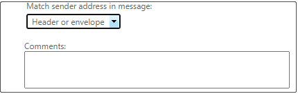

---
title: Exclusions to automatically forwarded messages are not honored by a transport rule
description: The transport rule doesn't honor the exclusions, and it rejects the messages. This article provides a resolution.
author: TobyTu
ms.author: Arindam.Thokder
manager: dcscontentpm
audience: ITPro 
ms.topic: article 
ms.service: exchange-online
localization_priority: Normal
ms.custom: 
- CI 116057
- CSSTroubleshoot 
ms.reviewer: lindabr, Arindam.Thokder
appliesto: 
- Exchange Online
search.appverid: 
- MET150
---

# Exclusions to automatically forwarded messages are not honored by a transport rule

## Symptoms

You create an Exchange transport rule to control the automatic forwarding of messages that are sent outside the organization. The rule excludes certain users and groups. When those users create a mailbox rule to automatically forward messages to external recipients, the transport rule doesn't honor the exclusions, and it rejects the messages.

## Cause

The transport rule logic to evaluate the sender of an automatic forwarding message was changed. The transport rule now treats the actual sender of the email message as the sender of the automatically forwarded message. The previous behavior was to treat the address of the mailbox where the automatic forwarding rule is configured as the sender.

This change to the logic was made because, under certain circumstances, the Exchange transport rule would match the sender address against the message envelope instead of the message's header. This change makes sure that transport rule matching is always applied correctly whether the sender's address is stored in the message header or in the message envelope.

## Resolution

To maintain the behavior of transport rules, change the **Match sender address in message** setting from **Header** to **Header or envelope**:

1. In the Exchange Admin Center, go to **Mail flow** > **Rules**.
2. Double-click the affected rule in the list, and then locate the **Match sender address in message** heading.
3. In the list under this heading, select **Header or envelope**.

    

> [!NOTE]
> This change also affects the mailbox redirect rule. To maintain the behavior of this rule, set the exception in the transport rule based on the recipient instead of the sender. Or, change this rule to an automatic forwarding rule.

## More information

Still need help? Go to [Microsoft Community](https://answers.microsoft.com).
