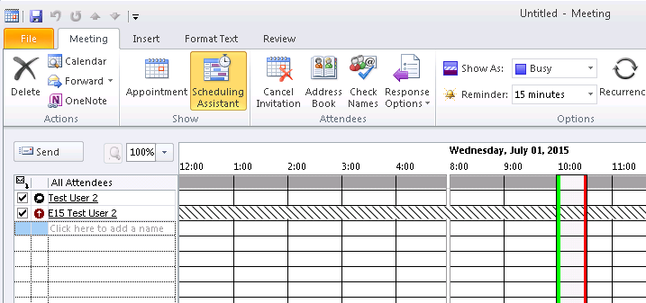
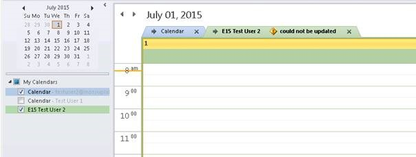
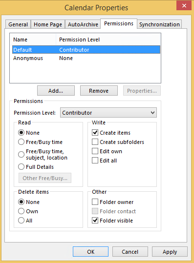
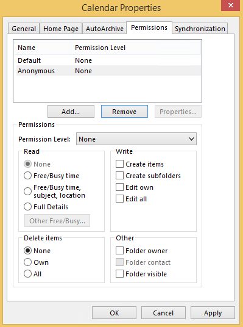
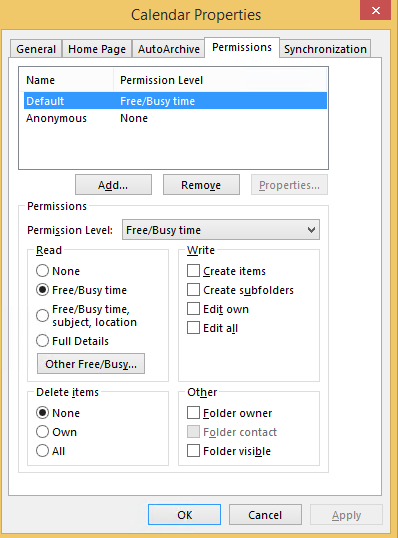
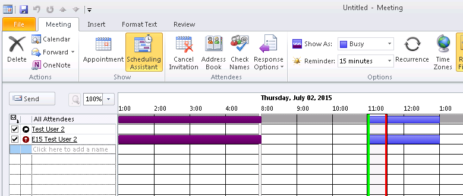
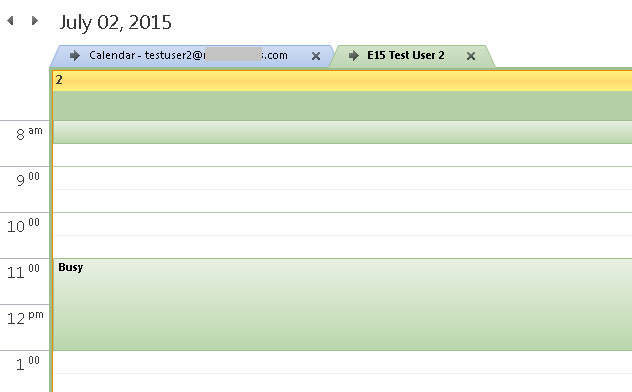
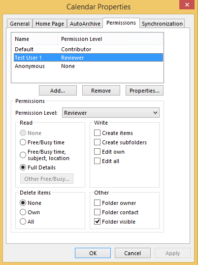
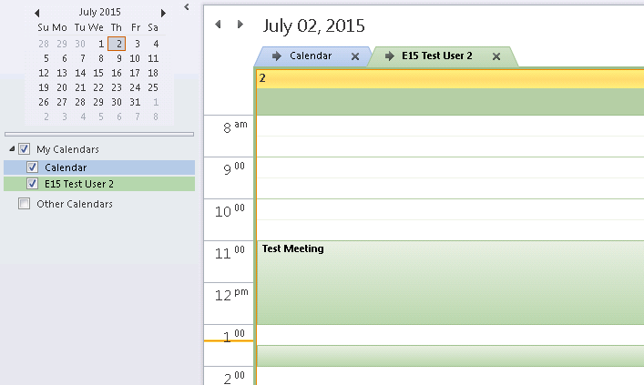
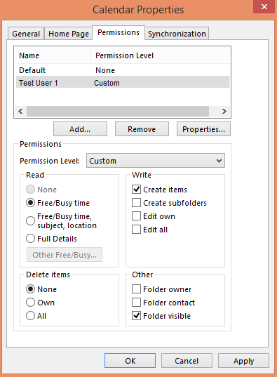

# Users can't see free/busy information after a mailbox is moved to Office 365

## Symptoms

After a mailbox is moved to Microsoft Office 365, an on-premises user can't see the free/busy information for the mailbox in Scheduling Assistant.

Also, the user can no longer view the Calendar folder, and the user receives a "Could not be updated" error.

## Cause

The default permissions of the Calendar folder are set to **None** or **Contributor**. When you query free/busy information by using Scheduling Assistant in a cross-forest scenario, the Availability service uses the organization relationship instead of delegated user permissions. Scheduling Assistant makes cross-forest requests on behalf of the organization relationship instead of on behalf of the user who is requesting it. The organization relationship links to the default account that is seen in the calendar permissions. Therefore, it can't process an explicitly granted permission such as "Free/Busy time" or "Free/Busy time, subject, location."

## Workaround

When the default permissions of the Calendar folder are set to **None** or **Contributor**, details can be obtained only when user delegation is used by attaching calendars directly to the calendar view of Outlook. In a hybrid deployment, free/busy and calendar-sharing functionality work differently than when both users are in the same environment. The default permissions determine the kind of free/busy information that users in a remote forest can see. If the default permissions are set to **None** or **Contributor**, no free/busy information is displayed for remote users, and users cannot view the mailbox calendar. This is because neither kind of permission offers any level of free/busy visibility.

If a remote user must be able to see free/busy information for the mailbox, the mailbox owner can work around this issue by changing the default permissions to **Free/Busy time** or **Free/Busy time, subject, location**. This changes the free/busy information that is shared for all remote users. For example, the default permissions can be set to **Free/Busy time**:

Remote users can see the free/busy data in Scheduling Assistant:

Or, remote users can see the free/busy data as an additional calendar:

A remote user can be granted Calendar folder permissions to obtain additional access to the contents of the Calendar folder:

> [!NOTE]
> Granting the **Free/Busy time, subject, location (Limited Details)** permission is insufficient in a hybrid environment. The user has to be granted at least **Reviewer** permission to view calendar item details.

The remote user (Test User 1) can now see the mailbox Calendar folder:

## More Information

For more information about cross-forest free/busy configuration, click the following article number to view the article in the Microsoft Knowledge Base:

[3079932](https://support.microsoft.com/help/3079932) Users can see only basic free/busy mailbox information in a remote forest in Office 365

There are some differences with contributor permissions when you set the default calendar permissions or when you explicitly grant a user calendar permission. When the default calendar permissions are set, the **Free/busy setting** uses **None**.

When a user is granted contributor rights, the permission level will automatically change to **Custom**. This includes **Free/Busy time**.

This is expected behavior, because users who can create items in a calendar can also see the folder and view free/busy information.
