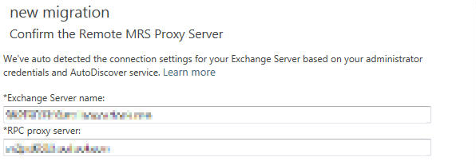
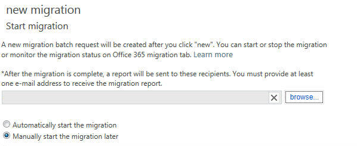
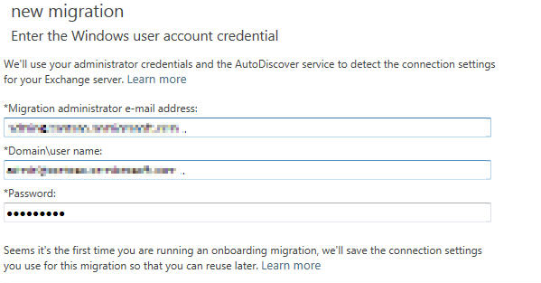
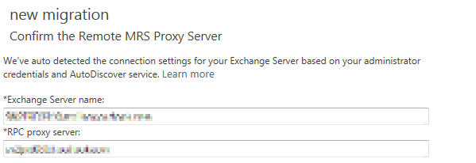
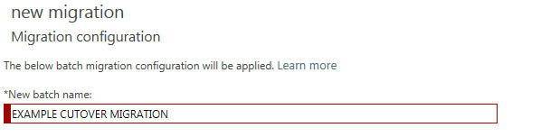
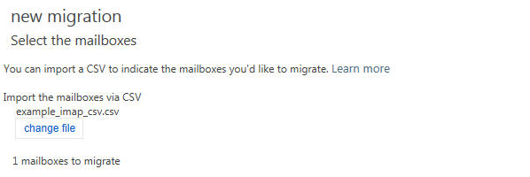
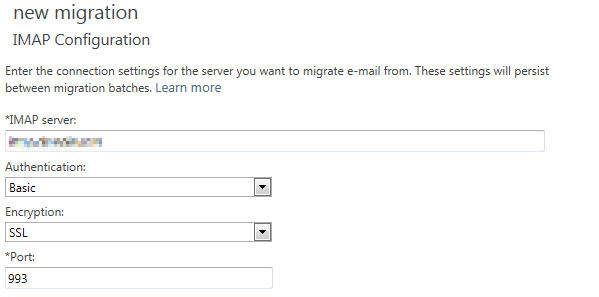
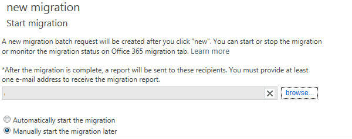
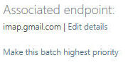

# How to migrate mailbox data by using the Exchange Admin Center in Office 365

## Introduction

This article describes the migration features that are available in the Exchange Admin Center in Microsoft Office 365. It also discusses migration scenarios in which the Exchange Admin Center is used to migrate data from the following existing environments:

- Microsoft Exchange Server 2003
- Microsoft Exchange Server 2007
- Microsoft Exchange Server 2010
- Microsoft Exchange Server 2013
- Internet Message Access Protocol (IMAP)

## More information

The Exchange Admin Center in Office 365 is used to migrate data from a hosted and on-premises Exchange environment or an IMAP environment through the creation and management of migration batches. Migration batches are specific requests to migrate all mailboxes or a subset of mailboxes from a remote mailbox source.

### Supported kinds of migration

In Exchange Online, IT admins have several options to migrate mailbox data from their existing on-premises or hosted environment. These options vary based on the source environment and the result that the customer wants to achieve. As with any deployment of Exchange Online in Office 365, customers can review the [Exchange Server Deployment Assistant](/exchange/exchange-deployment-assistant) to determine the settings that they have to set up to reach the end state that they want.

#### Remote move

Remote move enables migration from a deployment of Exchange 2010 or later versions. It uses the Microsoft Exchange Mailbox Replication Service (MRS) Proxy service. For more information about remote moves, go to the following Microsoft TechNet website:

[Mailbox Moves in Exchange 2013](/Exchange/recipients/mailbox-moves)

#### Staged migration

Staged migration enables migration from an on-premises Exchange 2003 or Exchange 2007 deployment. The main difference in this kind of migration is that the migration is targeted at customers who want to establish a permanent mail coexistence with Exchange Online and their on-premises environments. This requires that customers deploy directory synchronization when they deploy Exchange Online. This option is available for customers who have Enterprise Exchange licenses only. IT admins must provide a list of users to migrate in each batch by using a comma-separated values (CSV) file.

#### Cutover migration

The cutover migration option is for customers who want to migrate their whole environment at one time. This migration is limited to less than 2,000 mailboxes and is targeted at business customers who are running Exchange 2003 or a later version in their environment. Specifically, this migration supports users who are using the Microsoft Exchange Autodiscover service against Exchange 2007 (or later-version) environments to determine the mailboxes that are available for migration. However, if you're running Exchange 2003 in your on-premises environment, you can manually enter the remote procedure call (RPC) proxy addresses to access the Exchange mailboxes for migration. This option is available to Office 365 Enterprise customers and Office 365 Business customers.

#### IMAP migration

IMAP migration is targeted at customers who may be using non-Exchange-based mail systems in their current hosted environment or have access to the data only by using the IMAP 4 protocol. The Office 365 migration engine uses the information that's provided by IT admins in the EAC to connect to IMAP mailboxes and download mailbox data. IT admins must provide a list of users to migrate in each batch by using a CSV file.

### Offboarding migration

IT admins can move mailboxes from Exchange Online to a remote mailbox server by using the MRS Proxy service.

### How to manage migration batches in Exchange Online

Admins whose organizations are deployed on Exchange Online can create and manage multiple migration batches by using the E-mail Migration wizard in the Exchange Admin Center by using Exchange Online PowerShell. Admins can "pre-stage" several migration batches for execution and can control when a migration batch is started. More than one migration batch can be run at one time.

#### How to create migration batches by using the E-mail Migration wizard in the Exchange Admin Center

To create a migration batch, follow these steps:

1. Sign in to the Office 365 portal ([https://portal.office.com](https://portal.office.com/)).
2. Click **Admin**, and then click **Exchange**.
3. Click **Migration**, click **New** (), and then click **Onboarding**.
4. Select the migration option that you want, and then click **Next**. Migration options are as follows:  
   - Remote move
   - Staged migration
   - Cutover migration
   - IMAP

   The following screenshot shows the migration options:

    

#### Remote move walkthrough

For more information about remote move, go to the following Microsoft TechNet website:

[Mailbox Moves in Exchange 2013](/Exchange/recipients/mailbox-moves)

#### Staged migration walkthrough

To create a staged migration batch, follow these steps:

1. Prepare a CSV file.

    Each row in the CSV file that you use to migrate on-premises Exchange mailboxes to the cloud in a staged Exchange migration should contain information about the on-premises mailbox.
2. On the "Select the mailboxes" screen, locate the CSV file that you created in step 1, and then click **Next**. The following screenshot shows an example:

    
3. Enter the credentials of your on-premises admin account, and then click **Next**. The following screenshot shows an example:

    
4. If the Autodiscover service can't detect the connection settings for the on-premises Exchange server, you're prompted to enter the following information:  
   - The fully qualified domain name (FQDN) of the Exchange server that hosts the mailbox that you're migrating
   - The FQDN of the proxy server for the Exchange server

    If the Autodiscover service can detect the connection settings for the on-premises Exchange server, you're prompted to confirm the entries. The following screenshot shows an example:

    

    Click **Next**.
5. Enter a name for the migration batch, and then click **Next**.

    
6. Specify the admins in your Office 365 organization who should receive the migration report, select one of the following migration methods, and then click **New**:
   - Automatically start the migration
   - Manually start the migration later

    

#### Cutover migration walkthrough

To create a cutover migration batch, follow these steps:

1. Specify the Windows admin user account credentials for the Exchange server.

    
2. If the Autodiscover service can't detect the connection settings for the on-premises Exchange server, you're prompted to enter the following information:  
   - The FQDN of the Exchange server that hosts the mailboxes that you're migrating
   - The FQDN of the proxy server for the Exchange server

    If the Autodiscover service can detect the connection settings for the on-premises Exchange server, you're prompted to confirm the entries. The following screenshot shows an example:

    

    Click **Next**.
3. Enter a name for the migration batch, and then click **Next**.

    
4. Specify the admins in your Office 365 organization who should receive the migration report, select one of the following migration methods, and then click **New**:  
   - Automatically start the migration
   - Manually start the migration later

    

#### IMAP migration - Walkthrough

To create an IMAP migration batch, follow these steps:

1. Prepare a CSV file.

    The CSV file that you use to migrate the content of user's mailboxes should contain a row for each user. Each row contains information about the user's cloud-based mailbox and IMAP mailbox that are used to process the migration.
2. On the "Select the mailboxes" screen, locate the CSV file that you created in step 1, and then click **Next**. The following screenshot shows an example:

    
3. On the IMAP Configuration screen, enter the connection settings for the server from which you want to migrate mailbox data. The following screenshot shows an example:

    
4. Enter a name for the migration batch, and then click **Next**.

    
5. Specify the admins in your Office 365 organization who should receive the migration report, select one of the following migration methods, and then click **New**:  
   - Automatically start the migration
   - Manually start the migration later

    

### How to manage migration batches by using the Exchange Admin Center

After admins create the migration batch, they can create additional migration batches. Additionally, admins can change, delete, pause, or start an existing migration batch. They can use the following controls to perform these actions:

Admins can also change the associated endpoint of a migration batch by using controls on the **Migration** tab. If more than one batch is started, admins can select the migration batch that has the highest priority.

### Migration endpoints

Migration endpoints are management objects that describe the remote server information and connection settings that are associated with one or more batches. When you provide server information during a migration batch request, you're actually creating a migration endpoint. After you create migration endpoints, you can assign them to new migration batches or pending migration batches.

The following screenshot shows migration endpoint properties that are accessed through migration batch properties:

The following screenshot shows migration endpoint properties that are accessed from the **More** button on the **Migration** screen:

### How to manage migration batches by using Exchange Online PowerShell

Admins can use the following Exchange Online PowerShell cmdlets to manage migration batches:

- `Complete-MigrationBatch`
- `Get-MigrationBatch`
- `Get-MigrationConfig`
- `Get-MigrationEndpoint`
- `Get-MigrationStatistics`
- `Get-MigrationUser`
- `Get-MigrationUserStatistics`
- `New-MigrationBatch`
- `New-MigrationEndpoint`
- `Remove-MigrationBatch`
- `Remove-MigrationEndpoint`
- `Remove-MigrationUser`
- `Set-MigrationBatch`
- `Set-MigrationEndpoint`
- `Start-MigrationBatch`
- `Stop-MigrationBatch`
- `Test-MigrationServerAvailability`

For more information about how to use each cmdlet, run the `Get-Help` cmdlet.

### How to monitor the status of the migration batch

Admins can view the current status of each migration batch in the Exchange Admin Center. To do this, they should select the migration batch on the **Migration** tab. The status information is as follows:

- Type: Migration type. Migration types are as follows:
  - Remote move
  - Staged migration
  - Cutover migration
  - IMAP

- Direction: Migration direction. Migration directions are as follows:  
  - Onboarding
  - Offboarding

- Status: The current state of the migration batch that is selected. The status is as follows:  
  - Created
  - Removing
  - In Progress
  - Completed

- Failed Mailboxes: The number of mailboxes for which the migration isn't successful
- Created by: The mailbox address of the admin who created the migration batch
- Create Time: The date and time when the migration batch was created
- Start Time: The date and time when the migration batch was initiated
- Initial Sync Time: The date and time when the initial sync started
- Initial Sync Duration: The time that is taken to complete the initial sync
- Last Synced Time: The date and time when the last sync completed for the active users
  
## References

Still need help? Go to [Microsoft Community](https://answers.microsoft.com/).