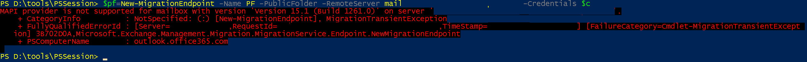

# New-MigrationEndpoint returns error in Exchange Online: MAPI provider is not supported for mailbox

_Original KB number:_ &nbsp;4052729

## Symptoms

When you run the `New-MigrationEndpoint` cmdlet to create a PublicFolder or PublicFolderToGroups type of migration endpoint in Microsoft Exchange Online, you get the following error message:

> MAPI provider is not supported for mailbox with version <*VersionNumber*> on server <*ServerName*>.



## Cause

This error occurs because the following mailboxes aren't on the same server:

- The primary hierarchy public folder mailbox.
- The organization mailbox that's named SystemMailbox{*MailboxID*}. (This is a type of arbitration mailbox.)

## Resolution

To resolve this problem, make sure that the databases that host these two mailboxes are on the same server. To do this, follow these steps:

1. Locate the database that hosts the primary hierarchy public folder mailbox by running the one of the following cmdlet options:

   **Option 1**

    ```powershell
    Get-Mailbox -PublicFolder | ?{$_.IsRootPublicFolderMailbox -eq $true} | ft name,database
    Get-MailboxDatabaseCopyStatus <database returned from the first cmdlet>
    ```

   **Option 2**

    ```powershell
    Get-MailboxDatabase (Get-Mailbox -PublicFolder | ?{$_.IsRootPublicFolderMailbox -eq $true}).database | Get-MailboxDatabaseCopyStatus
    ```

1. Locate the database that hosts the primary hierarchy public folder mailbox by running one the following cmdlet options:

   **Option 1**

    ```powershell
    Get-Mailbox -Arbitration | ?{$_.name -like "SystemMailbox{MailboxID}"} | ft database
    Get-MailboxDatabaseCopyStatus <database returned from the first cmdlet>
    ```

    **Option 2**

    ```powershell
    Get-MailboxDatabase (Get-Mailbox -Arbitration | ?{$_.name -like "SystemMailbox{MailboxID}"}).database | Get-MailboxDatabaseCopyStatus
    ```

1. If the databases that host the primary hierarchy public folder mailbox and the arbitration mailbox have a copy on the same server, activate both database copies on the same server.

    Otherwise, move the arbitration mailbox or the primary hierarchy public folder mailbox so that both mailboxes are on the same server.
