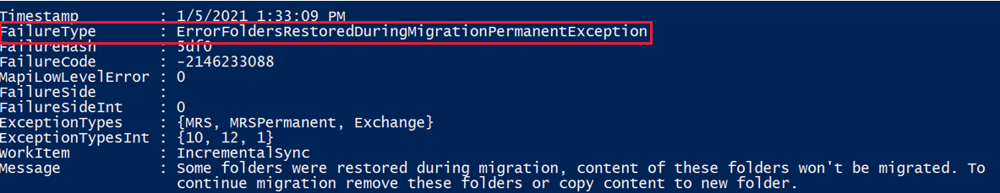
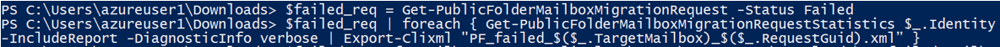
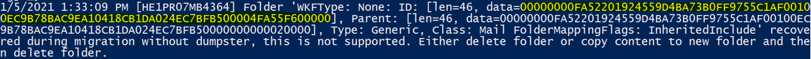

# "ErrorFoldersRestoredDuringMigrationPermanentException" error in a public folder migration batch

## Symptoms

You receive this error when running a public folder migration batch job:

> ErrorFoldersRestoredDuringMigrationPermanentException



## Cause

This issue occurs because the public folder restore operation isn't supported during migrations that starts with the [ExcludeDumpster](https://techcommunity.microsoft.com/t5/exchange-team-blog/announcing-the-support-for-modern-public-folder-migrations/ba-p/608004) parameter. It happens if these two conditions are met:

- The public folder migration batch was created with the `ExcludeDumpster` parameter.
- You recovered deleted public folders from dumpster in the source while running the migration batch job.

## Resolution

Here's how to resolve this issue:

1. Identify the entry IDs of the recovered folders. Here's how to check the report and identify the entry IDs:

   **Method 1: Use Exchange admin center**

   1. In Exchange admin center, select **Recipients** > **Migration**.
   1. Select the migration batch, and then select **View details** under **Mailbox status**.
   1. Select the failed migration mailbox, and then select **Download the report for this user**.

      Note the identity of the failed migration mailbox. In the following example, the identity is *Mailbox1*.

      :::image type="content" source="media/public-folder-migration-batch-error/download-report.png" alt-text="Screenshot of the downloading the report for failed mailbox.":::

   1. In the report, search for the keyword "recovered" to find the entry IDs of the recovered folders. The entry ID is the first data value of the recovered folder entry, for example:

      :::image type="content" source="media/public-folder-migration-batch-error/entry-id.png" alt-text="Screenshot of the entry ID of recovered folder.":::

   **Method 2: Use PowerShell**

   1. Connect to [Exchange Online PowerShell](/powershell/exchange/connect-to-exchange-online-powershell#connect-to-exchange-online-powershell-using-mfa-and-modern-authentication).
   1. Retrieve the failed public folder mailbox migration request by running this cmdlet:

      ```powershell
      $failed_req = Get-PublicFolderMailboxMigrationRequest -Status Failed 
      $failed_req
      ```

      Note the identity of the failed migration mailbox.

   1. Export statistics of the failed public folder mailbox migration request to an xml file by running this cmdlet:

      ```powershell
      $failed_req | foreach { Get-PublicFolderMailboxMigrationRequestStatistics $_.Identity -IncludeReport -DiagnosticInfo verbose | Export-Clixml "PF_failed_$($_.TargetMailbox)_$($_.RequestGuid).xml" }
      ```

      

      The xml file is created on your computer. For example:

      :::image type="content" source="media/public-folder-migration-batch-error/xml-path.png" alt-text="Screenshot of downloaded xml file path.":::

   1. Import the xml file by running this cmdlet:

      ```powershell
      $failedreport=Import-Clixml "Path of the xml file"
      ```

      **Note:** *$failedreport* is a variable that you can customize.

   1. Retrieve the entry IDs of the recovered folders from *$failedreport* by running this cmdlet:

      ```powershell
      $failedreport.Report.Entries|where {[string]$_ -like "*recovered*"}|%{[string]$_}
      ```

      The entry ID is the first data value of the recovered folder entry, for example:

      

2. Remove the recovered public folder by running this cmdlet:

   ```powershell
   Remove-PublicFolder -Identity "EntryID"
   ```

   Replace the *EntryID* placeholder with the entry ID that you found in step 1. For more information about that cmdlet, see [Examples](/powershell/module/exchange/remove-publicfolder#examples).

3. Start the migration of the failed mailbox by running this cmdlet:

   ```powershell
   Start-MigrationUser "FailedMailbox"
   ```

   Replace the *FailedMailbox* placeholder with the identity of the failed migration mailbox that you noted in step 1. For more information about that cmdlet, see [Start-MigrationUser](/powershell/module/exchange/start-migrationuser).

## More information

Still need help? Go to [Microsoft Community](https://answers.microsoft.com/).
