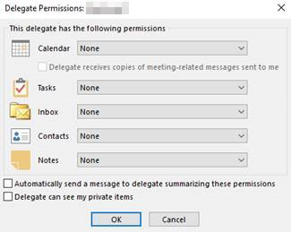
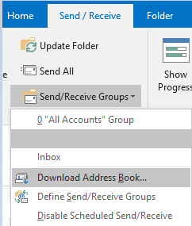

# Error viewing delegates in Outlook after a migration from on-premises to Exchange Online

## Symptoms

Assume that your mailbox is migrated from an on-premises Exchange environment to Microsoft Exchange Online. After you sign in to Microsoft Outlook, you may experience one of the following issues that affect the Outlook delegate feature:

- When you view the delegate permissions, a value of **None** is listed in the **Delegate Permissions** dialog box.

  

- When you try to remove or add a delegate, you receive the following error message:

  > The Delegates settings were not saved correctly. Unable to activate send-on-behalf-of list. You do not have sufficient permission to perform this operation on this object.

## Resolution

To resolve this issue after a move is made to Exchange Online from an on-premises environment, restart the Outlook client.

You can also force Outlook to download a new address book. To do this, select **Send / Receive** > **Send/Receive Groups** > **Download Address Book**.

Complete these steps to make sure that the Outlook client has the most up-to-date information.
