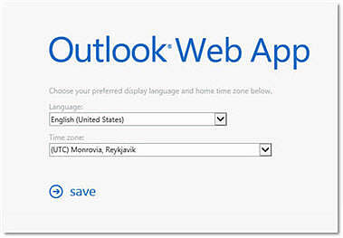

# The time zone setting in Outlook Web App in Office 365 is set incorrectly to (UTC) Monrovia, Reykjavik

## Problem

A Microsoft Office 365 user says that the time zone setting in Microsoft Outlook Web App is incorrect. Instead of being set to the user's current time zone, the time zone setting is set to **(UTC) Monrovia, Reykjavik**.

## Cause

This issue occurs if the user didn't set the time zone to the correct setting when he or she first signed in to Outlook Web App.

The first time that a user signs in to Outlook Web App, the user has to set his or her current time zone. If the user doesn't set the time zone, the time zone is set to **(UTC) Monrovia, Reykjavik**. There's no method for admins to set up the time zone setting in advance in Outlook Web App for all users.

The following screenshot shows the Outlook Web App sign-in screen in Office 365.

## Solution

Change the time zone to the correct setting in Outlook Web App. To do this, follow these steps.

1. Sign in to Outlook Web App, click **Settings**, and then click **Options**.
2. In the left navigation pane, click **Settings**, and then click **Regional**.
3. In the **Current time zone** box, click the arrow, and then click the correct time zone setting.
4. Click **Save**.
  
## More information

For more information about how to set the time zone in Outlook Web App, see [Regional settings](https://office.microsoft.com/redir/ha102908393.aspx).

For more information about incorrect time zone information in read receipts, see [Read receipt from an Office 365 recipient displays incorrect time zone information](/exchange/troubleshoot/outlook-on-the-web-issues/read-receipt-incorrect-timezone).

Still need help? Go to [Microsoft Community](https://answers.microsoft.com/).
