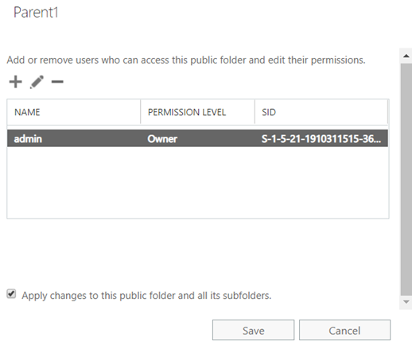

# Can't apply public folder permissions or other settings to subfolders in EAC

When you apply permissions or other settings to a public folder and its subfolders in the Exchange admin center (EAC), you experience the following issues.

## Permissions aren't applied to all or some subfolders

When you apply permissions to a public folder and its subfolders by selecting the **Apply changes to this public folder and all its subfolders** check box in the EAC, the permissions aren't applied to all or some subfolders.



### Cause

The issue occurs if the parent folder and its subfolders are in different public folder mailboxes.

### Workaround

To work around this issue, use the [Update-PublicFolderPermissions.ps1](https://www.microsoft.com/download/details.aspx?id=48689) script.

#### Example

```powershell
.\Update-PublicFolderPermissions.ps1 -IncludeFolders "\MyFolder" -AccessRights "Owner" -Users "John", "Administrator" -Recurse -Confirm:$false
```

This example script does the following:

- Replaces the current client permissions on the "\MyFolder" public folder and all its child folders for users "John" and "Administrator".
- Grants "Owner" access rights to the users.
- Don't request confirmation from the user.

> [!NOTE]
> If the public folders are active in Exchange Online, run the script from Exchange Online PowerShell. If they are active on-premises, run the script from Exchange Management Shell on the on-premises server.

The script has detailed help documentation. To view the documentation for the script, run the following command:

```powershell
Get-Help .\Update-PublicFolderPermissions.ps1 -Full
```

## Can't apply read setting to public folders in Exchange Online

When you select the **Apply the read and unread setting to this folder and all its subfolders** check box on a parent public folder in the EAC, you receive the following error message:

> The operation couldn't be performed because '\public folder identity' couldn't be found.

:::image type="content" source="media/can't-apply-permissions-settings-to-subfolders/public-folder-error.png" alt-text="Screenshot of the error when selecting the check box.":::

### Workaround

To work around this issue, follow these steps:

1. [Connect to Exchange Online PowerShell](/powershell/exchange/connect-to-exchange-online-powershell?view=exchange-ps&preserve-view=true).
2. Apply read and unread information tracking on the parent public folder by running the following cmdlet to set the `PerUserReadStateEnabled` value to **True**:

   ```powershell
   Set-PublicFolder -Identity "<\PF>" -PerUserReadStateEnabled $True
   ```

   > [!NOTE]
   > Replace \<\PF> with your parent public folder identity.

   Here's an example:

   ```powershell
   Set-PublicFolder -Identity \Marketing -PerUserReadStateEnabled $true
   ```

3. Apply read and unread information tracking on the child public folders by running the following cmdlet to set the `PerUserReadStateEnabled` value to **True**:

   ```powershell
   Get-PublicFolder "<\PF>" -GetChildren | foreach {Set-PublicFolder -Identity $_.identity -PerUserReadStateEnabled $True}
   ```

   > [!NOTE]
   > Replace \<\PF> with your parent public folder identity.

   Here's an example:

   ```powershell
   Get-PublicFolder \Marketing -GetChildren | foreach {Set-PublicFolder -Identity $_.identity -PerUserReadStateEnabled $True}
   ```

### Status

This issue is under investigation. We'll update the information when the issue is fixed.

## Can't apply age limit settings to subfolders

When you apply age limit settings to a public folder and its subfolders by selecting the **Apply setting to this folder and all its subfolders** check box in the EAC, you receive the following error message:

> The operation couldn't be performed because '\public folder identity' couldn't be found.

:::image type="content" source="media/can't-apply-permissions-settings-to-subfolders/set-age-limit-error.png" alt-text="Error when you apply age limit settings":::

### Workaround

To work around this issue, follow these steps:

1. [Connect to Exchange Online PowerShell](/powershell/exchange/connect-to-exchange-online-powershell?view=exchange-ps&preserve-view=true).
2. Run the following cmdlet to set age limit settings to subfolders:

   ```powershell
   Get-PublicFolder "<\ParentPF>" -Recurse | foreach {Set-PublicFolder -Identity $_.identity -AgeLimit "<newagelimit>"}
   ```

   For example, the following command applies an age limit of 10 days to all subfolders under Root1:

   ```powershell
   Get-PublicFolder \Root1 -Recurse | foreach {Set-PublicFolder -Identity $_.identity -AgeLimit "10.00:00:00"}
   ```
