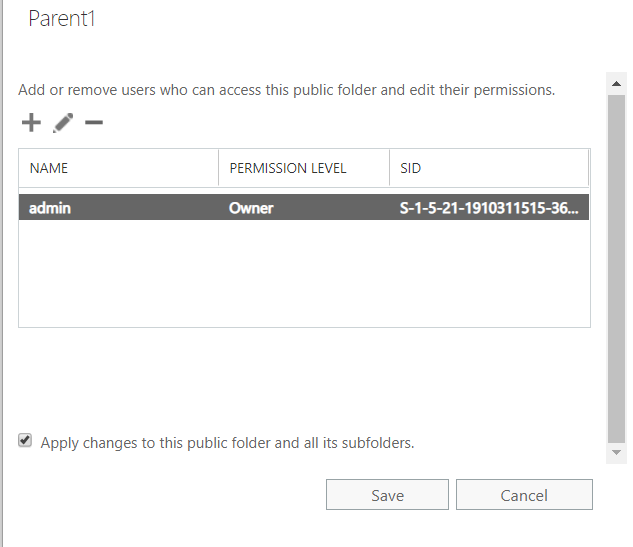

# Can't apply permissions to public folder subfolders in EAC

## Symptom

When you apply permissions to a public folder and its subfolders by selecting the **Apply changes to this public folder and all its subfolders** check box in the Exchange admin center (EAC), the permissions are not applied to all or some subfolders.



## Cause

The issue occurs if the parent folder and its subfolders reside in different public folder mailboxes.

## Workaround

To apply permissions to the parent folder and subfolders of the public folder, use the [Update-PublicFolderPermissions.ps1](https://www.microsoft.com/download/details.aspx?id=48689) script.

### Example

```powershell
.\Update-PublicFolderPermissions.ps1 -IncludeFolders "\MyFolder" -AccessRights "Owner" -Users "John", "Administrator" -Recurse -Confirm:$false
```

This example script does the following:

- Replaces the current client permissions on the "\MyFolder" public folder and all its child folders for users "John" and "Administrator".
- Grants "Owner" access rights to the users.
- Do not request confirmation from the user.

> [!NOTE]
> If the public folders are active in Exchange Online, run the script from Exchange Online PowerShell. If they are active on-premises, run the script from Exchange Management Shell on the on-premises server.

The script has detailed help documentation. To view the documentation for the script, run the following command:

```powershell
Get-Help .\Update-PublicFolderPermissions.ps1 -Full
```
