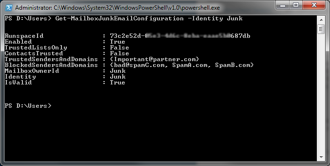

# How to set up safe senders and blocked senders in Office 365

## Introduction

When you set up safe senders and blocked senders for mailboxes in Microsoft Exchange Online in Microsoft Office 365, mailboxes store the safe senders and blocked senders for each user independently. This resembles the behavior in earlier versions of Microsoft Outlook.

After the settings are set up, they are persistent in Outlook and in Outlook Web App. Admins who have a hybrid deployment can set up the safe senders and blocked senders to match the settings that are applied by using Group Policy settings in Active Directory. Office 365 admins have to use Windows PowerShell in Exchange Online to set up these settings for user mailboxes.

> [!NOTE]
> The procedures in this article are intended for Office 365 admins. Individual users who want to make changes to safe senders and blocked senders should go to one of the following Microsoft websites:  
> - Outlook Web App: [Block or allow (junk email settings)](https://office.microsoft.com/office-online-help/block-or-allow-junk-email-settings-ha102908351.aspx)   
> - Outlook: [Overview of the Junk Email Filter](https://office.microsoft.com/outlook-help/overview-of-the-junk-email-filter-ha102748954.aspx)

## Procedure

Exchange Online admins must be assigned to the following management roles to set up the safe senders and blocked senders settings: 

- Organization Management
- Records Management
- Recipient Management
- Help Desk

### How to set up safe senders and blocked senders for a single user

1. Connect to Exchange Online by using remote PowerShell. For more info about how to do this, go to the following Microsoft website:

   [Connect to Exchange Online PowerShell](https://docs.microsoft.com/powershell/exchange/exchange-online/connect-to-exchange-online-powershell/connect-to-exchange-online-powershell?view=exchange-ps)

1. At the Windows PowerShell prompt, type the following command, and then press Enter:

   ```powershell
   Set-MailboxJunkEmailConfiguration -Identity <user@contoso.com> -BlockedSendersAndDomains "domainA.com",  "user@domainB.com","..." -TrustSendersAndDomains "domainC.com","user@domainD.com","..."
   ```
   > [!NOTE]
   > The *user@contoso.com* placeholder represents the user whose settings are being set up, and the "domainC.com","user@domainD.com","..." placeholder represents a list of domains or individual email addresses that must be added to the list. For example, the following command will block all email messages from "spamA.com" and accept all email messages from "john@spamB.com" for user@contoso.com:
   
   ```powershell
   Set-MailboxJunkEmailConfiguration -Identity <user@contoso.com> -BlockedSendersAndDomains "spamA.com" -TrustedSendersAndDomains john@spamB.com
   ```

### How to set up safe senders and blocked senders in bulk

1. Connect to Exchange Online by using remote PowerShell. For more info about how to do this, go to the following Microsoft website:
   
   [Connect to Exchange Online PowerShell](https://docs.microsoft.com/powershell/exchange/exchange-online/connect-to-exchange-online-powershell/connect-to-exchange-online-powershell?view=exchange-ps)

1. At the Windows PowerShell prompt, type the following command, and then press Enter:

   ```powershell
   Get-Mailbox | Set-MailboxJunkEmailConfiguration -BlockedSendersAndDomains "domainA.com", "user@domainB.com","..." -TrustedSendersAndDomains "domainC.com","user@domainD.com","..."
   ```
   > [!NOTE]
   > The *user@contoso.com* placeholder represents the user whose settings are being set up, and the "domainC.com","user@domainD.com","..." placeholder represents a list of domains or individual email addresses that must be added to the list. For example, the following command will block all email messages from "spamA.com" and accept all email messages from "john@spamB.com" for all the users in Contoso:

   ```powershell
   Get-Mailbox | Set-MailboxJunkEmailConfiguration -BlockedSendersAndDomains "spamA.com" -TrustedSendersAndDomains "john@spamB.com"
   ```

### How to check safe senders and blocked senders

To check that the safe senders and blocked senders settings were applied successfully, use the **Get-MailboxJunkEmailConfiguration** cmdlet to confirm the status of the list for any user. To do this, type the following command at the Windows PowerShell prompt, and then press Enter:

```powershell
Get-MailboxJunkEmailConfiguration -Identity <user@contoso.com>
```
> [!NOTE]
> The *user@contoso.com* placeholder represents any user in the organization.

An example of the results is as follows:



### How to update an existing safe sender and blocked sender list

After the list is set up, it may have to be updated in the future. When you update the list, you may want remove and to add email addresses or domains. Because these entries are stored as a multivalued variable, any changes that you make could potentially overwrite the previously configured entry items. To prevent this issue, store the existing mailbox configuration in a variable before you try to update the list. To do this, follow these steps:

1. Connect to Exchange Online by using remote PowerShell. For more info about how to do this, go to the following Microsoft website: 

   [Connect to Exchange Online PowerShell](https://docs.microsoft.com/powershell/exchange/exchange-online/connect-to-exchange-online-powershell/connect-to-exchange-online-powershell?view=exchange-ps)

1. Store the configuration in the **$Temp** variable. To do this, type the following PowerShell command at the prompt, and then press Enter: 
   
   ```powershell
   $Temp = Get-MailboxJunkEmailConfiguration <user@contoso.com>
   ```
   > [!NOTE]
   > The *user@contoso.com* placeholder represents the user whom you want to change.

1. Update the list in **$Temp**. To do this, use the "+=" operator to update **BlockedSendersandDomains** or the **TrustedSendersAndDomains** attributes. To do this, follow these steps:
  1. Type the following PowerShell command, and then press Enter to update the Blocked Senders list:
     
     ```powershell
     $Temp.BlockedSendersAndDomains += "domainC.com","user@domainD.com","..."
     ```

  1. Type the following PowerShell command, and then press Enter to update the Safe Senders list:

     ```powershell
     $Temp.TrustedSendersAndDomains += "domainC.com","user@domainD.com","..."
     ```

1. To commit the updates that were made to the variable **$Temp**, type the following PowerShell command, and then press Enter: 

   ```powershell
   Set-MailboxJunkEmailConfiguration -Identity <user@contoso.com> -BlockedSendersAndDomains $Temp.BlockedSendersAndDomains -TrustedSendersAndDomains $Temp.TrustedSendersAndDomains
   ```

> [!NOTE]
> To apply these changes to all users in an organization, follow the steps in the "How to configure safe senders and blocked senders in bulk" section of this article.

## More information

For more info about the PowerShell cmdlets that are used in these steps, go to the following Microsoft TechNet websites:

- [Get-MailboxJunkEmailConfiguration](https://technet.microsoft.com/library/dd979784.aspx)
- [Set-MailboxJunkEmailConfiguration](https://technet.microsoft.com/library/dd979780.aspx)

Still need help? Go to [Microsoft Community](https://answers.microsoft.com/).