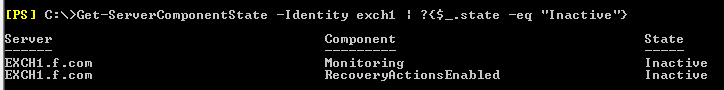
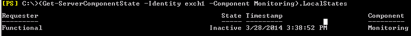
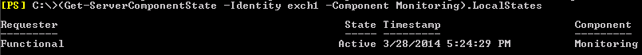

# Determine the requestor that changed Server component state

_Original KB number:_ &nbsp; 2958835

## Symptoms

In Microsoft Exchange Server 2013, you are trying to change state of server component to `Active` by using the `Set-ServerComponentState` command. The command completes without any error, however, component remains `Inactive`.

It mostly happens because the Requestor name provided in `Set-ServerComponentState` isn't matching the Requestor that changed the state originally.

## Resolution

In such scenario, use the following command to find the Requestor that has changed component state:

```powershell
(Get-ServerComponentState -Identity <ServerName> -Component <Component>).LocalStates
```

For example, in the following example, Monitoring and RecoveryActionsEnabled components are inactive.



Use the following command to find Requestor that change state of the Monitoring component to `Inactive`:

```powershell
(Get-ServerComponentState -Identity Exch1 -Component Monitoring).LocalStates
```



Now that you know the Requestor, use the following command to change the state of the Monitoring component to `Active`:

```powershell
Set-ServerComponentState -Identity Exch1 -Component Monitoring -State Active -Requester Functional
```

Verify the component is active by using the following command:

```powershell
Get-ServerComponentState -Identity exch1 -Component Monitoring).LocalStates
```



## References

For in depth understanding of Server component states in Exchange Server 2013, see [Server Component States in Exchange 2013](https://techcommunity.microsoft.com/t5/exchange-team-blog/server-component-states-in-exchange-2013/ba-p/591342).
