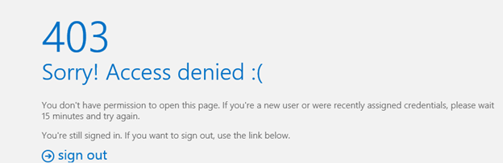

# Error occurs in EMS, EAC, ECP, OWA, or Outlook on the web in Exchange Server 2013 or Exchange Server 2016

_Original KB number:_ &nbsp;2898571

## Symptoms

You may experience one or more of the following issues in Microsoft Exchange Server 2013 or Exchange Server 2016:

- When you try to start the Exchange Management Shell (EMS), you receive an error message like this:

    ```console
    VERBOSE: Connecting to Cas1.Fabrikam.com.
    New-PSSession : [cas1.fabrikam.com] Connecting to remote server cas1.fabrikam.com failed with the following error
    message : [Server=CAS1,RequestId=1694d4e1-3f45-4ff3-bfca-7ded20aaa838,TimeStamp=10/4/2013 2:15:34 PM] Access is
    denied.

    For more information, see the about_Remote_Troubleshooting Help topic.
    At line:1 char:1
    + New-PSSession -ConnectionURI "$connectionUri" -ConfigurationName Microsoft.Excha ...
    + ~~~~~~~~~~~~~~~~~~~~~~~~~~~~~~~~~~~~~~~~~~~~~~~~~~~~~~~~~~~~~~~~~~~~~~~~~~~~~~~~
        + CategoryInfo          : OpenError: (System.Manageme....RemoteRunspace:RemoteRunspace) [New-PSSession], PSRemotin
       gTransportException
        + FullyQualifiedErrorId : -2144108477,PSSessionOpenFailed
    ```

- When you try to sign in to Exchange Admin Center (EAC) or Exchange Control Panel (ECP), you receive an error message like this:

    

    Additionally, the following event is logged in the Application log:

    ```console
    Log Name:      Application
    Source:        MSExchange Control Panel
    Event ID:      4
    Task Category: General
    Level:         Error
    Keywords:      Classic
    User:          N/A
    Computer:      MBX1.Fabrikam.com
    Description:
    Current user: 'FAB\CAS1$'
    Request for URL 'https://mbx1.fabrikam.com:444/ecp/default.aspx(https://cas1.fabrikam.com/ecp/)' failed with the following error:
    Microsoft.Exchange.Configuration.Authorization.CmdletAccessDeniedException: The user "Fabrikam.com/Computers/CAS1" isn't assigned to any management roles.
    ```

- When users try to sign in to Outlook Web App (OWA) or Outlook on the web, they receive an error message like this:

    

## Cause

These issues occur if the "deny" permission is effective on the `ms-Exch-EPI-Token-Serialization` user right on a computer object that has an Exchange Server 2013 or Exchange Server 2016 role assigned.

> [!NOTE]
> Typically, this issue occurs if a computer object is added to a group that's denied the `ms-Exch-EPI-Token-Serialization` user right. By default, the following groups are denied the `ms-Exch-EPI-Token-Serialization` user right:
>  
> - Domain Admins
> - Schema Admins
> - Enterprise Admins
> - Organization Management

## Resolution

To resolve this issue, remove the computer object from the restricted group.

> [!NOTE]
> To resolve this issue, you may have to restart the computer that has the Exchange Server role assigned.

## More information

To determine the group memberships for the computer that's running Exchange Server 2013 or Exchange Server 2016, open a command prompt, type the following command, and then press Enter:

```console
gpresult /scope computer /r
```

In this example, the computer that's running Exchange Server 2013 has the following default group memberships:

:::image type="content" source="media/error-occur-ems-eac-owa/output-gpresult-cmdlet.png" alt-text="Screenshot of output for the gpresult cmdlet.":::

In the following example, the computer was added to the "Exchange Trusted Subsystem" group. The "Exchange Trusted Subsystem" group was then added to the "Domain Admins" group:

:::image type="content" source="media/error-occur-ems-eac-owa/output-gpresult-cmdlet-when-groups-nested.png" alt-text="Screenshot of Output for the gpresult cmdlet when groups are nested.":::

To view all the users and groups that are denied permissions on the Exchange computer object, run the following cmdlet:

```powershell
Get-ADPermission -Identity <ExchangeComputerObject> | where {($_.ExtendedRights -like "ms-Exch-EPI-Token-Serialization") -and ($_.Deny -like "True")} | ft -autosize User,ExtendedRights
```
