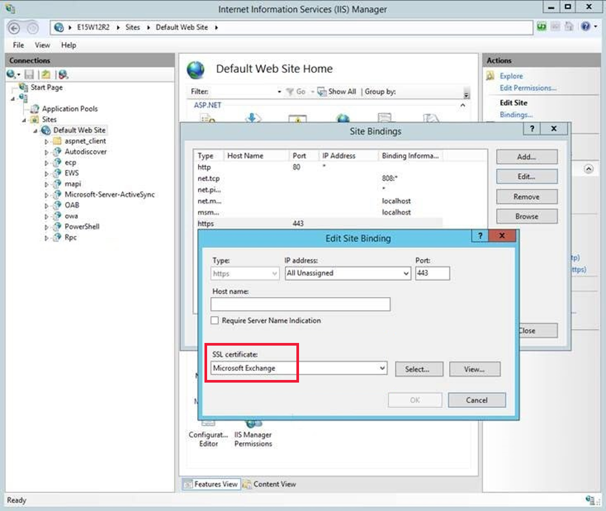
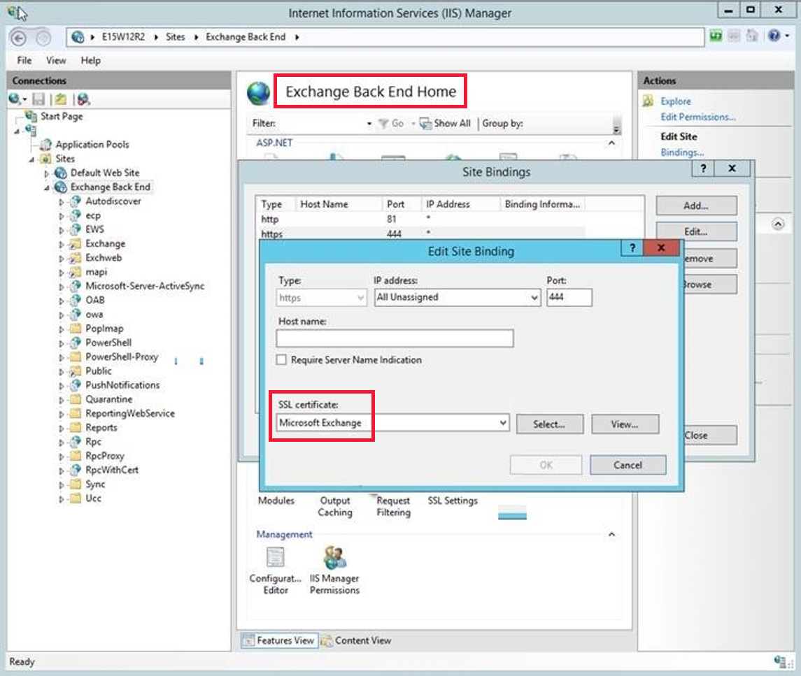

# Repair failed installations of Exchange Cumulative and Security updates

This article describes the methods to verify the installation of Microsoft Exchange Server Cumulative Updates (CUs) and Security Updates (SUs) on your servers, lists known issues that you might encounter when installing CUs and SUs, and provides resolutions to fix the issues.

## Assess the health of on-premises Exchange Servers

</br>
<details>
<summary>Check for Indicators of Compromise (IOCs)</summary>
</br>

Use the following script which automates testing for all four vulnerabilities described in the [Microsoft Threat Intelligence Center (MSTIC) blog post](https://www.microsoft.com/security/blog/2021/03/02/hafnium-targeting-exchange-servers/). The script provides a progress bar and performance tweaks to make the test for CVE-2021-26855 test run fast. Download the latest version of the script from the Exchange Support GitHub repository [aka.ms/TestProxyLogon](https://aka.ms/TestProxyLogon).  
</br>
</details>

<details>
<summary>Verify the installation of CUs & SUs</summary>

### Option 1 (Recommended)

Run the [HealthChecker script](https://aka.ms/exchangehealthchecker) and check the build number.


### Option 2

Run the following command and verify that the file version in the output matches the information in the table below.

```powershell
Get-Command Exsetup.exe | ForEach {$_.FileVersionInfo}
```

| Exchange version  | Patched systems file versions  |
|---|---|
| Exchange Server 2019  | For CU7: 15.02.0721.013</br>For CU8: 15.02.0792.010|
| Exchange Server 2016  | For CU18: 15.01.2106.013</br>For CU19: 15.01.2176.009|
| Exchange Server 2013  | For CU23: 15.00.1497.012  |

</details>

## Resolve errors during CU or SU installation

</br>
<details>
<summary>HTTP 500 errors in OWA or ECP</summary>
</br>

**Issue**

HTTP 500 errors might occur in Outlook on the Web (OWA) and Exchange Control Panel (ECP) after updates are installed. After you provide credentials to log on to OWA or ECP, the login process may fail with an error message similar to the following:

> Could not load file or assembly Microsoft.Exchange.Common, Version=15.0.0.0, Culture=neutral, PublicKeyToken=31bf3856ad364e35' or one of its dependencies. The system cannot find the file specified.

**Resolution**

Run the following scripts to restore the configuration for OWA and ECP:

`.\UpdateCas.ps1` and `.\UpdateConfigFiles.ps1`.

The scripts are located in the following path: \Program Files\Microsoft\Exchange Server\v15\Bin\ directory.

**Note**: For Exchange Server 2010, the path will use “V14“ instead of “V15”.

Then open a command prompt as administrator and run `iisreset`.

For more information, see [OWA or ECP stops working after you install a security update](https://docs.microsoft.com/exchange/troubleshoot/client-connectivity/owa-stops-working-after-update).

</br>
</details>

<details>
<summary>Missing images in ECP</summary>
</br>

**Issue**

After installating the SU, OWA or ECP may not display images.

**Cause**

This issue occurs if the SU is not installed properly.

**Resolution**

Uninstall and reinstall the MSP by running the update from an administrative command prompt. Then reboot the server after the installation is complete.
</br>
</details>

<details>
<summary>Blank page in EAC or OWA</summary>
</br>

**Issue**

A blank page displays when you log in to the Exchange Admin Center (EAC) or OWA from Exchange Server 2016 or Exchange Server 2013. When this issue occurs, event ID 15021 may be logged.  

**Cause**

This issue occurs if the SSL binding on 0.0.0.0:444 has one or more of the following problems:  

- The binding is installed incorrectly  
- The binding doesn’t have a certificate assigned.  
- The binding contains incorrect information.  

**Resolution**

1. On the Client Access Server (CAS), open Internet Information Services (IIS).  

2. Expand **Sites**, select **Default Web Site**, and then click **Bindings** on the **Actions** pane.  

3. In the **Site Bindings** dialog box, open the binding for the following values: </br>
   **Type**: **https**; **Port**: **443**.  

4. Check whether a valid SSL certificate is specified for the default web site. If not, specify a valid SSL certificate, such as **Microsoft Exchange**, and select **OK**.

5. Run the following command in an elevated PowerShell window to restart IIS:

   ```Powershell
   Restart-Service WAS,W3SVC  
   ```

     

6. On the Mailbox server, perform the verification steps 1 through 5 for the **Exchange Back End** site.

      

For more information, see [this article](/topic/you-get-a-blank-page-after-logging-in-eac-or-owa-in-exchange-2013-or-exchange-2016-a24db2f2-4d67-806b-670b-efb8f08605f7).

</br>
</details>

<details>
<summary>Can't access EAC or OWA after Exchange installation</summary>
</br>

**Issue**

When installing Exchange Server 2016 or Exchange Server 2013, the installation process might have failed or been interrupted at some stage, then resumed and finally completed successfully. However, when you try to access EAC or OWA, you receive the following error message:

> :-(  
something went wrong

Sorry, we can't get that information right now. Please try again later. If the problem continues, contact your helpdesk.

**Cause**

This issue occurs if the SharedWebConfig.config file is missing from one of the following locations:

- C:\Program Files\Microsoft\Exchange Server\V15\ClientAccess
- C:\Program Files\Microsoft\Exchange Server\V15\FrontEnd\HttpProxy

**Resolution**

Do the following:

1. On the server in which the error is occurring, identify the location where the SharedWebConfig.config file is missing.
2. Generate the missing file:

    1. Run `cd %ExchangeInstallPath%\bin` to change the current directory to the bin folder which is under the Exchange installation path.
    2. Use the DependentAssemblyGenerator.exe tool to generate the file as appropriate:

        - If the file is missing from *C:\Program Files\Microsoft\Exchange Server\V15\ClientAccess*, run the following command:

        ```console
        DependentAssemblyGenerator.exe -exchangePath "%ExchangeInstallPath%\bin" -exchangePath "%ExchangeInstallPath%\ClientAccess" -configFile "%ExchangeInstallPath%\ClientAccess\SharedWebConfig.config"
        ```

        - If the file is missing from *C:\Program Files\Microsoft\Exchange Server\V15\FrontEnd\HttpProxy*, run the following command:

        ```console
        DependentAssemblyGenerator.exe -exchangePath "%ExchangeInstallPath%\bin" -exchangePath "%ExchangeInstallPath%\FrontEnd\HttpProxy" -configFile "%ExchangeInstallPath%\FrontEnd\HttpProxy\SharedWebConfig.config"
        ```

3. Restart the server or open an elevated PowerShell session and run the following command:

    ```Powershell
    Restart-Service WAS,W3SVC
    ```

    For more information, see [this article](/exchange/troubleshoot/client-connectivity/event-1309-code-3005-cannot-access-owa-ecp).

</br>
</details>

<details>
<summary>Exchange Server setup does not run</summary>
</br>

**Issue**

Consider the following scenario:

You run an unattended installation to upgrade Microsoft Exchange Server 2019, Microsoft Exchange Server 2016, or Microsoft Exchange Server 2013 from PowerShell or command prompt using setup.exe. The Setup program starts and may indicate that it has completed successfully. However, Exchange isn't actually updated.

The Setup media is located on D: drive and the unattended installation is started as</br>
"`setup.exe /m:upgrade /IAcceptExchangeServerLicenseTerms`" (from PowerShell or command prompt) instead of</br>
"`.\setup.exe /m:upgrade /IAcceptExchangeServerLicenseTerms`" (from PowerShell) or</br>
"`D:\setup.exe /m:upgrade /IAcceptExchangeServerLicenseTerms`" (from PowerShell or command prompt).

**Cause:**  

When you run a command in PowerShell or command prompt, the paths in the System environment variable "Path" are checked first to verify the command to be executed, before the current path in PowerShell or command prompt is checked. This order of checks is followed unless the following conditions are true:

- ".\" is entered in front of the command or program being executed in PowerShell.
- The Tab key is used to automatically add ".\" in front of the command or program being executed in PowerShell.
- The full path is used to run setup.exe (for example "`D:\setup.exe /m:upgrade /IAcceptExchangeServerLicenseTerms`") in PowerShell or command prompt.

In the absence of these conditions, another setup.exe file located in `C:\Program Files\Microsoft\Exchange Server\V15\bin` is found and executed by PowerShell instead of the setup.exe in the correct path.

**Resolution:**  

Run the upgrade by using "`.\setup.exe /m:upgrade /IAcceptExchangeServerLicenseTerms`" (PowerShell) or "`D:\setup.exe /m:upgrade /IAcceptExchangeServerLicenseTerms`" (PowerShell and command prompt).

For more information, see [this article](https://docs.microsoft.com/exchange/troubleshoot/setup/ex2019-setup-does-not-run-correctly-started-powershell).

</br>
</details>

<details>
<summary>Upgrade patch can't be installed</summary>
</br>

**Issue**

You might see the following error message when installing the SU:

>The upgrade patch cannot be installed by the Windows Installer service because the program to be upgraded may be missing, or the upgrade patch may update a different version of the program. Verify that the program to be upgraded exists on your computer and that you have the correct upgrade patch.

Cause
This error message displays if the versions of the CU and SU don't match.

**Resolution**

Either upgrade to the correct CU or download the correct SU for the intended CU.

</br>
</details>

<details>
<summary>Installation fails due to running services</summary>
</br>

**Issue**

The installation fails because services didn't stop properly.

**Resolution**

Use the best practice to reboot the server before installing the CU or SU. For the antivirus software you're running, set proper [exclusions](https://docs.microsoft.com/Exchange/antispam-and-antimalware/windows-antivirus-software?view=exchserver-2019&preserve-view=true) or consider turning it off for the duration of the setup. In some cases where services still don't stop or start as expected, try the following:

1. Rename the C:\ExchangeSetupLogs folder (for example, ExchangeSetupLogs-OLD).
2. Change the startup type for Exchange services in the services.msc console to **Automatic**.

    **Note**: Do so only for the Exchange services that were active prior to the setup attempt. The POP3 and IMAP4 services are stopped by default and need to run only if there are users who need them.

3. Try the setup again.
The setup process might get interrupted in a phase in which services are already disabled. Restarting it in this updated phase may record the “before” state of services as disabled and try to restore this state.

</br>
</details>

<details>
<summary>Services don't start after SU installation</summary>
</br>

**Issue**

Exchange services don't start after you complete installing the SU installation.

**Resolution**

Check the state of the services. If they are **Disabled**, set them to **Automatic** and start them manually.

**Note**: The services **MSExchangeIMAP4**, **MSExchangeIMAP4BE**, **MSExchangePOP3** and **MSExchangePOP3BE** are typically disabled by default. Check the Exchange log located at `C:\ExchangeSetupLogs\ServiceControl.log` to see which services were disabled during the SU installation.

</br>
</details>

<details>
<summary>Error during Setup</summary>
</br>

**Issue**

You receive the following error message during Setup in the Setup logs:

>Setup encountered a problem while validating the state of Active Directory or Mailbox Server Role isn’t installed on this computer.

**Resolution**

Download and run the Exchange Setup log reviewer script [SetupLogReviewer.ps1](https://aka.ms/ExSetupScripts). This script reviews the ExchangeSetup.log, determines whether this error is a known issue and presents an action you can take to resolve the issue.
After you download the script, point it to the Exchange Setup log as shown below and review the output.

````powershell
.\SetupLogReviewer.ps1 -SetupLog C:\ExchangeSetupLogs\ExchangeSetup.log
````

Alternatively you can review the log located at `C:\ExchangeSetupLogs\ExchangeSetup.log` for the following error:

"Setup encountered a problem while validating the state of Active Directory: Exchange organization-level objects have not been created, and setup cannot create them because the local computer is not in the same domain and site as the schema master. Run setup with the /prepareAD parameter on a computer in the domain \<domainnname> and site \<Default-First-Site-Name>, and wait for replication to complete."

If you find this error, run the following command from a machine which is in the same domain as the schema master.

`.\setup.exe /PrepareAD /IAcceptExchangeServerLicenseTerms`

**Note**: The machine must be a member of the **Enterprise Admin**, **Domain Admin**, and **Schema Admin** groups.

To find the Domain Controller (DC) which holds the schema master, run the following command from administrative command prompt on the DC:

`netdom query fsmo`.

</br>
</details>

<details>
<summary>Error during update rollup installation</summary>
</br>

**Issue**

When you install the update rollup on a computer that isn’t connected to the internet, you may experience a long installation delay. Additionally, you may receive the following error message:

>Creating Native images for .Net assemblies.

**Cause**

This issue is caused by the network requests to connect to the following URL:

``http://crl.microsoft.com/pki/crl/products/CodeSigPCA.crl``

The network requests are attempts to access the certificate revocation list for each assembly for which Native image generation (Ngen) compiles to native code. Because the server that’s running Exchange Server isn’t connected to the internet, each request must wait to time out before the process can continue.

**Resolution**

Do the following:

1. In Internet Explorer, select **Tools** > **Internet Options**.
2. Select the **Advanced** tab.
3. In the **Security** section, clear the **Check for publisher’s certificate revocation** check box, and then select **OK**.

    > [!NOTE]
    > Clear this security option only if the computer is in a tightly-controlled environment.
  
4. After the Setup process completes, select the **Check for publisher’s certificate revocation** check box again.

</br>
</details>

<details>
<summary>Setup fails with "Cannot start the service" error</summary>
</br>

**Issue**

The CU setup might fail with the following error message:
>Cannot start the service Microsoft Exchange Service Host

You might find that the Microsoft Exchange Service Host and/or all other Exchange services are stopped and in **Disabled** mode.

**Resolution**

Do the following:

1. Rename the C:\ExchangeSetupLogs folder (for example, ExchangeSetupLogs-OLD).
2. Change the startup type for all Exchange services in the services.msc console to **Automatic**.
3. Assuming that the Exchange CU media is on D: drive, open a command prompt as administrator and resume setup by using the following command:
`D:\setup.exe /m:upgrade /IAcceptExchangeServerLicenseTerms`

</br>
</details>


<details>
<summary>SU installation fails due to IU</summary>
</br>

**Issue**

During the SU installation, you might see the following error message:

>Installation cannot continue. The Setup Wizard has determined that this Interim Update is incompatible with the current Microsoft Exchange Server 2013 Cumulative Update 23 configuration.

**Resolution**

Uninstall the previously installed Interim Update (IU) before applying this SU because the updates are cumulative. You can find previous IUs in **Add/Remove programs**.

</br>
</details>

<details>
<summary>Setup installs older CU or fails to install language pack</summary>
</br>

**Issue**

You're upgrading to the latest CU but Setup either displays that it is installing an existing CU on the server OR fails with the following error message:

> Couldn't open package **'C:\Program Files\Microsoft\Exchange Server\V15\bin\Setup\\\<package name>**. This installation package could
not be opened. Verify that the package exists and that you can access it, or contact the application vendor to verify that this is a valid Windows Installer package. Error code is 1619.

**Cause**

These issues occur if you start the installation from Windows PowerShell and use the Setup.EXE command.

**Resolution**

If the Exchange CU media is on D: drive, run an upgrade using PowerShell by using either of the following commands:
"`.\setup.exe /m:upgrade /IAcceptExchangeServerLicenseTerms`" (PowerShell) or "`D:\setup.exe /m:upgrade /IAcceptExchangeServerLicenseTerms`" (PowerShell and command prompt)

</br>
</details>

<details>
<summary>Restart fom previous installation is pending</summary>
</br>

**Issue**

You keep getting the following error message even after restarting the server several times:

> Microsoft Exchange Server setup cannot continue because a restart from a previous installation or update is pending.

**Resolution**

Follow the information provided in [A Restart from a Previous Installation is Pending](/previous-versions/office/exchange-server-analyzer/cc164360(v=exchg.80)) to fix the issue.

</br>
</details>

## Additional information

</br>
<details>
<summary>Update .NET when migrating from an unsupported CU</summary>
</br>

If you're upgrading Exchange Server from an unsupported CU to the current CU and no intermediate CUs are available, you should first upgrade to the latest version of .NET that's supported by your version of Exchange Server and then immediately upgrade to the current CU. This method doesn't replace the need to keep your Exchange servers up to date and on the latest supported CU. Microsoft makes no claim that an upgrade failure will not occur by using this method, which may result in the need to contact Microsoft Support Services.

> [!IMPORTANT]
> Versions of the .NET Framework that aren't listed in the tables in the [Exchange Server supportability matrix](/Exchange/plan-and-deploy/supportability-matrix?view=exchserver-2019#exchange-2019&preserve-view=true) are not supported on any version of Exchange. This includes minor and patch-level releases of the .NET Framework.  

Follow these steps to install the latest version of the .NET Framework:

1. Put the Server into [Maintenance Mode](/Exchange/high-availability/manage-ha/manage-dags?redirectedfrom=MSDN&view=exchserver-2019#performing-maintenance-on-dag-members&preserve-view=true).
    Run the following command:

    `set-servercomponentstate \<server_name\> -Component serverwideoffline -State inactive -Requester Maintenance`

2. Stop all Exchange Services by using either the Services MMC or PowerShell. If you want to use PowerShell, run the following command twice to stop all Exchange
    services:

    `Get-service \*exch\* \| stop-service`

    **Note**: It is not recommended to use the -Force command to stop all the services.

3. Download and install the correct version of the .NET Framework according to the [Exchange Server supportability matrix](/exchange/plan-and-deploy/supportability-matrix?view=exchserver-2019#exchange-2019&preserve-view=true).

4. After the installation is complete, reboot the server.

5. Update to the newest CU available for Exchange 2013, 2016, or 2019.

6. Reboot the server after the CU is installed.

7. Ensure all Exchange services are in their normal start mode and have started. You can use PowerShell to run the following command to start them:

    `Get-service \*exch\*`

8. Take the server out of [Maintenance Mode](/Exchange/high-availability/manage-ha/manage-dags?redirectedfrom=MSDN&view=exchserver-2019#performing-maintenance-on-dag-members&preserve-view=true). Run the following command:

    `set-servercomponentstate \<server_name\> -Component serverwideoffline -State active - Requester Maintenance`

</br>
</details>

<details>
<summary>Handle customized OWA or .config  files</summary>
</br>

> [!IMPORTANT]
> Before you apply a CU, make a backup copy of your customized files.

When you apply a CU (for Exchange Server 2013, 2016 or 2019) or Rollup package (for Exchange Server 2010), the process updates OWA files and .config files if required. As a result, any customization that you may have made to Exchange or Internet Information Server (IIS) settings in Exchange XML application configuration files on the Exchange server will be overwritten when you install an Exchange CU. Examples of such application configuration files include web.config files, EdgeTransport.exe.config files, and any customized logon.aspx Outlook on the web files.. Make sure to save this information so you can easily re-apply the settings after the CU is installed.

</br>
</details>

<details>
<summary>Install the update for CAS-CAS Proxying deployment</summary>
</br>

If your scenario meets both the following conditions, apply the update rollup on the internet-facing CAS before you apply the update rollup on the non–internet-facing CAS:

- You’re a CAS Proxy Deployment Guidance customer.
- You have deployed [CAS-CAS proxying](https://docs.microsoft.com/previous-versions/exchange-server/exchange-140/bb310763(v=exchg.140)?redirectedfrom=MSDN).

> [!NOTE]
> For other Exchange Server 2010 configurations, you don’t have to apply the update rollup on your servers in a specific order.

</br>
</details>

<details>
<summary>Install the update on DBCS version of Windows Server 2012</summary>
</br>

To install or uninstall Update Rollup 32 for Exchange Server 2010 SP3 on a Double Byte Character Set (DBCS) version of Windows Server 2012, the language preference for non-Unicode programs should not be set to the default language. If it is, then you must change this setting before beginning the installation.

1. In Control Panel, select **Clock, Region and Language** > **Region** > **Administrative**.
2. In the **Language for non-Unicode programs** area, select **Change system locale**.
3. In the **Current system locale** list, select **English (United States)**, and then select **OK**.

Now you can install or uninstall Update Rollup 32 as needed. After the process completes, revert the language setting as appropriate.

</br>
</details>
