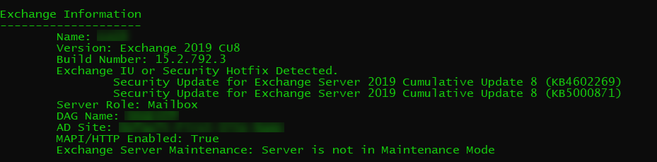

# Issues due to Exchange Server security updates

This article provides a list of known issues that users might encounter when installing Cumulative Updates (CUs) and Security Updates (SUs) for the versions of Microsoft Exchange Server specified in the Applies to section.

## Checking vulnerabilities and verify the update installation

### Script for checking Vulnerabilities
This script automates all four of the commands found in the [Hafnium blog post](https://www.microsoft.com/security/blog/2021/03/02/hafnium-targeting-exchange-servers/) . It also has a progress bar and some performance tweaks to make the CVE-2021-26855 test run much faster. You can download the latest script at [Exchange Support GitHub repository](https://github.com/microsoft/CSS-Exchange/tree/main/Security).

### Customized OWA or .config files

> [!IMPORTANT]
> This article applies to clients running Windows 7, Windows Server 2008 R2, and later versions of both operating systems.

When you apply a Cumulative Update (for Exchange Server 2013, Exchange Server 2016 or Exchange Server2019) or Rollup package (for Exchange Server2010), the update process updates the Outlook on the web files and .config files if required. Any customized Exchange or Internet Information Server (IIS) settings that you made in Exchange XML application configuration files on the Exchange server (for example, web.config files, EdgeTransport.exe.config files, any [customized logon.aspx Outlook on the web files](https://docs.microsoft.com/previous-versions/exchange-server/exchange-140/ee633483(v=exchg.140)?redirectedfrom=MSDN) will be overwritten when you install an Exchange CU. Be sure save this information so you can easily re-apply the settings after the install. After you install the Exchange CU, you need to re-configure these settings.

### How to confirm the installation of Security Updates completed successfully

### Option 1 (recommended)

 Run the [HealthChecker script](https://aka.ms/exchangehealthchecker) and check the Build number.
 
 

### Option 2

Run the following command and check and make sure if file version is matching with below table:

```
Get-Command Exsetup.exe | ForEach {$_.FileVersionInfo}
```

| Exchange version  | Patched systems file versions  |
|---|---|
| Exchange Server 2019  |  For CU7: 15.02.0721.013</br> For CU8: 15.02.0792.010|
| Exchange Server 2016  |  For CU18: 15.01.2106.013</br>For CU19: 15.01.2176.009|
| Exchange Server 2013  | For CU23: 15.00.1497.012  |

## Resolution to the issues

### OWA or ECP 500 errors

**Issue**

OWA and ECP may experience HTTP 500 errors after installation. After providing credentials to log on to OWA/ECP, it may fail with an error similar to:

>Could not load file or assembly Microsoft.Exchange.Common, Version=15.0.0.0, Culture=neutral, PublicKeyToken=31bf3856ad364e35' or one of its dependencies. The system cannot find the file specified.

**Resolution**

If this occurs, run the following scripts to restore the configuration for OWA and ECP.
The scripts can be found in the folder: \Program Files\Microsoft\Exchange Server\v15\Bin\ directory. (Where “V15“ will be “V14” for Exchange 2010)
The scripts are located in the following location: \Program Files\Microsoft\Exchange Server\v15\Bin\ directory. Where “V15“ will be “V14” for Exchange 2010.

Run the scripts `.\UpdateCas.ps1` and `.\UpdateConfigFiles.ps1`.

Then go to a command prompt as administrator and run `iisreset`.

If this fails please review and follow the steps in [this Docs article](https://docs.microsoft.com/exchange/troubleshoot/client-connectivity/owa-stops-working-after-update).

### ECP Missing Images

**Issue**

After Security Update installation, OWA or ECP may show missing images similar to the below:
‎

**Resolution**

 The SU was not installed properly. Make sure to always follow the best practice by running the update from an administrative command prompt and then reboot after the application. To mitigate this issue the MSP will need to be uninstalled and reinstalled using the best practices from above.

### The upgrade patch cannot be installed by the Windows Installer service

**Issue**

This error may be seen when installing the Security Update:

>The upgrade patch cannot be installed by the Windows Installer service because the program to be upgraded may be missing, or the upgrade patch may update a different version of the program. Verify that the program to be upgraded exists on your computer and that you have the correct upgrade patch.

**Resolution**

This means the Cumulative Update or Security Update version mismatch and it did not meet the requirements. You need to upgrade to the correct Cumulative Update first or validate that you have downloaded the correct Cumulative Update for your intended Cumulative Update.

### Installation fails because service cannot stop properly

**Issue**

The Installation fails because services cannot stop properly.

**Resolution**

Try the best practice to reboot the server first before installing the Cumulative Update or Security Update. Also make sure anti-virus is ruled out (set proper [exclusions](https://docs.microsoft.com/Exchange/antispam-and-antimalware/windows-antivirus-software?view=exchserver-2019&preserve-view=true) or consider turning it off for the time of the installation). In some cases where services still wouldn’t stop/start as expected, try the following steps:

1. Rename the C:\ExchangeSetupLogs folder (such as ExchangeSetupLogs-OLD)
2. Change the startup type of Exchange services in the services.msc console to Automatic (note: do this only for the Exchange services which were active prior to the setup attempt. POP3 and IMAP4 are stopped by default and only need to run if there are indeed any users who need them).
3. Run setup again.
The reason is that setup may get interrupted in a phase where services are already disabled. Starting setup again in this phase may record the “before” state of services as disabled and will try to restore this state.

### Services are not started after Security Update installation is completed

**Issue**

Services are not started after Security Update installation is completed.

**Resolution**

After the application of the security update, you notice that the Exchange services are not starting, check the service state, if they are Disabled, set them to Automatic and start them manually. Please note that the services **MSExchangeIMAP4**, **MSExchangeIMAP4BE**, **MSExchangePOP3** and **MSExchangePOP3BE** are typically disabled by default you can refer to the log `C:\ExchangeSetupLogs\ServiceControl.log` to see what was disabled during setup by searching for Disabling services.

### Error during Setup: Setup encountered a problem while validating the state of Active Directory or Mailbox Server Role Isn’t Installed on this Computer

**Issue**

You receive the following error during Setup: 

>Setup encountered a problem while validating the state of Active Directory or Mailbox Server Role Isn’t Installed on this Computer.

**Resolution**

If the above are seen in the setup logs, consider running [Exchange Setup log reviewer script](https://github.com/microsoft/CSS-Exchange/blob/main/Setup/SetupLogReviewer.ps1)This script reviews the ExchangeSetup.log and determines if it is a known issue and reports an action to take to resolve the issue.

Also see `C:\ExchangeSetupLogs\ExchangeSetup.log` for the following error:

"Setup encountered a problem while validating the state of Active Directory: Exchange organization-level objects have not been created, and setup cannot create them because the local computer is not in the same domain and site as the schema master.  Run setup with the /prepareAD parameter on a computer in the domain domainnname and site Default-First-Site-Name, and wait for replication to complete."

If the error exists, then run `.\setup.exe /PrepareAD /IAcceptExchangeServerLicenseTerms` from a machine in the same domain as the schema master (user must be a member of the **Enterprise Admin**, **Domain Admin**, and **Schema Admin**)
To find the DC that holds the schema master run the following from administrative command prompt on the DC: `netdom query fsmo`.

### Error during install: Creating Native images for .NET assemblies.

**Issue**

When you install this update rollup on a computer that isn’t connected to the internet, you may experience a long installation time. Additionally, you may receive the following message:

>Creating Native images for .Net assemblies.

**Resolution** 

This issue is caused by network requests to connect to the following website:
‎
[http://crl.microsoft.com/pki/crl/products/CodeSigPCA.crl](http://crl.microsoft.com/pki/crl/products/CodeSigPCA.crl)
These network requests are attempts to access the certificate revocation list for each assembly that native image generation (Ngen) compiles to native code. However, because the server that’s running Exchange Server isn’t connected to the internet, each request must wait to time out before the process can continue.

To fix this issue, follow these steps:
1. In Internet Explorer, select Internet Options on the Tools menu, and then select Advanced.
‎ 2. In the Security section, clear the Check for publisher’s certificate revocation check box, and then select OK.
‎ Note : Clear this security option only if the computer is in a tightly-controlled environment.
‎ 3. When the Setup process is finished, select the Check for publisher’s certificate revocation check box again.

### Security Update Installation fails due to previous IU installation

**Issue**

You may see the following error: 

>Installation cannot continue. The Setup Wizard has determined that this Interim Update is incompatible with the current Microsoft Exchange Server 2013 Cumulative Update 23 configuration.

**Resolution** 

You need to uninstall the previous installed IU before applying this SU as it is cumulative. You can find previous IU’s in add/remove programs.

## Additional information for installing the update

### How to install this update for customers who deploy CAS-CAS Proxying - CAS Proxy Deployment Guidance in Exchange 2010

If your scenario meets both the following conditions, apply the update rollup on the internet-facing Client Access servers (CAS) before you apply the update rollup on the non–internet-facing CAS: 
- You’re a CAS Proxy Deployment Guidance customer.
- You have deployed [CAS-CAS proxying](https://docs.microsoft.com/previous-versions/exchange-server/exchange-140/bb310763(v=exchg.140)?redirectedfrom=MSDN).

> [!NOTE]
> For other Exchange Server 2010 configurations, you don’t have to apply the update rollup on your servers in any particular order.

### How to install this update on a DBCE version of Windows Server 2012

You can’t install or uninstall Update Rollup 32 for Exchange Server 2010 SP3 on a double byte character set (DBCS) version of Windows Server 2012 if the language preference for non-Unicode programs is set to the default language. To work around this issue, you must first change this setting. To do this, follow these steps:

1. In Control Panel, select **Clock, Region and Language**, select **Region**, and then select **Administrative**.
2. In the **Language for non-Unicode programs** area, select **Change system locale**.
3. In the **Current system locale** list, select **English (United States)**, and then select **OK**.

After you successfully install or uninstall Update Rollup 32, revert this language setting, as appropriate.
