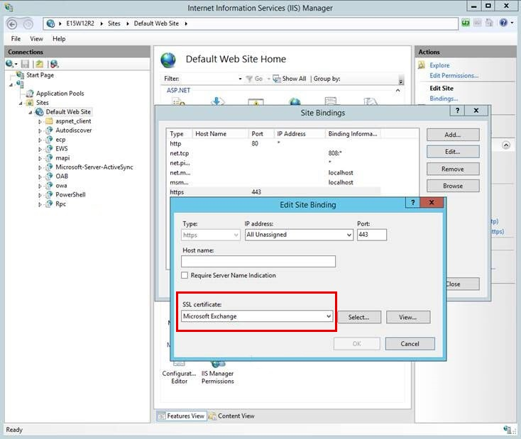

# Repair failed installations of Exchange cumulative and security updates

This article provides a list of known issues that users might encounter when installing Cumulative Updates (CUs) and Security Updates (SUs) for the versions of Microsoft Exchange Server specified in the Applies to section.

## Check for Indicators of Compromise (IOC) and verify the update
</br>
<details>
<summary>Looking Indicators of Compromise (IOC)</summary>
</br>

This script automates all four of the commands found in the [Microsoft Threat Intelligence Center (MSTIC) Blog](https://www.microsoft.com/security/blog/2021/03/02/hafnium-targeting-exchange-servers/). It also has a progress bar and some performance tweaks to make the CVE-2021-26855 test run much faster. You can download the latest script at the Exchange Support GitHub repository [aka.ms/TestProxyLogon](https://aka.ms/TestProxyLogon).  
</br>
</details>

<details>
<summary>How to verify the installation of Cumulative Updates & Security Updates</summary>

### Option 1 (Recommended)

 Run the [HealthChecker script](https://aka.ms/exchangehealthchecker) and check the build number.
 
 

### Option 2

Run the following command and verify that the file version matches the information in the table below the screenshot.

```
Get-Command Exsetup.exe | ForEach {$_.FileVersionInfo}
```

| Exchange version  | Patched systems file versions  |
|---|---|
| Exchange Server 2019  | For CU7: 15.02.0721.013</br>For CU8: 15.02.0792.010|
| Exchange Server 2016  | For CU18: 15.01.2106.013</br>For CU19: 15.01.2176.009|
| Exchange Server 2013  | For CU23: 15.00.1497.012  |

</details>

## Resolve errors during CU or SU installation

### OWA or ECP 500 errors

**Issue**

OWA and ECP may experience HTTP 500 errors after installation. After providing credentials to log on to OWA/ECP, it may fail with an error similar to:

> Could not load file or assembly Microsoft.Exchange.Common, Version=15.0.0.0, Culture=neutral, PublicKeyToken=31bf3856ad364e35' or one of its dependencies. The system cannot find the file specified.

**Resolution**

If this occurs, run the following scripts to restore the configuration for OWA and ECP.
The scripts can be found in the folder: \Program Files\Microsoft\Exchange Server\v15\Bin\ directory. (Where “V15“ will be “V14” for Exchange 2010)
The scripts are located in the following location: \Program Files\Microsoft\Exchange Server\v15\Bin\ directory. Where “V15“ will be “V14” for Exchange 2010.

Run the scripts `.\UpdateCas.ps1` and `.\UpdateConfigFiles.ps1`.

Then go to a command prompt as administrator and run `iisreset`.

If this fails please review and follow the steps in [this Docs article](https://docs.microsoft.com/exchange/troubleshoot/client-connectivity/owa-stops-working-after-update).

### ECP Missing Images

**Issue**

After Security Update installation, OWA or ECP may show missing images similar to the following:

**Resolution**

The SU was not installed properly. Make sure to always follow the best practice by running the update from an administrative command prompt and then reboot after the application. To mitigate this issue the MSP will need to be uninstalled and reinstalled using the best practices from above.
## Blank page after logging in EAC or OWA  

**Issue**

When you log in the Exchange Admin Center(EAC) or Outlook on the web (OWA) in Microsoft Exchange Server 2016 or Exchange Server 2013, you get a blank page. When this issue occurs, event ID 15021 may be logged.  

**Cause**

This issue occurs if the SSL binding on 0.0.0.0:444 has one of more of the following issues:  

- The binding is installed incorrectly  
- The binding doesn’t have a certificate assigned.  
- The binding contains incorrect information.  

**Workaround**

1. On the CAS server, open Internet Information Services (IIS).  

2. Expand **Sites**, click **Default Web Site**, and then click **Bindings** on the **Actions** pane.  

3. In the **Site Bindings** dialog box, open the binding for https on IP address \* and port 443.  

4. Verify that a valid SSL certificate is specified for the site. If not, specify a valid SSL certificate, for example the **Microsoft Exchange** certificate, and restart the IIS service by running the following command in the Elevated PowerShell window: 
    ````Powershell
    Restart-Service WAS,W3SVC  
    ````

     

5. On the mailbox server, do the same verification for the **Exchange Back End** site.  
      

More information available at [support.microsoft.com](https://support.microsoft.com/en-us/topic/you-get-a-blank-page-after-logging-in-eac-or-owa-in-exchange-2013-or-exchange-2016-a24db2f2-4d67-806b-670b-efb8f08605f7)

## Event ID 1309 and you cannot access EAC or OWA

**Issue**  

You successfully installed Microsoft Exchange Server 2016 or Exchange Server 2013. The installation process may have failed or been interrupted at some stage and then resumed and finally completed successfully. However, when you try to access Exchange Control Panel (ECP) or Outlook Web App (OWA), you receive the following error message:

something went wrong

Sorry, we can't get that information right now. Please try again later. If the problem continues, contact your helpdesk.

**Cause**  

This issue occurs if SharedWebConfig.config is missing from either of the following locations:

- C:\Program Files\Microsoft\Exchange Server\V15\FrontEnd\HttpProxy
- C:\Program Files\Microsoft\Exchange Server\V15\ClientAccess

**Resolution**  

To resolve this issue, follow these steps:  

1. On the server that's facing the problem, identify the location that the file is missing from.
2. Generate the missing file:

    1. Run `cd %ExchangeInstallPath%\bin` to change the current directory to the bin folder that's under the Exchange installation path.
    2. Use the DependentAssemblyGenerator.exe tool to generate the file:

        - If the file is missing from *C:\Program Files\Microsoft\Exchange Server\V15\ClientAccess*, run the following command:

        ```console
        DependentAssemblyGenerator.exe -exchangePath "%ExchangeInstallPath%\bin" -exchangePath "%ExchangeInstallPath%\ClientAccess" -configFile "%ExchangeInstallPath%\ClientAccess\SharedWebConfig.config"
        ```

        - If the file is missing from *C:\Program Files\Microsoft\Exchange Server\V15\FrontEnd\HttpProxy*, run the following command:

        ```console
        DependentAssemblyGenerator.exe -exchangePath "%ExchangeInstallPath%\bin" -exchangePath "%ExchangeInstallPath%\FrontEnd\HttpProxy" -configFile "%ExchangeInstallPath%\FrontEnd\HttpProxy\SharedWebConfig.config"
        ```

3. Restart the server or open a elevated PowerShell session and Run 

```Powershell
Restart-Service WAS,W3SVC
```

More information available at [support.microsoft.com](https://docs.microsoft.com/en-us/exchange/troubleshoot/client-connectivity/event-1309-code-3005-cannot-access-owa-ecp)

### Exchange Server 2019 setup does not run as expected if started from PowerShell using Setup.exe

**Issue**  

Consider the following scenario:

- You plan to run an unattended setup to upgrade Microsoft Exchange Server 2019, Microsoft Exchange Server 2016, or Microsoft Exchange Server 2013 from PowerShell or command prompt using Setup.exe
- The setup media is located on D: drive
- The unattended installation is started from PowerShell or command prompt as "`setup.exe /m:upgrade /IAcceptExchangeServerLicenseTerms`" instead of "`.\setup.exe /m:upgrade /IAcceptExchangeServerLicenseTerms`" (PowerShell) or "`D:\setup.exe /m:upgrade /IAcceptExchangeServerLicenseTerms`" (PowerShell or command prompt).

In this situation, the Exchange Server Setup program starts, and may indicate that it's successfully completed. However, Exchange itself isn't updated.

**Cause:**  

When you run a command in PowerShell or command prompt, the paths in the System environment variable "Path" are first checked to verify the command being executed, before the current path in PowerShell or command prompt is checked, unless:

- ".\" is entered in front of the command or program being executed in PowerShell, or
- the Tab key is used to automatically add the ".\" in front of the command or program being executed in PowerShell, or
- the full path is used to run the setup.exe (for example "`D:\setup.exe /m:upgrade /IAcceptExchangeServerLicenseTerms`") in PowerShell or command prompt.

A setup.exe file located in `C:\Program Files\Microsoft\Exchange Server\V15\bin` is found and executed by PowerShell, instead of the setup.exe in the current path.

**Workaround:**  

If you run an upgrade, use "`.\setup.exe /m:upgrade /IAcceptExchangeServerLicenseTerms`" (PowerShell) or "`D:\setup.exe /m:upgrade /IAcceptExchangeServerLicenseTerms`" (PowerShell and command prompt) to start the command.

More information available at [support.microsoft.com](https://docs.microsoft.com/exchange/troubleshoot/setup/ex2019-setup-does-not-run-correctly-started-powershell)

### The upgrade patch cannot be installed by the Windows Installer service

**Issue**

This error may be seen when installing the Security Update:

>The upgrade patch cannot be installed by the Windows Installer service because the program to be upgraded may be missing, or the upgrade patch may update a different version of the program. Verify that the program to be upgraded exists on your computer and that you have the correct upgrade patch.

**Resolution**

This means the Cumulative Update or Security Update version mismatch and it did not meet the requirements. You need to upgrade to the correct Cumulative Update first or validate that you have downloaded the correct Cumulative Update for your intended Cumulative Update.

### Installation fails because service cannot stop properly

**Issue**

The Installation fails because services don't stop properly.

**Resolution**

Try the best practice to reboot the server first before installing the Cumulative Update or Security Update. Also make sure antivirus software is ruled out (set proper [exclusions](https://docs.microsoft.com/Exchange/antispam-and-antimalware/windows-antivirus-software?view=exchserver-2019&preserve-view=true) or consider turning it off for the time of the installation). In some cases where services still wouldn’t stop/start as expected, try the following steps:

1. Rename the C:\ExchangeSetupLogs folder (such as ExchangeSetupLogs-OLD)
2. Change the startup type of Exchange services in the services.msc console to Automatic (note: do this only for the Exchange services which were active prior to the setup attempt. POP3 and IMAP4 are stopped by default and only need to run if there are indeed any users who need them).
3. Run setup again.
The reason is that setup may get interrupted in a phase where services are already disabled. Starting setup again in this phase may record the “before” state of services as disabled and will try to restore this state.

### Services are not started after Security Update installation is completed

**Issue**

Services are not started after Security Update installation is completed.

**Resolution**

After the application of the security update, you notice that the Exchange services are not starting, check the service state, if they are Disabled, set them to Automatic and start them manually. Please note that the services **MSExchangeIMAP4**, **MSExchangeIMAP4BE**, **MSExchangePOP3** and **MSExchangePOP3BE** are typically disabled by default you can refer to the log `C:\ExchangeSetupLogs\ServiceControl.log` to see what was disabled during setup by searching for Disabling services.

### Error during Setup: Setup encountered a problem while validating the state of Active Directory or Mailbox Server Role Isn’t Installed on this Computer

**Issue**

You receive the following error during Setup: 

>Setup encountered a problem while validating the state of Active Directory or Mailbox Server Role Isn’t Installed on this Computer.

**Resolution**

If the above are seen in the setup logs, consider running the Exchange Setup log reviewer script [SetupLogReviewer.ps1](https://aka.ms/ExSetupScripts) This script reviews the ExchangeSetup.log and determines if it is a known issue and reports an action to take to resolve the issue.
Once you have downloaded the script just point it to the Exchange Setup log like below and review the output:

````PowerShell
.\SetupLogReviewer.ps1 -SetupLog C:\ExchangeSetupLogs\ExchangeSetup.log
````

Otherwise you can review the log located at `C:\ExchangeSetupLogs\ExchangeSetup.log` for the following error:

"Setup encountered a problem while validating the state of Active Directory: Exchange organization-level objects have not been created, and setup cannot create them because the local computer is not in the same domain and site as the schema master.  Run setup with the /prepareAD parameter on a computer in the domain domainnname and site Default-First-Site-Name, and wait for replication to complete."

If the error exists, then run `.\setup.exe /PrepareAD /IAcceptExchangeServerLicenseTerms` from a machine in the same domain as the schema master (user must be a member of the **Enterprise Admin**, **Domain Admin**, and **Schema Admin**)
To find the DC that holds the schema master run the following from administrative command prompt on the DC: `netdom query fsmo`.

### Error during install: Creating Native images for .NET assemblies

**Issue**

When you install this update rollup on a computer that isn’t connected to the internet, you may experience a long installation time. Additionally, you may receive the following message:

>Creating Native images for .Net assemblies.

**Resolution** 

This issue is caused by network requests to connect to the following URL:

``http://crl.microsoft.com/pki/crl/products/CodeSigPCA.crl``

These network requests are attempts to access the certificate revocation list for each assembly that native image generation (Ngen) compiles to native code. However, because the server that’s running Exchange Server isn’t connected to the internet, each request must wait to time out before the process can continue.

To fix this issue, follow these steps:

1. In Internet Explorer, select **Internet Options** on the **Tools** menu, and then select **Advanced**.
1. In the **Security** section, clear the Check for publisher’s certificate revocation check box, and then select **OK**. 
 
    > [!NOTE]
    > Clear this security option only if the computer is in a tightly-controlled environment.
  
1. When the Setup process is finished, select the Check for publisher’s certificate revocation check box again.

### Security Update Installation fails due to previous IU installation

**Issue**

You may see the following error: 

>Installation cannot continue. The Setup Wizard has determined that this Interim Update is incompatible with the current Microsoft Exchange Server 2013 Cumulative Update 23 configuration.

**Resolution** 

You need to uninstall the previous installed IU before applying this SU as it is cumulative. You can find previous IU’s in add/remove programs.

## Additional information

### How to update .NET when migrating from an unsupported CU

If you are upgrading Exchange Server from an unsupported CU to the current CU and no intermediate CUs are available, you should first upgrade to the latest version of .NET that's supported by your version of Exchange Server and then immediately upgrade to the current CU. This method doesn't replace the need to keep your Exchange servers up to date and on the latest supported CU. Microsoft makes no claim that an upgrade failure will not occur using this method, which may result in the need to contact Microsoft Support Services.

> [!IMPORTANT]
> Versions of the .NET Framework that aren't listed in the tables on the [supportability matrix](https://docs.microsoft.com/en-us/Exchange/plan-and-deploy/supportability-matrix?view=exchserver-2019#exchange-2019) are not supported on any version of Exchange. This includes minor and patch-level releases of the .NET Framework.  

Follow these steps below to install the latest .NET Framework

1.  Put the Server into [Maintenance
    Mode](https://docs.microsoft.com/en-us/Exchange/high-availability/manage-ha/manage-dags?redirectedfrom=MSDN&view=exchserver-2019#performing-maintenance-on-dag-members).
    For example,

    set-servercomponentstate \<server_name\> -Component serverwideoffline -State
    inactive -Requester Maintenance

2.  Stop all of the Exchange Services.

3.  Either by the services MMC

4.  Or by utilizing Powershell. Run the below command twice to stop all Exchange
    services. We do not recommend using the -Force command to stop all the
    services.

    Get-service \*exch\* \| stop-service

5.  Download and install the correct new .Net Version according to the
    [supportability
    table](https://docs.microsoft.com/en-us/exchange/plan-and-deploy/supportability-matrix?view=exchserver-2019#exchange-2019).

6.  After the install is complete, reboot the server.

7.  Update to the newest Cumulative Update available for Exchange 2013, 2016, or
    2019.

8.  Make sure to reboot the server after the Cumulative Update is installed.

9.  Ensure all Exchange services are in their normal start Mode and started. You
    can use PowerShell to run: Get-service \*exch\*

10. Take the server out of [Maintenance
    Mode](https://docs.microsoft.com/en-us/Exchange/high-availability/manage-ha/manage-dags?redirectedfrom=MSDN&view=exchserver-2019#performing-maintenance-on-dag-members).
    For example:  
    set-servercomponentstate \<server_name\> -Component serverwideoffline -State
    active - Requester Maintenance

### Customized OWA or .config files

> [!IMPORTANT]
> Before you apply a CU, make a backup copy of your customized files.

When you apply a CU (for Exchange Server 2013, 2016 or 2019) or Rollup package (for Exchange Server 2010), the process updates Outlook on the web files and .config files if required. Any customized Exchange or Internet Information Server (IIS) settings that you made in Exchange XML application configuration files on the Exchange server (for example, web.config files, EdgeTransport.exe.config files, any [customized logon.aspx Outlook on the web files](https://docs.microsoft.com/previous-versions/exchange-server/exchange-140/ee633483(v=exchg.140)?redirectedfrom=MSDN) will be overwritten when you install an Exchange CU. Be sure save this information so you can easily re-apply the settings after the install. 

### How to install this update for customers who deploy CAS-CAS Proxying - CAS Proxy Deployment Guidance in Exchange 2010

If your scenario meets both the following conditions, apply the update rollup on the internet-facing Client Access servers (CAS) before you apply the update rollup on the non–internet-facing CAS: 
- You’re a CAS Proxy Deployment Guidance customer.
- You have deployed [CAS-CAS proxying](https://docs.microsoft.com/previous-versions/exchange-server/exchange-140/bb310763(v=exchg.140)?redirectedfrom=MSDN).

> [!NOTE]
> For other Exchange Server 2010 configurations, you don’t have to apply the update rollup on your servers in any particular order.

### How to install this update on a DBCE version of Windows Server 2012

You can’t install or uninstall Update Rollup 32 for Exchange Server 2010 SP3 on a double byte character set (DBCS) version of Windows Server 2012 if the language preference for non-Unicode programs is set to the default language. To work around this issue, you must first change this setting. To do this, follow these steps:

1. In Control Panel, select **Clock, Region and Language**, select **Region**, and then select **Administrative**.
2. In the **Language for non-Unicode programs** area, select **Change system locale**.
3. In the **Current system locale** list, select **English (United States)**, and then select **OK**.

After you successfully install or uninstall Update Rollup 32, revert this language setting, as appropriate.
