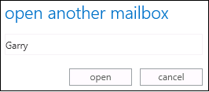
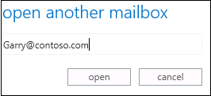

# Error (HTTP 400 Bad Request) when you try to open another user's mailbox in Outlook Web App in an Exchange Server environment

_Original KB number:_ &nbsp; 2770796

## Symptoms

When you try to open another user's mailbox by using Outlook on the web (formally known as Outlook Web App) in an Exchange Server environment, you receive following error message:

> This error (HTTP 400 Bad Request) means that Internet Explorer was able to connect to the web server, but the webpage could not be found because of a problem with the address.
>
> For more information about HTTP errors, see Help.

For example, you have full access permissions to Garry's mailbox, which is associated with the following email address: `Garry@contoso.com`. You sign in to Outlook Web App, type *Garry* in the **Open another mailbox** dialog box, and then click **open**. In this situation, you receive the error message that was mentioned earlier.

## Cause

This issue occurs because Outlook on the web doesn't resolve the identity of the additional mailbox to the correct format.

## Resolution

To open another user's mailbox by using Outlook on the web, use the email address that is associated with that mailbox. For example, you should type `Garry@contoso.com` instead of *Garry* in the **Open another mailbox** dialog box.

