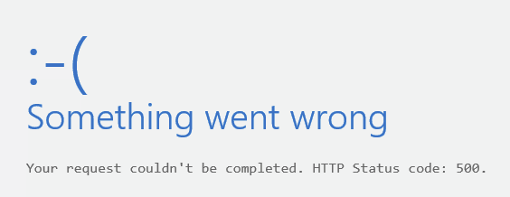

# OWA or ECP stop working after installing Exchange Server security update

## Symptoms

After you install a security update on a server that’s running Exchange, either Outlook on the web (OWA) or Exchange Control Panel (ECP), or both these applications stop working on the server.

OWA displays the following error message:

>:-( 
Something went wrong 
Your request couldn’t be completed. HTTP Status code: 500

ECP displays the following error message:

>Server Error in ‘/ecp’ Application. 
Could not load file or assembly ‘Microsoft.Exchange.Common, Version=15.0.0.0 …Culture=neutral, PublicKeyToken=31bf3856ad364e54’ or one of its dependencies. The system cannot find the file specified.

## Cause

These errors occur if the security update was manually installed on a server that has UAC (User Account Control) enabled, but without using elevated permissions.

## Resolution

Use elevated permissions to reinstall the security update on the server.

1. Select **Start**, and then type **cmd**.
1. Right-click **Command Prompt** from the search results, and then select **Run as administrator**.
1. If the **User Account Control** window appears, select the option to launch an elevated command prompt, and then select **Continue**. 
   If the window doesn’t appear, continue to the next step.
1. Type the full path of the .msp file for the security update, and then press **Enter**.
1. After the update installs, reboot the server.

Check whether you can now access OWA and ECP on the server without getting an error message.

If the ECP error message continues to display, do the following:

1. Launch **IIS Manager** on the server. 
1. Browse to **Exchange Backend website** > **ECP Virtual directory**
1. Select **Application settings** > **BinsearchFolder**
1. Check the paths to the Exchange directories that are listed. You might see directory paths similar to:

   **%ExchangeInstallDir%bin;%ExchangeInstallDir%bin\CmdletExtensionAgents;%ExchangeInstallDir%ClientAccess\Owa\bin**

1. Replace the paths with the following paths. 
   **C:\Program Files\Microsoft\Exchange Server\V15\bin; 
C:\Program Files\Microsoft\Exchange Server\V15\bin\CmdletExtensionAgents; 
C:\Program Files\Microsoft\Exchange Server\V15\ClientAccess\Owa\bin**

**Note** The path must be where Exchange Server is installed. In the following example, it is assumed to be installed on C:\ drive and the product version is Exchange Server 2013. If it is installed on a different drive on your server, or if you’re using a different version such as Exchange Server 2010, then use the path and version information that is appropriate for your installation.

1. Navigate to a folder that includes Exchange Server scripts. By default, scripts are located in the following path for Exchange Server 2013:

   **C:\Program Files\Microsoft\Exchange Server\v15\Bin\directory** 
**Note** For Exchange Server 2010, the scripts will be in the “V14” folder instead.

1. Launch Exchange Management Shell as an administrator and run the following commands:

   **.\UpdateCas.ps1 
   .\UpdateConfigFiles.ps1**

1. Exit Exchange Management Shell and open a command prompt as an administrator.
1. Run the **iisreset** command.
1. Restart the server.

Verify that you no longer get an error message when you access ECP.
