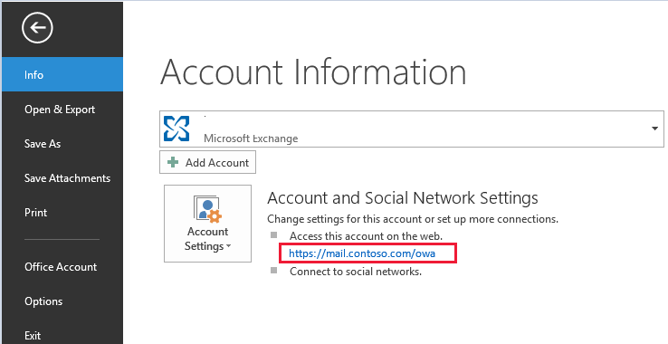
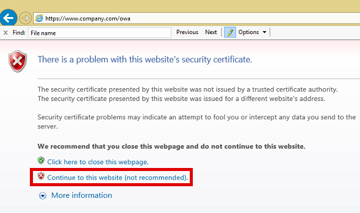

# How to set up Outlook on the web to access Exchange Server

Outlook on the web (formerly known as Outlook Web App or Outlook Web Access) is a browser-based email client. Outlook on the web lets you access your Microsoft Exchange Server mailbox from almost any web browser.

If you are a Microsoft Office 365 user, click the following link to access Office 365 Outlook Web App:

[Outlook.Office365.com](https://outlook.office365.com)

To set up Outlook Web App to access Exchange Server, follow these steps:

1. Ask your network administrator or local HelpDesk to see whether your account has Outlook Web App enabled. If Outlook Web App is enabled, ask the administrator or HelpDesk for the address (URL) of Outlook Web App. Usually, the address is in the following form:

    `https://\<Domain Name>/OWA`

    Normally, you can find the Outlook Web App URL by clicking File->Info in Outlook.

    > [!NOTE]
    > This feature is available on Outlook 2010 and Outlook 2013. It depends on the server side settings.

    
2. Open a web browser such as Internet Explorer, type the Outlook Web App address in the address bar, and then press Enter.
3. If you receive the following certificate warning page, click **Continue to this website (not recommended)** to continue to open Outlook Web App.

    

    > [!NOTE]
    > This certificate warning is displayed if an incorrect certificate is being used in the Exchange server. Report this issue to the network administrator.
4. On the Outlook Web App sign-in page, type your user name and password, and then click **Sign in**. The user name must be in one of the following formats:
   - `Username@domain.com`
   - `Domain/username`

    > [!NOTE]
    > In most cases, the user name and password are the logon name and password that you use to log on to your organization's network or computer.

    If you don't know your Outlook Web App user name and password, you should contact the network administrator.
