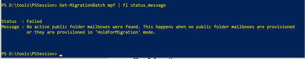

# "No active public folder mailboxes were found" error and migration batch fails at Complete-MigrationBatch command

## Symptoms

You are migrating public folders from Microsoft Exchange Server 2019, 2016, or 2013 on-premises to Exchange Online. The on-premises environment has multiple Active Directory (AD) domains.

When you run the **Complete-MigrationBatch** command, the migration batch goes into a failed state and generates the following error message:




```
"No active public folder mailboxes were found. This happens when no public folder mailboxes are provisioned or they are provisioned in 'HoldForMigration' mode."
```

## Cause

This problem occurs because the public folder mailbox and associated user account are not in the same AD domain. For example, the user account that is associated with the public folder mailbox is in contoso.com, and the mailbox is hosted in Exchange Server in child.contoso.com.

## Resolution

To fix this problem, use [Active Directory Migration Tool](https://support.microsoft.com/help/4089459) to move the AD account that is associated with the public folder mailbox to the same AD domain that hosts Exchange Server, and then run the **Complete-MigrationBatch** command again.
