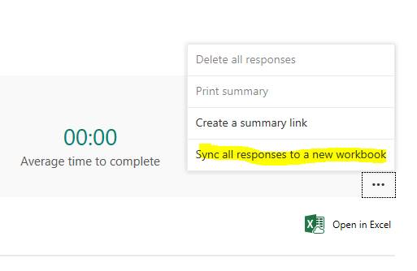

# Forms response columns are out of order

## Symptoms

In Microsoft Forms, you may experience an issue in which the response columns are out of order in the response workbook for a form when you compare the columns to the order of the questions on the form.

## Cause

This is a known issue that's being investigated.

## Workaround

To work around this issue, locate the Responses tab on the form, click the ellipses, and then select Sync all responses to a new workbook. This resets the order of the columns to match the order of the questions on the form.

