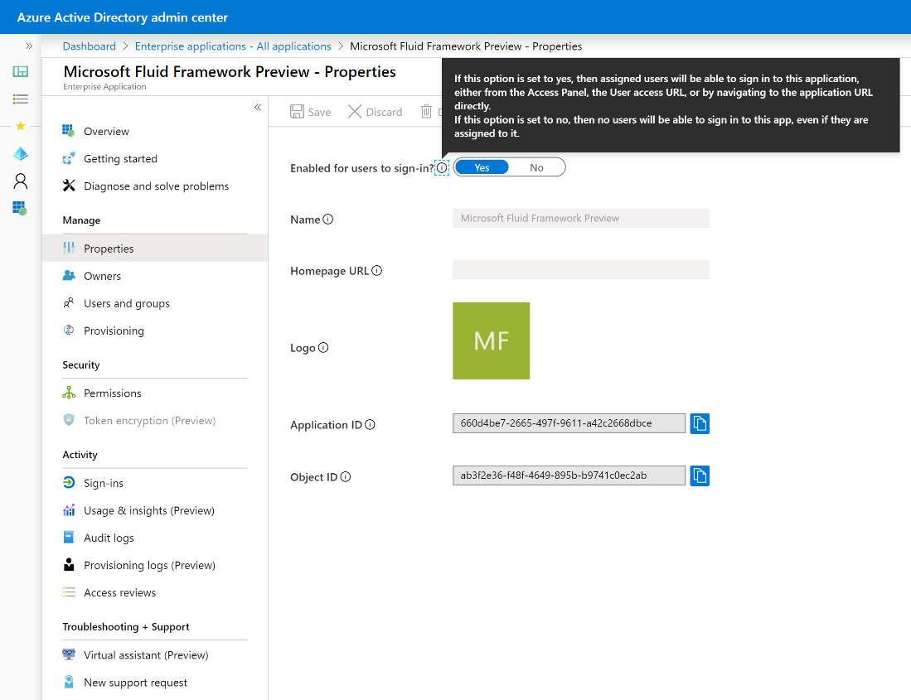

# Microsoft Fluid Framework preview – access management

[!INCLUDE [Branding name note](../../../includes/branding-name-note.md)]

This article describes how administrators of Microsoft 365 tenants can manage access to Microsoft Fluid Framework preview by disabling user sign-ins in the [Azure portal](https://portal.azure.com/).

Follow the instructions in [Disable user sign-ins for an enterprise app in Azure Active Directory](/azure/active-directory/manage-apps/disable-user-sign-in-portal).

The Microsoft Fluid preview experience is listed as follows:

Name: **Microsoft Fluid Framework Preview**

ID: **660d4be7-2665-497f-9611-a42c2668dbce**

> [!NOTE]
> If you have a long list of applications, consider searching on "Microsoft Fluid."



## Create a missing Microsoft Fluid Framework service principal

If you do not find "Microsoft Fluid Framework preview" in the list of enterprise applications, follow these steps to create the service principal in your tenant:

1. [Install the AAD PowerShell Module v2](/powershell/azure/active-directory/install-adv2?preserve-view=true&view=azureadps-2.0#installing-the-azure-ad-module).
2. Run the following cmdlet, and sign in by using your tenant admin credentials:

   ```powershell
   Connect-AzureAD -TenantId '[The tenant Id]'
   ```

3. Run the following cmdlet to register the service principal:

   ```powershell
   New-AzureADServicePrincipal -AppId 660d4be7-2665-497f-9611-a42c2668dbce -DisplayName 'Microsoft Fluid Framework Preview'
   ```

## Alternative method: Disable Microsoft Fluid Framework service principal through a script

If you prefer to disable access to Microsoft Fluid Framework preview by using PowerShell, follow these steps:

1. Get the service principal object ID:

   ```powershell
   $ServicePrincipalId = (Get-AzureADServicePrincipal -Filter "appId eq '660d4be7-2665-497f-9611-a42c2668dbce'").ObjectId
   ```

2. Disable the service principal by providing the SP ID:

   ```powershell
   Set-AzureADServicePrincipal -ObjectId $ServicePrincipalId -AccountEnabled $False
   ```

For more information about the Microsoft Fluid Framework preview, see the [Ignite 2019 announcement](https://aka.ms/FluidPreviewBlog).