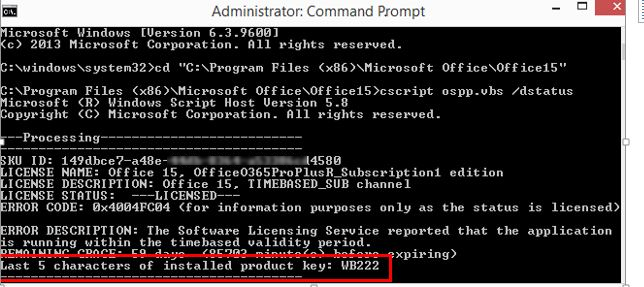
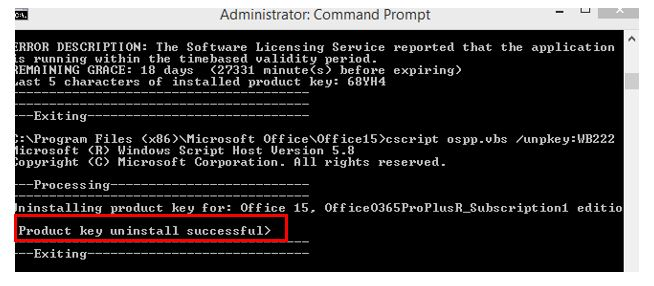
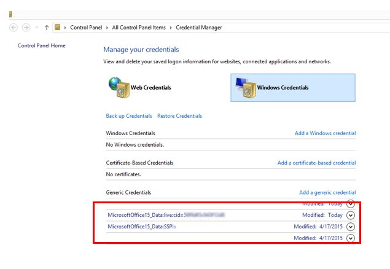

# Reset Office 365 ProPlus activation state

It's very common for users to switch devices or an enterprise to add or change Microsoft Office 365 tenants. Another scenario is when enterprise organizations roam licenses or credentials to simplify sign in. After an Office 365 user is activated, there are four locations that must be cleared to reset the application to a clean state.

## Step 1: Remove Office 365 license for subscription based installs (not Shared Computer Licensing scenarios)

To remove the Office 365 license, follow these steps:

1. Run the following cscript command:

   ```vbs
   C:\program files <x86>\Microsoft office\office16>cscript ospp.vbs /dstatus
   ```

   The command line generates a report of the current licenses in use. An example resembles the following:

   

   > [!NOTE]
   > You might see multiple licenses in the report.

1. Note the value for **Last 5 characters of installed product key**.
1. Run the following command:

   ```vbs
   C:\program files <x86>\Microsoft office\office16>cscript ospp.vbs /unpkey:"Last 5 of installed product key"
   ```
   
   For example:

   ```vbs
   C:\program files <x86>\Microsoft office\office16>cscript ospp.vbs /unpkey:WB222
   ```

   Repeat the command if it is necessary until all keys are removed.

   
   
   After you run the command, you see a "product key uninstall successful" message. You can now close the Command Prompt and move onto Step 2.

## Step 2: Remove cached identities in HKCU registry

> [!WARNING]
> Follow the steps in this section carefully. Serious problems can occur if you modify the registry incorrectly. Before you modify it,  [back up the registry for restoration](https://support.microsoft.com/help/322756/how-to-back-up-and-restore-the-registry-in-windows) in case problems occur.

In Registry Editor, locate the following registry:

**HKEY_CURRENT_USER\Software\Microsoft\Office\16.0\Common\Identity\Identities**

Remove all the identities under the Identities registry entry.

> [!NOTE]
> If you use a Shared Computer Licensing, remove the above identities from **HKEY_USERS\SID**

## Step 3: Remove the stored credentials in the Credential Manager

1. Open **Control Panel** > **Credential Manager**.
1. Remove all Windows credentials listed for Office16. To remove the credentials, click the drop-down arrow and then select **Remove**.

   

For Shared Computer Licensing scenarios, you must remove the tokens and identities that are listed as follows:

**Appdata\local\Microsoft\Office\16.0\Licensing**

## Step 4: Clear persisted locations

**Credential Manager:**

- Appdata\Roaming\Microsoft\Credentials
- Appdata\Local\Microsoft\Credentials
- Appdata\Roaming\Microsoft\Protect
- HKEY_CURRENT_USER\Software\Microsoft\Protected Storage System Provider

**Office 365 activation tokens and identities:**

- Appdata\local\Microsoft\Office\16.0\Licensing
- HKEY_CURRENT_USER\Software\Microsoft\Office\16.0\Common\Identity
- HKEY_USERS\The Users SID\Software\Microsoft\Office\16.0\Common\Identity

The above steps reset the activation state for Office 365 ProPlus (2013 & 2016). The activation flow after the locations are cleared will represent an initial activation.

The above four steps can be automated by using a script. Copy the content from [OLicenseCleanup](https://msdnshared.blob.core.windows.net/media/2018/05/OLicenseCleanup.vbs_.txt), save the content as a .vbs file, and then run the .vbs file.