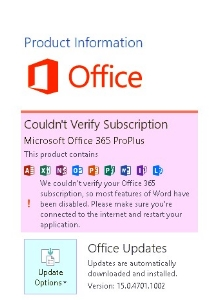

# Office 365 subscription automatic license renewal fails when heartbeatcache is in wrong location

##  Symptoms

When O365 paid subscription tries to renew, the license fails and eventually displays a red bar stating that the subscription is unlicensed.

Message 1: Couldn't Verify Subscription

We couldn't verify your Office 365 subscription, so most features of <application> have been disabled. Please make sure you're connected to the internet and restart your application.

Message 2: Application (Unlicensed Product)

##  Cause

The HeartbeatCache.xml file is located in the wrong folder.

##  Resolution

To resolve this issue, delete the heartbeatcache.xml file using the following steps.

1. Exit all Office applications. 

2. Browse to "C:\Program Files\Microsoft Office 15\root\vfs\Common AppData\microsoft\office\Heartbeat\"

3. Delete the HeartbeatCache.xml file

4. Launch one of the Office Applications and the file will be automatically placed the expected native folder location.