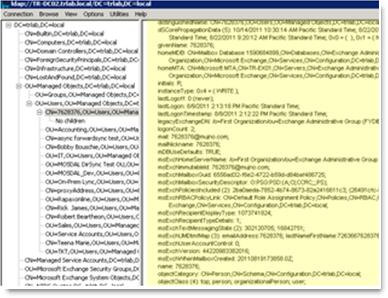

# Duplicate or invalid attributes prevent directory synchronization in Office 365

## PROBLEM

In Microsoft Office 365, an administrator receives the following email message warning when directory synchronization finishes:

```asciidoc
From: [MSOnlineServicesTeam@MicrosoftOnline.com](mailto:msonlineservicesteam@microsoftonline.com)Subject: Directory Synchronization Error Report
```

The error report in the email message may contain one or more of the following error messages:

- A synchronized object with the same proxy address already exists in your Microsoft Online Services directory.
- Unable to update this object because the user ID is not found.
- Unable to update this object in Microsoft Online Services because the following attributes associated with this object have values that may already be associated with another object in your local directory.
- Unable to update this object because the following attributes associated with this object have values that may already be associated with another object in your local directory services: [UserPrincipalName *john@contoso.com*;]. Correct or remove the duplicate values in your local directory.
- Unable to update this object because the following attributes associated with this object have values that may already be associated with another object in your local directory services: [ProxyAddresses SMTP:*john@contoso.com*;]. Correct or remove the duplicate values in your local directory.

Additionally, if you're running Azure Active Directory (Connect) Sync Service, an instance of event ID 6941 that contains one of the following error messages is logged in the Application log in Event Viewer:

```asciidoc
Event ID: 6941
Log Name: Application
Source: ADSync
Level: Error
Details:
ECMA2 MA export run caused an error. 

Error Name: AttributeValueMustBeUnique
Error Detail: Unable to update this object because the following attributes associated with this object have values that may already be associated with another object in your local directory services: [UserPrincipalName john@contoso.com;]. Correct or remove the duplicate values in your local directory. Please refer to https://support.microsoft.com/kb/2647098 for more information on identifying objects with duplicate attribute values.
```

```asciidoc
Event ID: 6941
Log Name: Application
Source: ADSync
Level: Error
Details:
ECMA2 MA export run caused an error.

Error Name: InvalidSoftMatch
Error Detail: Unable to update this object because the following attributes associated with this object have values that may already be associated with another object in your local directory services: [ProxyAddresses SMTP:john@contoso.com;]. Correct or remove the duplicate values in your local directory.
```

## CAUSE

This issue may occur if user objects in the on-premises Active Directory Domain Services (AD DS) schema have duplicate or invalid alias values, and if these user objects are not synced from the AD DS schema to Office 365 correctly during directory synchronization.

All alias values in Office 365 must be unique for a given organization. Even if you have multiple unique suffixes after the at sign (@) in the Simple Mail Transfer Protocol (SMTP) address, all alias values must be unique.

In an on-premises environment, you can have alias values that are the same as long as they are unique based on the suffixes after the at sign (@) in the SMTP address.

If you create objects that have duplicate alias values in the cloud for Office 365, to make the aliases unique, one alias has a unique number appended to it. (For example, if the duplicate alias values are "Albert," one of them becomes "Albert2" automatically. If "Albert2" is already being used, the alias becomes "Albert3," and so on.) However, if objects that have duplicate alias values are created in your on-premises AD DS, an object collision occurs when directory synchronization runs, and object synchronization fails.

## SOLUTION

To resolve this issue, determine duplicate values and values that conflict with other AD DS objects. To do this, use one of the following methods.

#### Method 1: Use the IdFix DirSync Error Remediation Tool

Use the IdFix DirSync Error Remediation Tool to identify duplicate or invalid attributes. To resolve duplicate attributes by using the IdFix Tool, see the following Microsoft Knowledge Base article:

[2857385](https://support.microsoft.com/help/2857385) "Duplicate" is displayed in the ERROR column for two or more objects after you run the IdFix tool

For more information about the IdFix tool, go to [IdFix DirSync Error Remediation Tool](https://www.microsoft.com/download/details.aspx?id=36832).

#### Method 2: Map an existing on-premises user to an Azure AD user

To do this, see the following Microsoft Knowledge Base article:

[2641663](https://support.microsoft.com/help/2641663) How to use SMTP matching to match on-premises user accounts to Office 365 user accounts for directory synchronization

#### Method 3: Determine attribute conflicts that are caused by objects that weren't created in Azure AD through directory synchronization

To determine attribute conflicts that are caused by user objects that were created by using Office 365 management tools (and that weren't created in Azure AD through directory synchronization), follow these steps:
 
1. Determine the unique attributes of the on-premises AD DS user account. To do this, on a computer that has Windows Support Tools installed, follow these steps:  
   1. Click **Start**, click **Run**, type ldp.exe, and then click **OK**. 
   2. Click **Connection**, click **Connect**, type the computer name of an AD DS domain controller, and then click **OK**.
   3. Click **Connection**, click **Bind**, and then click **OK**.
   4. Click **View**, click **Tree View**, select the AD DS domain in the **BaseDN**drop-down list, and then click **OK**.
   5. In the navigation pane, locate and then double-click the object that isn't syncing correctly. The Details pane on the right side of the window lists all object attributes. The following example shows the object attributes:

      

   6. Record the values of the userPrincipalName attribute and each SMTP address in the multivalue proxyAddresses attribute. You will need these values later.  
     
      |Attribute name|Example|Notes|
      |----------|----------|----------|
      |proxyAddresses|proxyAddresses (3): x500:/o=Exchange/ou=Exchange Administrative Group (GroupName)/cn=Recipients/cn=GUID; smtp:7628376@service.contoso.com; SMTP:7628376@contoso.com;|The number that's displayed in parentheses next to the attribute label indicates the number of proxy address values in the multivalue attribute. Each distinct proxy address value is indicated by a semicolon (;). The primary SMTP proxy address value is indicated by uppercase "SMTP:"|
      |userPrincipalName|7628376@contoso.com||

      > [!NOTE]
      > Ldp.exe is included in Windows Server 2008 and in the Windows Server 2003 Support Tools. The Windows Server 2003 Support Tools are included in the Windows Server 2003 installation media. Or, to obtain the tool, go to the following Microsoft website: [Windows Server 2003 Service Pack 2 32-bit Support Tools](https://go.microsoft.com/fwlink/?linkid=100114)

2. Connect to Office 365 by using the Azure Active Directory Module for Windows PowerShell. To do this, follow these steps:  
   1. Click **Start**, click **All Programs**, click **Windows Azure Active Directory**, and then click **Windows Azure Active Directory Module for Windows PowerShell**.
   2. Type the following commands in the order in which they are presented, and press Enter after each command:
      
      ```powershell
      $cred = get-credential
      ```
      > [!NOTE]
      > When you are prompted, enter your Office 365 administrator credentials.

      ```powershell
      Connect-MSOLService –credential $cred
      ```

      Leave the console window open. You will have to use it in the next step.
     
3. Check for the duplicate userPrincipalName attributes in Office 365.

   In the console connection that you opened in step 2, type the following commands in the order in which they are presented, and press Enter after each command:

   ```powershell
   $userUPN = "<search UPN>"
   ```
   > [!NOTE]
   > In this command, the placeholder "search UPN" represents the UserPrincipalName attribute that you recorded in step 1f.

   ```powershell
   get-MSOLUser –UserPrincipalName $userUPN | where {$_.LastDirSyncTime -eq $null}
   ```

   Leave the console window open. You will use it again in the next step.

4. Check for duplicate proxyAddressesattributes. In the console connection that you opened in step 2, type the following commands in the order in which they are presented, and press Enter after each command:

   ```powershell
   $SessionExO = New-PSSession -ConfigurationName Microsoft.Exchange -ConnectionUri https://outlook.office365.com/powershell-liveid/ -Credential $Cred -Authentication Basic -AllowRedirection
   ```

   ```powershell
   Import-PSSession $sessionExO -prefix:Cloud
   ```
     
5. For each proxy address entry that you recorded in step 1f, type the following commands in the order in which they are presented, and press Enter after each command:

   ```powershell
   $proxyAddress = "<search proxyAddress>"
   ```
   > [!NOTE]
   > In this command, the placeholder"search proxyAddress" represents the value of a proxyAddresses attribute that you recorded in step 1f.

   ```powershell
   Get-Recipient | Where {[string] $str = ($_.EmailAddresses); $str.tolower().Contains($proxyAddress.tolower()) -eq $true} | foreach {get-MsolUser -ObjectID $_.ExternalDirectoryObjectId | Where {($_.LastDirSyncTime -eq $null)}}
   ```

Items that are returned after you run the commands in step 3 and 4 represent user objects that weren't created through directory synchronization and that have attributes that conflict with the object that is not syncing correctly.

After you determine conflicting or invalid attribute values, troubleshoot the issue by following the steps in the following Microsoft Knowledge Base article:

[2643629](https://support.microsoft.com/help/2643629) One or more objects don't sync when the Azure Active Directory Sync tool is used

## MORE INFORMATION

The Windows PowerShell commands in this article require the Azure Active Directory Module for Windows PowerShell. For more information about Azure Active Directory Module for Windows PowerShell, go to the following Microsoft website:

[Azure Active Directory Cmdlets](https://aka.ms/aadposh)

Still need help? Go to [Microsoft Community](https://answers.microsoft.com/).
