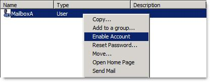
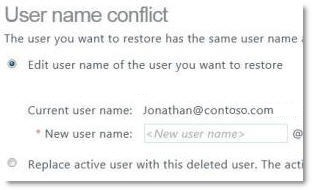

# How to restore deleted user accounts in Office 365, Azure, and Intune

This article describes how to restore deleted user accounts in Office 365, Azure, and Intune.

_Original KB number:_ &nbsp; 2619308

## Symptoms

A user account was accidentally deleted from Microsoft Office 365, Microsoft Azure, or Microsoft Intune and has to be restored.

## Solution

### Before you start  

When a user is deleted from Azure Active Directory, it is moved to a deleted state and no longer appears in the user list. However, it is not removed and can be recovered within 30 days.

To determine whether a user is eligible to be recovered from a deleted state using Office 365 and Azure Active Directory Module, follow these steps:

1. In the Office 365 portal, look up user accounts that were deleted through the portal. To do this, follow these steps:
   1. Sign in to the Office 365 portal ([https://portal.office.com](https://portal.office.com/)) using administrative credentials.
   1. Select **Users**, and then select **Deleted Users**.
   1. Look for the user that you want to recover.
1. In the Azure Active Directory Module for Windows PowerShell, follow these steps:
   1. Select **Start**, select **All Programs**, select Azure Active Directory, and then select **Azure Active Directory Module for Windows PowerShell**.
   1. Type the following commands in the order in which they are presented. Make sure that you press Enter after you type each command.
      - `$cred = get-credential`

        > [!NOTE]
        > When you're prompted, enter your Office 365 credentials.
      - `Connect-MSOLService -credential:$cred`
      - `Get-MsolUser -ReturnDeletedUsers`

## Resolution

### Resolution 1: Use the Office 365 portal or the Azure Active Directory Module for Windows PowerShell to recover a deleted user account  

To recover a user account that was deleted manually, use one of the following methods:

- Use the Office 365 portal to recover the user account. For more information about how to do this, [restore users](https://docs.microsoft.com/microsoft-365/admin/add-users/restore-user?view=o365-worldwide).
- Use the Azure Active Directory Module for Windows PowerShell to recover the user account. To do this, type *one* of the following commands, and then press Enter:
  - `Restore-MsolUser -ObjectId <Guid> -AutoReconcileProxyConflicts -NewUserPrincipalName <string>`

  If the first command doesn’t work. Use the second command:

  - `Restore-MsolUser -UserPrincipalName <string> -AutoReconcileProxyConflicts -NewUserPrincipalName <string>`

### Resolution 2: Recover a user account that was deleted because directory synchronization filtering (scoping) changes exclude the on-premises Active Directory user object

To recover deleted user accounts, make sure that directory synchronization filtering is set in such a way that the scope includes the objects that you want to recover. For more information, go to the [Microsoft website](https://docs.microsoft.com/azure/active-directory/hybrid/how-to-connect-sync-configure-filtering).

### Resolution 3: Recover a user account that was deleted because the on-premises user object was deleted from the on-premises Active Directory schema

To recover an item that was deleted from the on-premises Active Directory schema, follow these steps:

1. Try to restore the deleted item from the Active Directory recycle bin. Follow the Microsoft website link below:

   [Active Directory Recycle Bin Step-by-Step Guide](https://docs.microsoft.com/previous-versions/windows/it-pro/windows-server-2008-R2-and-2008/dd392261(v=ws.10)?redirectedfrom=MSDN)

    > [!NOTE]
    > The Active Directory recycle bin is available only with the functional level of Windows 2008 R2 or later versions.
    > For the Active Directory recycle bin to be useful in recovering an item, it must be enabled before the item is deleted.

1. If the Active Directory recycle bin is unavailable, or if the object in question is no longer in the recycle bin, try to recover the deleted item by using the AdRestore tool. To do this, follow these steps:

   1. Install the [AdRestore](https://docs.microsoft.com/sysinternals/downloads/adrestore) tool from the Microsoft.
   1. Use AdRestore together with a search filter to locate the deleted on-premises user object.

      Example:  We are using “UserA” string to search for usernames that match.

1. AdRestore to enumerate all user objects that have a "UserA" string in their name:

    ```console
    C:\>adrestore.exe UserA
    AdRestore v1.1 by Mark Russinovich
    Sysinternals - www.sysinternals.com

    Enumerating domain deleted objects:
    cn: MailboxA
    DEL:3c45a0ae-ebc5-490d-a4b4-4b20d3e34a3f
    distinguishedName: CN=UserA\0ADEL:3c45a0ae-ebc5-490d-a4b4-4b20d3e34a3f,CN=Deleted Objects,DC=Domain,DC=com
    lastKnownParent: OU=OnPremises,DC=Domain,DC=com

    Found 1 item matching search criteria.
    ```

1. Use AdRestore together with the -r switch to restore the user object.

    The following is an example of how to use AdRestore to restore the UserA object:

    ```console
    C:\>adrestore.exe Usera -r
    AdRestore v1.1 by Mark Russinovich
    Sysinternals - www.sysinternals.com

    Enumerating domain deleted objects:
    cn: UserA
    DEL:3c45a0ae-ebc5-490d-a4b4-4b20d3e34a3f
    distinguishedName: CN=MailboxA\0ADEL:3c45a0ae-ebc5-490d-a4b4-4b20d3e34a3f,CN=Deleted Objects,DC=Domain,DC=com
    lastKnownParent: OU=OnPremises,DC=Domain,DC=com

    Do you want to restore this object (y/n)? y
    Restore succeeded.

    Found 1 item matching search criteria.
    ```

1. Enable the user object in Active Directory. When the object is restored, it's disabled at first. Therefore, you have to enable it. It is recommended to reset the user password, and then enable the user. To enable the user, follow these steps:

    1. In Active Directory Users and Computers, right-click the user, and then select **Reset Password.**  
    1. Enter a new password in the **New password** and **Confirm password** boxes, and then select **OK**.
    1. Right-click the user, clselectick **Enable Account**, and then select **OK**.

       

    You receive the following error message. (This error message is expected.)

    > Windows cannot enable object \<MailboxName> because:
    Unable to update the password. The value provided for the new password does not meet the length, complexity, or history requirements of the domain.

    After you receive this error message, reset the user's password in Active Directory Users and Computers.

   1. Configure the user logon name. The user logon name (also known as the user principal name, or UPN) isn't set from the restored user object. You have to update the user logon name, especially if the user is a federated account.

    To configure the user logon name, follow these steps:

    1. In Active Directory Users and Computers, right-click the user, and then select **Properties**.  
    2. Select **Account**, enter a name in the User logon name box, and then select **OK**. Finally, if you can't recover the deleted user account through the Active Directory recycle bin or by using the AdRestore tool, perform an authoritative restore of the deleted user objects in Active Directory.

> [!WARNING]
> Make sure that only the user objects that you want to restore are marked as authoritative. Active Directory objects that are marked as authoritative in the restore process may cause many Active Directory service issues.

For more information about how to perform an authoritative restore of Active Directory objects, follow [Performing an Authoritative Restore of Active Directory Objects](http://technet.microsoft.com/library/cc779573(ws.10).aspx).

> [!WARNING]
> After restoring the object using Resolution 3, they may not have all service attributes (Exchange Online, Skype for Business Online etc.) automatically restored.

For example, for a user that was formerly mail-enabled in Exchange Online, you can use Windows PowerShell cmdlets to repopulate the Exchange Online attributes.

In the following example, the User1 object is repopulated with Exchange Online attributes for the contoso.onmicrosoft.com tenant:

```powershell
Enable-RemoteMailbox -Identity User1 -RemoteRoutingAddress user1@contoso.mail.onmicrosoft.com
```

If the following conditions are true, resolution 3 won't work:

- Restoring the object by using the Active Directory recycle bin isn't an available option.
- Restoring the object by using the AdRestore tool isn't an available option.
- Active Directory authoritative restoring isn't an available option. In this situation, contact Office 365 Support for help.

## More information

After user deletion and before user recovery, the following events may occur to present conflicts that may alter user experience:

- A new user is created who uses a unique user ID value that was formerly assigned to the deleted user.
- A new user is created who uses a unique email address value that was formerly assigned to the deleted user.

When these conflicts occur, conflicting attributes must be updated to remove the conflict before user recovery can be completed. If a conflict occurs during user recovery, the user will experience one of the following symptoms when a user recovery is tried:

Windows PowerShell returns one of the following errors:

Error 1

> Restore-MsolUser : The specified user account cannot be restored because of the following error: Error Type UserPrincipalName

Error 2

> Restore-MsolUser : The specified user account cannot be restored because of the following error: Error Type proxyAddress

To restore users who are in this state, you can correct the conflict by using the following parameters when you run the Restore-MSOLUser cmdlet:

- `AutoReconcileProxyConflicts`
- `NewUserPrincipalName`

> [!NOTE]
> When you use the `AutoReconcileProxyConflicts` parameter, any conflicting email addresses are removed from the deleted user before you continue with the recovery process.

The Office 365 portal shows the equivalent error messages in the form of the Windows PowerShell error states that were mentioned earlier. For example, you see the following:



To restore users who are in this state, fill out the information required in the form

Still need help? Go to [Microsoft Community](https://answers.microsoft.com/) or the [Azure Active Directory Forums](https://docs.microsoft.com/answers/products/?WT.mc_id=msdnredirect-web-msdn) website.
