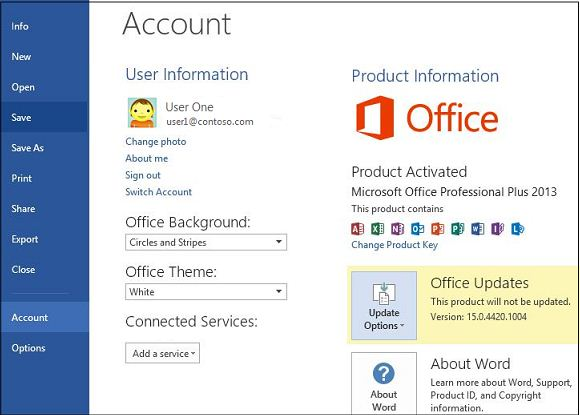
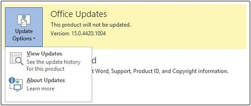

# Automatic updating for Office 2013 and Office 2016 Click-to-Run is not enabled

##  Symptoms

By default, Click-to-Run installations of Microsoft Office 2013 and Office 2016 are configured to automatically update your Office installation when new updates are made publicly available. However, if you examine the Accountsection of the backstage, you may see that updates are disabled or that the command to manage updates is disabled or hidden. For example, the following figure indicates that updates are disabled in the backstage.

 

##  Cause

This problem occurs if you manually disable updates or if updates are being managed by Group Policy settings.

##  Resolution

We recommend that you keep automatic updating enabled for Office 2013 and Office 2016 Click-to-Run installations. We recommend this because this configuration keeps Office updated with the latest fixes for Office 2013 and Office 2016 programs. To re-enable automatic updates for Office 2013 and Office 2016, follow these steps. 
 
- Manually configure automatic updates

  If your Office installation is not managed by Group Policy, you can manually re-enable automatic updates by following these steps. If you cannot follow these steps because the Update Options control is disabled or missing, your updates are being managed by Group Policy.  
  1. Start any Office 2013 or Office 2016 program.    
  2. On the **File** tab, click **Account**. **Note** In Outlook, click **Office Account**.
  1. On the right side, click **Update Options**, and then select **Enable Updates**.    
  1. If you are asked whether you want to let Microsoft Office Click-to-Run make changes to your computer, click **Yes**.    
     
- Automatic updates managed by Group Golicy

  Warning Serious problems might occur if you modify the registry incorrectly by using Registry Editor or by using another method. These problems might require that you reinstall the operating system. Microsoft cannot guarantee that these problems can be solved. Modify the registry at your own risk.

  If you cannot follow the steps in the "Manually configure automatic updates" section, this is because the Update Optionscontrol is disabled or missing because of Group Policy. For example, the following figure shows the Update Options control when the **Enable Updates** option is  hidden by Group Policy.

  

  To examine the registry data that is associated with the Group Policy settings that control this feature, follow these steps:  
  1. Start Registry Editor. To do this, take one of the following actions:  
     - In Windows 7 and in Windows Vista, click **Start**, type regedit in the **Start Search** box, and then press Enter. If you are prompted for an administrator password or for confirmation, type the password, or click **Allow**.    
     - In Windows 8, on the Desktop, press the Windows key + X, click **Run**, type regedit in the **Open** box, and then press Enter. 
        
  2. Locate and then select the following registry key:

     Office 2013

     **HKEY_LOCAL_MACHINE\software\policies\microsoft\office\15.0\common\OfficeUpdate**

     Office 2016

     **HKEY_LOCAL_MACHINE\software\policies\microsoft\office\16.0\common\OfficeUpdate**  
  
  3. Examine the following registry values under the \OfficeUpdate key:  
     - DWORD: EnableAutomaticUpdates
        
       Values:

        0 = automatic updates are disabled
        
        1 = automatic updates are enabled    
     - DWORD: HideEnableDisableUpdates

       Values:

         1 = hide the menu option to enable or disable automatic updates

         0 = show the menu option to enable or disable automatic updates         
  4. If you have any questions or concerns about these policy settings, see your domain administrator.    
     
