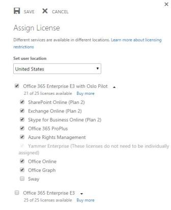
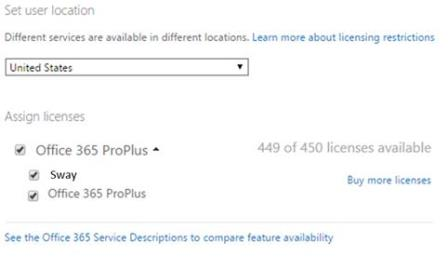

# Office 365 Sway tile continues to appear in App Launcher even after it's disabled

## Problem 

After a Microsoft Office 365 administrator disables Sway in the Microsoft 365 admin center, the Sway tile continues to appear in the Office 365 App Launcher and on the Office 365 home page. 

## Solution

Microsoft has implemented a new Sway service plan that will be used to control access to Sway and to display the Sway tile in the Office 365 App Launcher and on the Office 365 home page. This new Sway service plan enables organizations to control access to Sway on a per-user level. Disabling the Sway service plan for a user makes sure that the user no longer has access to Sway and that the user can't see the Sway tile in the Office 365 App Launcher and on the Office 365 home page.

To enable or disable Sway at a per-user level, follow the steps in the "Enable or disable Sway at a per-user level" section. 

> [!NOTE]
> It may take some time before the new Sway service plan is associated with new and existing Office 365 users.

Organizations that want to force the association of the new Sway service plan to users in their organization should follow the steps that are outlined in the "Workaround" section.  

#### Enable or disable Sway at a per-user level

To enable or disable Sway for a specific user in an organization, follow these steps:

1. In the Microsoft 365 admin center, browse to **Users**, and then click **Active Users**.    
2. On the **Active Users** list, select a user.    
3. Under **Assign licenses**, click **Edit**.    
4. Expand the appropriate license that contains the Sway service plan.

    > [!NOTE]
    > To view the list of supported licenses for Office 365 Sway, see [Available licenses for Office 365 Sway](https://support.microsoft.com/help/3080969).
5. Disable the Sway service plan by unchecking the check box that's associated with Sway. Or, enable the Sway service plan by selecting the check box that's associated with Sway.

        
 

To enable or disable Sway for one or more users in an organization or for all users in the whole organization, use the necessary Windows PowerShell scripts that are described in [Disable access to services with Office 365 PowerShell](https://go.microsoft.com/fwlink/p/?linkid=691483).

## Workaround

To work around the delay of associating the new Sway Service plan to users in an organization, follow these steps: 
 
1. In the Microsoft 365 admin center, browse to **Billing**, and then click **Subscriptions**.    
2. Under the **Active** section, switch the slider for **Auto Renew** to **Off**, and then switch it to **On**.

    > [!NOTE]
    > By toggling the **Auto Renew** setting from **Off** to **On**, you trigger the tenant-level update that manually associates the new Sway service plan for users.    
3. Browse to **Assign licenses.** You should see that Sway is enabled. This confirms that the new Sway service plan is associated with Office 365 users.

    

> [!NOTE]
> For more information about how to assign licenses for Office 365, see [Assign or unassign licenses for Office 365 for business](https://support.office.com/article/assign-or-unassign-licenses-for-office-365-for-business-997596b5-4173-4627-b915-36abac6786dc).     
4. After the Sway service plan is associated with an organization’s users, you can enable or disable Sway at a per-user level. To do this, follow the steps in the “Enable or disable Sway at a per-user level” section.

Still need help? Go to [Microsoft Community](https://answers.microsoft.com/).
