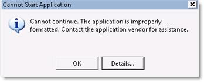
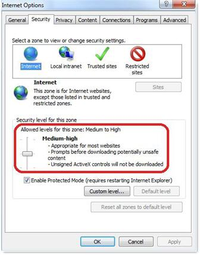

# Cannot continue error when you start the Office 365 Desktop Setup Tool

[!INCLUDE [Branding name note](../../../includes/branding-name-note.md)]

## Problem

When you try to start the Office 365 Desktop Setup Tool, you receive the following error message:

> Cannot continue. The application is improperly formatted. Contact the application vendor for assistance.

If you click **Details** in the dialog box, you receive a detailed error message that's like the following:

PLATFORM VERSION INFO

Windows: 6.0.6002.131072 (Win32NT)
Common Language Runtime: 2.0.50727.4214
System.Deployment.dll: 2.0.50727.4016 (NetFxQFE.050727-4000)
mscorwks.dll: 2.0.50727.4214 (VistaSP2GDR.050727-4200)
dfdll.dll: 2.0.50727.4016 (NetFxQFE.050727-4000)
dfshim.dll: 4.0.31106.0 (Main.031106-0000)

SOURCES

Deployment url: `https://bposast.vo.msecnd.net/ClickOnceConnector/Office365DesktopSetup.application`
Server: Microsoft-IIS/7.0

ERROR SUMMARY

Below is a summary of the errors, details of these errors are listed later in the log.* Activation of `https://bposast.vo.msecnd.net/ClickOnceConnector/Office365DesktopSetup.application` resulted in exception. Following failure messages were detected:
- Your Web browser settings do not allow you to run unsigned applications.

  COMPONENT STORE TRANSACTION FAILURE SUMMARY

  No transaction error was detected.WARNINGS

  There were no warnings during this operation.

  OPERATION PROGRESS STATUS
- [9/1/2011 6:23:51 PM]: Activation of `https://bposast.vo.msecnd.net/ClickOnceConnector/Office365DesktopSetup.application` has started.

  ERROR DETAILS

  Following errors were detected during this operation.
[9/1/2011 6:23:51 PM] System.Deployment.Application.InvalidDeploymentException (Manifest)

  -Your Web browser settings do not allow you to run unsigned applications.

  -Source: System.Deployment
 
  -Stack trace:

  at System.Deployment.Application.ApplicationActivator.BrowserSettings.Validate(String manifestPath)
  at System.Deployment.Application.ApplicationActivator.PerformDeploymentActivation(Uri activationUri, Boolean isShortcut, String textualSubId, String deploymentProviderUrlFromExtension, BrowserSettings browserSettings, String& errorPageUrl)
  at System.Deployment.Application.ApplicationActivator.ActivateDeploymentWorker(Object state)

  COMPONENT STORE TRANSACTION DETAILS

  No transaction information is available.

## Cause

This issue occurs for the following reasons:

- The Internet Explorer security level for the Internet zone is set to High.    
- Internet Explorer is explicitly prevented from running programs in a lower security level for the Internet zone.   

## Solution

To resolve this issue, use one of the following methods.
### Method 1: Set the security level of the Internet zone in Internet Explorer to Medium-high
To do this, follow these steps: 

1. Start Internet Explorer, and then on the **Tools** menu, click **Internet options**.    
2. Click the **Security** tab, and then click the **Internet** zone.   
3. Set the security level to **Medium-high** (the default setting), and then click ****OK****.

       

### Method 2: Enable Internet Explorer to run signed programs, and then add the Office 365 application server to the Trusted sites list 

If the security level of the Internet zone in Internet Explorer is set higher than the Medium-high level and you don't want to change it, add the Office 365 application server to the **Trusted sites** list, and then enable Internet Explorer to run signed applications. To do this, follow these steps: 

1. Start Internet Explorer, and then click **Internet options** on the **Tools** menu.    
2. Click the **Security** tab, and then select the **Trusted sites** zone.   
3. Click **Custom level**, and then click **Enable** under **Run components signed with Authenticode**, if this item isn't already enabled.

   Note Doing this enables Internet Explorer to run signed programs from sites in this zone.
 
4. Click **OK**, and then click **Sites**.   
5. Add the server site to the **Websites** list in the Trusted sites zone.    

Still need help? Go to [Microsoft Community](https://answers.microsoft.com/).