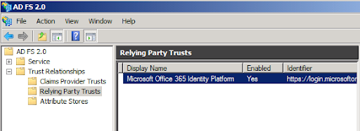
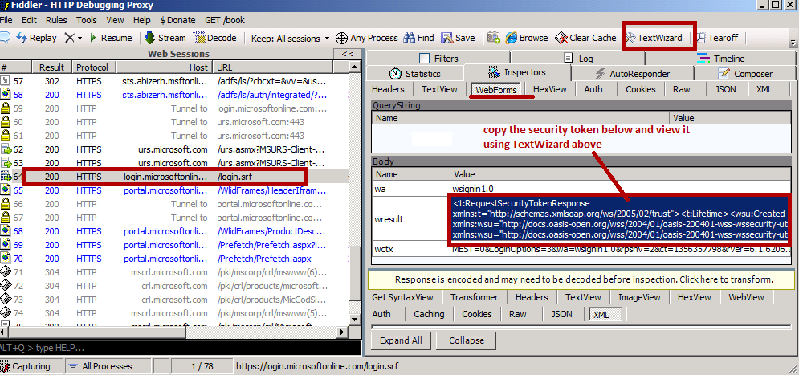
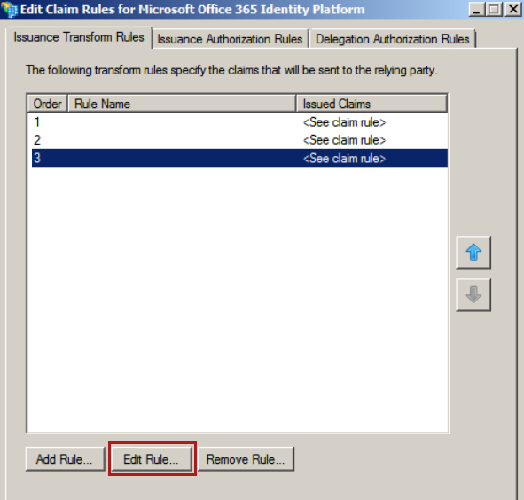

# SupportMultipleDomain switch when managing SSO to Office 365

## Summary

### Use of SupportMultipleDomain switch, when managing SSO to Office 365 using ADFS

When a SSO is enabled for O365 via ADFS, you should see the Relying Party (RP) trust created for O365.



### Commands that would create the RP trust for O365 are below:

```PowerShell
New-MsolFederatedDomain -DomainName<domain>
Update-MSOLFederatedDomain -DomainName <domain>
Convert-MsolDomainToFederated -DomainName <domain>
```

The RP trust created above came with 2 claims rules

Get-MsolFederationProperty -DomainName <domain> on the federated domains shows that the “FederationServiceIdentifier” was the same for source ADFS and O365 i.e. the http://stsname/adfs/Services/trust


Earlier before the ADFS [Rollup 1](https://support.microsoft.com/kb/2607496) and [Rollup 2](https://support.microsoft.com/kb/2681584) updates,Microsoft Office 365 customers who utilize single sign-on (SSO) through AD FS 2.0 and have multiple top level domains for users' user principal name (UPN) suffixes within their organization (for example, @contoso.com or @fabrikam.com) are required to deploy a separate instance of AD FS 2.0 Federation Service for each suffix.  There is now a rollup for AD FS 2.0 ([https://support.microsoft.com/kb/2607496](https://support.microsoft.com/kb/2607496)) that works in conjunction with the “SupportMultipleDomain” switch to enable the AD FS server to support this scenario without requiring additional AD FS 2.0 servers.


### With the ADFS rollup 1 update, we added the following functionality:


#### Multiple Issuer Support
“Previously, Microsoft Office 365 customers who require single sign-on (SSO) by using AD FS 2.0 and use multiple top level domains for users' user principal name (UPN) suffixes within their organization (for example, @contoso.us or @contoso.de) are required to deploy a separate instance of AD FS 2.0 Federation Service for each suffix. After you install this Update Rollup on all the AD FS 2.0 federation servers in the farm and follow the instructions of using this feature with Office 365, new claim rules will be set to dynamically generate token issuer IDs based on the UPN suffixes of the Office 365 users. As a result, you do not have to set up multiple instances of AD FS 2.0 federation server to support SSO for multiple top level domains in Office 365.”


#### Support for Multiple Top Level Domains

“Currently, Microsoft Office 365 customers who utilize single sign-on (SSO) through AD FS 2.0 and have multiple top level domains for users' user principal name (UPN) suffixes within their organization (for example, @contoso.com or @fabrikam.com) are required to deploy a separate instance of AD FS 2.0 Federation Service for each suffix.  There is now a rollup for AD FS 2.0 ([https://support.microsoft.com/kb/2607496](https://support.microsoft.com/kb/2607496)) that works in conjunction with the “SupportMultipleDomain” switch to enable the AD FS server to support this scenario without requiring additional AD FS 2.0 servers.”

### Commands that would create the RP trust for O365 are below:

```powershell
New-MsolFederatedDomain -DomainName<domain>-SupportMultiDomain

Update-MSOLFederatedDomain -DomainName <domain>-SupportMultipleDomain

Convert-MsolDomainToFederated -DomainName <domain>-supportMultipleDomain
```

Get-MsolFederationProperty -DomainName <domain> on the federated domains now shows that the “FederationServiceIdentifier” is different for ADFS and O365. Every federated domain will have the “FederationServiceIdentifier” as 
http://<domainname>/adfs/services/trust/ whereas the ADFS configuration still has http://STSname/adfs/Services/trust


Due to this mismatch in configuration, we need to ensure that when a token is sent to O365 the issuer mentioned in it, is the same as one configured for the Domain in O365. If not you will get the error below:


So when adding or updating RP trust with SupportMultipleDomain switch, a 3rd claim rule is automatically added to the RP trust for O365.

Default 3rd rule:

c:[Type == "[http://schemas.xmlsoap.org/claims/UPN](http://schemas.xmlsoap.org/claims/UPN)"]
=> issue(Type = "[https://schemas.microsoft.com/ws/2008/06/identity/claims/issuerid](https://schemas.microsoft.com/ws/2008/06/identity/claims/issuerid)", Value = regexreplace(c.Value, "[.+@(?<domain>.+)](mailto:.+@%28?%3cdomain%3e.+%29)", "http://${domain}/adfs/services/trust/"));

This rule uses the suffix value of user’s UPN and uses that to generate a new claim called Issuerid. Example [http://contoso.com/adfs/services/trust/](http://contoso.com/adfs/services/trust/)


Using [fiddler](https://www.fiddler2.com/fiddler2/), we can trace the token being passed to login.microsoftonline.com/login.srf. After copying the token passed in wresult, paste the content in notepad and save that file as .xml.
Later you can open the token saved as .xml file using IE and see its content.




It’s interesting to note that the though this rule issues Issuerid claim, we don’t see this claim in the response token, in fact we see the “Issuer” attribute modified to the newly composed value.

```adoc
<saml:Assertion MajorVersion="1" MinorVersion="1" AssertionID="_2546eb2e-a3a6-4cf3-9006-c9f20560097f"Issuer="[http://contoso.com/adfs/services/trust/](http://contoso.com/adfs/services/trust/)" IssueInstant="2012-12-23T04:07:30.874Z" xmlns:saml="urn:oasis:names:tc:SAML:1.0:assertion">
```
**NOTE** If

- SupportMultipleDomain is used without the ADFS rollup 1 or 2 installed. You will see that the response token generated by ADFS has BOTH the Issuer=”[http://STSname/adfs/Services/trust](http://stsname/adfs/Services/trust) and the claim “Issuerid” with the composed value as per the 3rd claim rule.

    ```adoc
    <saml:Assertion MajorVersion="1" MinorVersion="1" AssertionID="_2546eb2e-a3a6-4cf3-9006-c9f20560097f"Issuer="[http://STS.contoso.com/adfs/services/trust/](http://sts.contoso.com/adfs/services/trust/)" IssueInstant="2012-12-23T04:07:30.874Z" xmlns:saml="urn:oasis:names:tc:SAML:1.0:assertion">
    
    …
    
    <saml:Attribute AttributeName="issuerid" AttributeNamespace="[http://schemas.microsoft.com/ws/2008/06/identity/claims](http://schemas.microsoft.com/ws/2008/06/identity/claims)"><saml:AttributeValue>[http://contoso.com/adfs/services/trust/</saml:AttributeValue](http://contoso.com/adfs/services/trust/%3c/saml:AttributeValue)></saml:Attribute>
    - This will again lead to error “Your organization could not sign you in to this service”
    ```
#### Support for Sub domains

“It is important to note that the“SupportMultipleDomain” switch is not required when you have a single top level domain and multiple sub domains.  For example if the domains used for upn suffixes are @sales.contoso.com, @marketing.contoso.com and @contoso.com and the top level domain (contoso.com in this case) was added first and federated then you don’t need to use the “SupportMultipleDomain” switch.  This is because these sub domains are effectively managed within the scope of the parent and a single AD FS server can be utilized to handle this already.”

If however, you have multiple top level domains (@contoso.com and @fabrikam.com) and these domains also have sub domains (@sales.contoso.com and @sales.fabrikam.com) the “SupportMultipleDomain” switch will not work for the sub domains and these users will not be able to login.

#### Why will this switch not work, in the above scenario?
Answer:
- For child domain, sharing the same namespace, we don’t federate them separately. The federated root domain covers the child as well, which mean that the
federationServiceIdentifier value for the child domain will also be the same as that of parent i.e.
[https://contoso.com/adfs/services/trust/](https://contoso.com/adfs/services/trust/)

- But the 3rd claim rule which ends up picking the UPN suffix for the user to compose the Issuer value ends up with[https://Child1.contoso.com/adfs/services/trust/](https://child1.contoso.com/adfs/services/trust/), again causing a mismatch and hence the error“Your organization could not sign you in to this service”

  To resolve this, we can modify the 3rd rule such that it ends up generating an Issuer value that matches “FederationServiceIdentifier” for the domain at O365 end. 2 different rules that can work in this scenario is below. This rule just picks up the root domain from the UPN suffix to compose the Issuer value. For a UPN suffix child1.contoso.com, it will still generate an Issuer value of [https://contoso.com/adfs/services/trust/](http://contoso.com/adfs/services/trust/) instead of  [https://Child1.contoso.com/adfs/services/trust/](https://child1.contoso.com/adfs/services/trust/) (with default rule)



#### Customized 3rd rule


Rule 1:

```adoc
c:[Type == "[http://schemas.xmlsoap.org/claims/UPN](http://schemas.xmlsoap.org/claims/UPN)"]
=> issue(Type = "[http://schemas.microsoft.com/ws/2008/06/identity/claims/issuerid](http://schemas.microsoft.com/ws/2008/06/identity/claims/issuerid)", Value = regexreplace(c.Value, "^((.*)([.|@]))?(?<domain>[^.]*[.].*)$", "http://${domain}/adfs/services/trust/"));
```

Rule 2:

```adoc
c:[Type == "[http://schemas.xmlsoap.org/claims/UPN](http://schemas.xmlsoap.org/claims/UPN)"]
=> issue(Type = "[http://schemas.microsoft.com/ws/2008/06/identity/claims/issuerid](http://schemas.microsoft.com/ws/2008/06/identity/claims/issuerid)", Value =regexreplace(c.Value, “^((.*)([.|@]))?(?<domain>[^.]*.(com|net|co|org)(.\w\w)?)$”, “[http://${domain}/adfs/services/trust/](http://$%7bdomain%7d/adfs/services/trust/)”));
```
**Note**

The rules above may not apply to all scenarios, but can be customized toensure that the Issuerid value matches “FederationServiceIdentifier” for the domain added/federated at O365 end.

The mismatch of federationServiceIdentifier between ADFS and O365 for a domain can also be corrected by modifying the “federationServiceIdentifier” for the domain at O365 end, to match the “federationServiceIdentifier” for ADFS. But the federationServiceIdentifier can only be configured for ONE federated domain and not all.

Set-MSOLDomainFederationSettings -domainname  Contoso.com –issueruri 
[http://STS.contoso.com/adfs/services/trust/](http://sts.contoso.com/adfs/services/trust/)


### More information that should help you write your own claim rules.**

- [The Role of the Claim Rule Language](https://technet.microsoft.com/library/dd807118%28WS.10%29.aspx)
- [Understanding Claim Rule Language in AD FS 2.0](https://social.technet.microsoft.com/wiki/contents/articles/4792.understanding-claim-rule-language-in-ad-fs-2-0.aspx#General_Syntax_of_the_Claim_Rule_Language)
- [Regular Expressions](https://technet.microsoft.com/library/hh440535.aspx)
