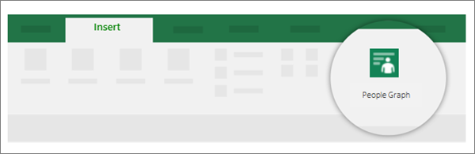
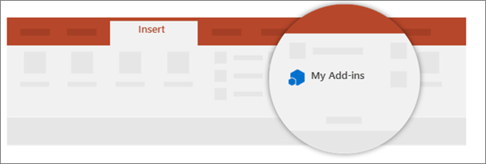
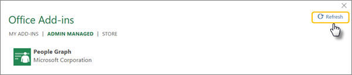
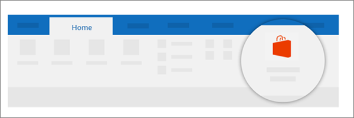

# User not seeing add-ins

Now that you've deployed the add-in, your end users can start using it in their Office applications. The add-in will appear on all platforms that the add-in supports.
  
## For Word, PowerPoint, and Excel 2016

If the add-in supports add-in commands, the commands appear on the Office ribbon. In the following example, the command appears for the People Graph add-in in the **Insert** tab. The add-in command can appear on any tab. 
  

  
If the deployed add-in doesn't support add-in commands or if you want to view all deployed add-ins, you can view them via **My Add-ins** from the **Insert** tab. 
  

  
Then select the **Admin Managed** tab along the top in the Office Add-ins window. If add-in is not there, select **Refresh** in the top right corner. 
  

  
## For Outlook 2016

On the **Home** ribbon, select **Store**, as shown here. Select **Admin-managed** in the left nav. 
  

  
Users can't see add-in? Try one of these:
  
- **Use the compatibility checker**
    
  - Outputs a status report for each user in your organization, whether they have a valid Office License, if they are set up correctly on Exchange, and if they are ready for centralized deployment. For more information, see [deployment compatibility checker](https://www.microsoft.com/download/details.aspx?id=55270).
    
- **Check Office version requirements**
    
  - The user might be on an older, incompatible version of Office. For add-ins to be deployed the user must have Office ProPlus 2016. You can check this out for any member of your organization. To find out how, see [Office 365 reports](https://support.office.com/article/office-365-reports-in-the-admin-center-microsoft-office-activations-87c24ae2-82e0-4d1e-be01-c3bcc3f18c60?ui=en-US&amp;rs=en-US&amp;ad=US).
    
  - Alternatively, you can check this manually by going to the application, such as Word, then select **File \> Account**. Under **Product Information**, you should see **Office 365 ProPlus**. 
    
- **Check Exchange requirements**
    
  - Microsoft Exchange stores the add-in manifests within your organization's tenant. The admin deploying add-ins and the users receiving those add-ins must be on a version of Exchange Server that supports OAuth authentication. By default, Exchange Multi-Tenant and Dedicated VNext deployments support OAuth. Exchange Dedicated Legacy and hybrid on-premises deployments can be configured to support OAuth; however, it isn't the default configuration.
    
  - Check with your organization's Exchange admin to find out which configuration is in use. OAuth connectivity per user can be verified by using the [Test-OAuthConnectivity](https://docs.microsoft.com/powershell/module/exchange/organization/Test-OAuthConnectivity?view=exchange-ps) PowerShell cmdlet. 
    
- **See regulations surrounding minors using add-ins**
    
  - Please see further information regarding [minors using add-ins](https://support.office.com/article/Manage-deployment-of-Office-365-add-ins-in-the-Office-365-admin-center-737e8c86-be63-44d7-bf02-492fa7cd9c3f) if applicable. 
    
- **Check for nested groups**
    
  - Add-ins will no longer appear to the user if the user is removed from a group that the add-in is assigned to.
    
  - Centralized deployment currently does not support nested group assignments. It supports users in top-level groups or groups without parent groups, but not users in nested groups or groups that have parent groups.
    
  - For more information, check out [user and group assignments](https://support.office.com/article/Determine-if-Centralized-Deployment-of-add-ins-works-for-your-Office-365-organization-B4527D49-4073-4B43-8274-31B7A3166F92).
    
## See also

[Manage deployment of Office 365 add-ins in the Microsoft 365 admin center](https://docs.microsoft.com/office365/admin/manage/manage-deployment-of-add-ins)
