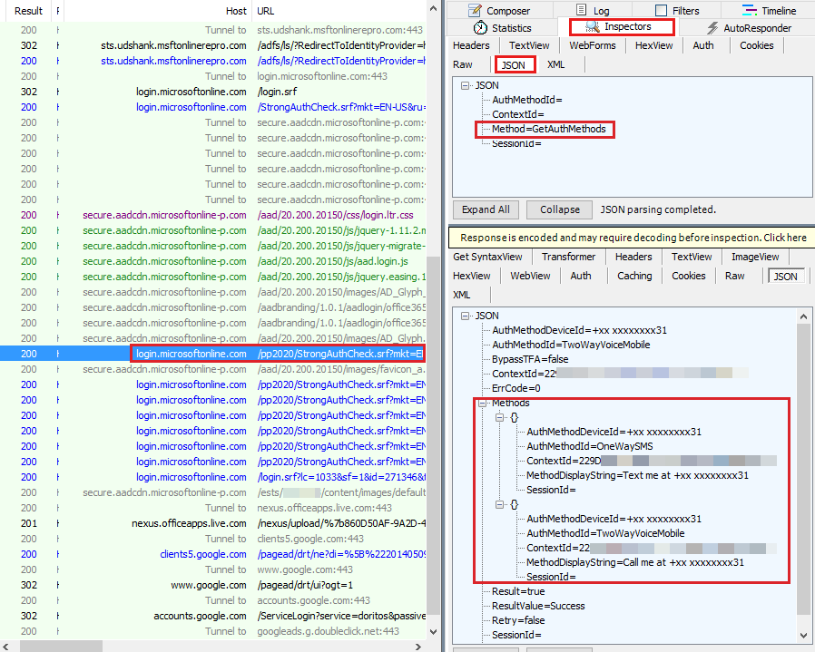
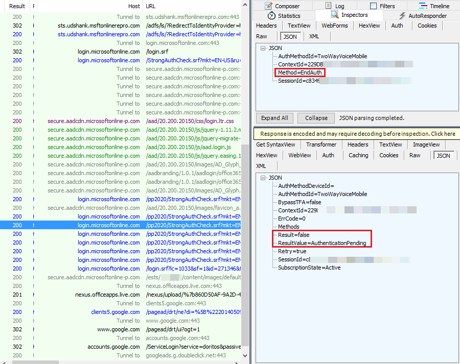

# How to use Fiddler trace logs for MFA in Office 365 and Azure AD

[!INCLUDE [Branding name note](../../../includes/branding-name-note.md)]

##  Summary

This article introduces the Fiddler trace log for the following multifactor authentication (MFA) scenarios:

- Working MFA scenarios 
- When the phone is out of coverage or the phone is not picked 
- When the fraud alert is triggered to block the account in the cloud
- For a blocked account 
- When MFA is used for managed accounts 

##  More Information

If a user account is federated, the user is redirected to the Service Token Server (STS) for authentication and to login.microsoftonline.com, and the SAML token is issued by the STS. If the user is managed, login.microsoftonline.com authenticates the user by way of the user's password.

MFA starts after the user's password has been verified by Azure AD or STS. The `SANeeded=1` cookie will be set if the user is enabled for MFA authentication in Office 365 or Azure directory. The communication between the client and login.microsoftonline.com after the user password authentication resembles the following:

> POST `https://login.microsoftonline.com/login.srf` HTTP/1.1  
> Host: login.microsoftonline.com
>
> HTTP/1.1 302 Found
>
> Set-Cookie: SANeeded=1; domain=login.microsoftonline.com;secure= ;path=/;HTTPOnly= ;version=1

### Scenario 1: Working MFA scenarios

The SANeeded=1 cookie is set after password authentication. Network traffic is then redirected to the endpoint: `https://login.microsoftonline.com/StrongAuthCheck.srf`, and available authentication methods are requested.

MFA starts with BeginAuth, and then the phone call is triggered on the back end to the phone service provider. 

After MFA authorization has begun, the client starts to query the same endpoint for the EndAuth method every 10 seconds to check whether authentication has completed. Until the call has been picked and verified, the Resultvalue is returned as AuthenticationPending. 

When the phone has been picked and verified, the answer for the next query for EndAuth will be a ResultValue of Success. Additionally, the user has completed Mulitifactor authentication. Also the Set-Cookie : SANeeded=xxxxxxx cookie is set in the response, which will be given to the endpoint : login.srf to complete authentication. 

### Scenario 2: When the phone is out of coverage or the phone is not picked
When the phone is not picked and verified within 60 seconds after the call is made, the ResultValue will be set as UserVoiceAuthFailedPhoneUnreachable. And at the next query for the EndAuth method, UserVoiceAuthFailedPhoneUnreachable is returned, as seen in Fiddler.

### Scenario 3: When the fraud alert is triggered to block the account in the cloud
When the phone has not been picked and a fraud alert posted within 60 seconds after the call is made, the ResultValue will be set as AuthenticationMethodFailed. And at the next query for the EndAuth method, an AuthenticationMethodFailed response is returned, as seen in Fiddler.

### Scenario 4: For a blocked account
If the user is blocked, ResultValue will be set as UserIsBlocked. At the first query for the EndAuth method, UserIsBlocked will be returned, as seen in Fiddler.

Solution: In an Azure MFA scenario with an Azure subscription, you can unblock by first logging on to manage.windowsazure.com. Then, select **Directory > Users** and **Manage Multi factor Authentication** > **Service Settings**. At the end of the page, select **Go to portal**. Now, select **Block/Unblock Users** to find the list of blocked users.

If MFA is enabled through Office 365, open a support case with Microsoft to unblock it. 

### Scenario 5: MFA for managed accounts
In this situation, authentication remains the same, but the endpoints will be [https://login.microsoftonline.com/common/SAS/BeginAuth](https://login.microsoftonline.com/common/sas/beginauth) and [https://login.microsoftonline.com/common/SAS/EndAuth](https://login.microsoftonline.com/common/sas/endauth) instead of `https://login.microsoftonline.com/StrongAuthCheck.srf` as for the federated accounts.