# How to run (SaRA) Fiddler Trace

[!INCLUDE [Branding name note](../../../includes/branding-name-note.md)]

## Summary

Fiddler is a third-party (non-Microsoft) web debugging proxy that logs all HTTP(S) traffic between a user's computer and the Internet. It includes a powerful, event-based scripting subsystem (Fiddler Tracer) and can be extended by using any Microsoft .NET language.

## More Information

> [!NOTE]
> The Fiddler Trace scenario in SaRA can only be run with the assistance of [Microsoft Support](https://support.microsoft.com/contactus).

To install and run the Fiddler Trace scenario in the Microsoft Support and Recovery Assistant (SaRA), follow these steps:

1. Go to the [SaRA Assisted Setup](https://aka.ms/SaRA-Assisted).
2. When prompted by your browser, select **Run**.
3. In the "Do you want to install this application?" window, select **Install**.

   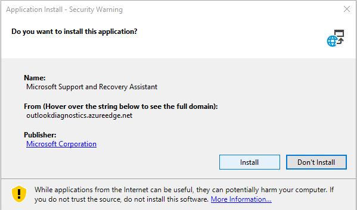

4. Wait for the download to finish.

   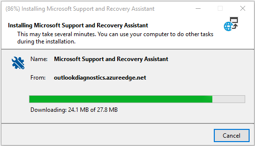

5. Read the **Microsoft Services Agreement**, then at the bottom of the window, select **I agree**.

   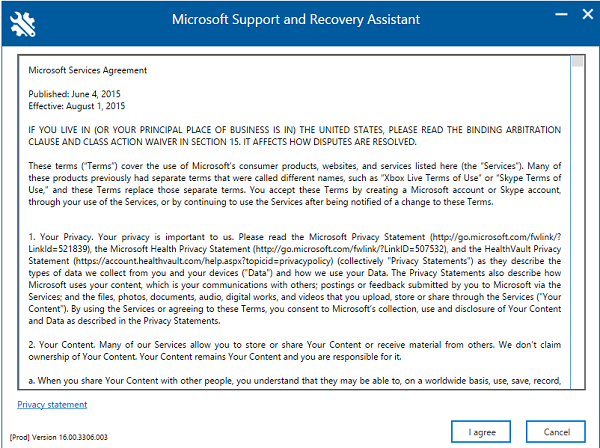

6. Enter the passcode provided by Microsoft Support in the box, and then select **Next**.

   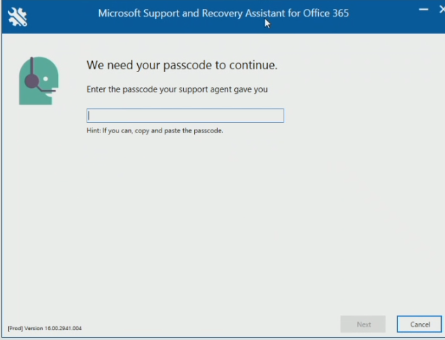

7. In the **Security Warning** window, select **Yes** and then select **Next**.

   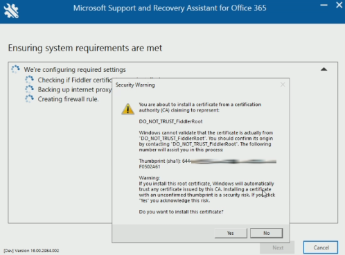

8. Select **Start** to capture the log.
   Note: The log may contain personal information. You can review the log before you send them to us. You decide whether or not to send us the logs.

   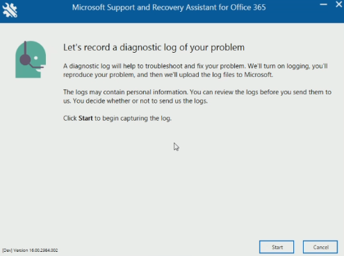

9. Reproduce the issue that you are having, and then return to the Recovery Assistant and select **Stop**. The Recover Assistant stops recording, creates the log files, and then restarts your applications.

   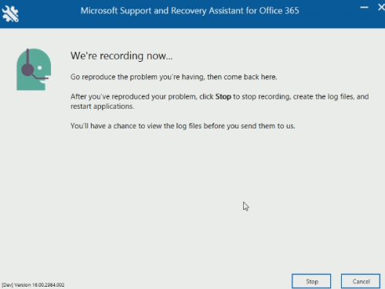

10. To help secure the network capture, enter a password. Note the password so that you can provide it to support technicians if they request it. When finished, select **Next**. 
   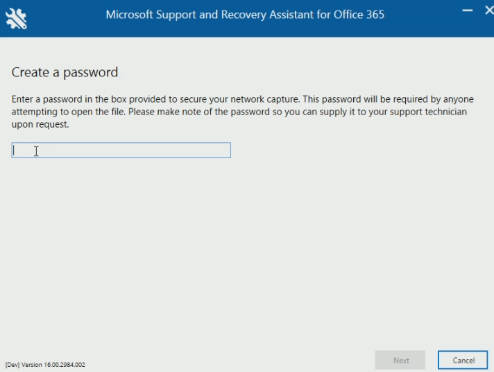

11. If you are satisfied with the information that the Recovery Assistant has collected, select **Next**. If you want to discard the information and repeat this procedure to collect new information, select **Start over**.
   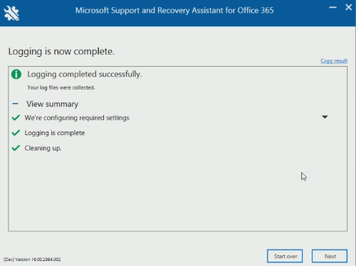

12. On the **Thanks for collecting diagnostic logs** page, follow the instructions to upload the log files and then select **Next**.
   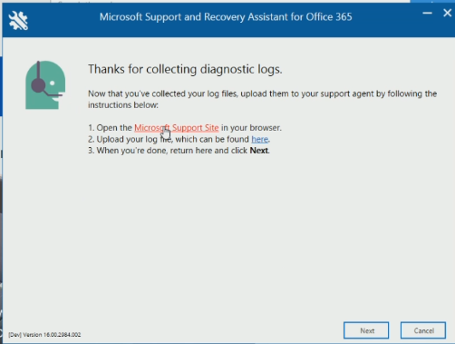

      > [!NOTE]
      > - Selecting the "Microsoft Support Site" link opens the file transfer workspace.
      > - Selecting the "here" link opens the folder that holds the recorded log files.

13. On the Microsoft Support Secure File Exchange website, select **Add files** to upload the log files.
   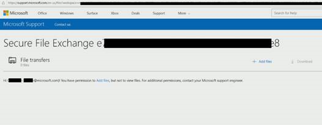
