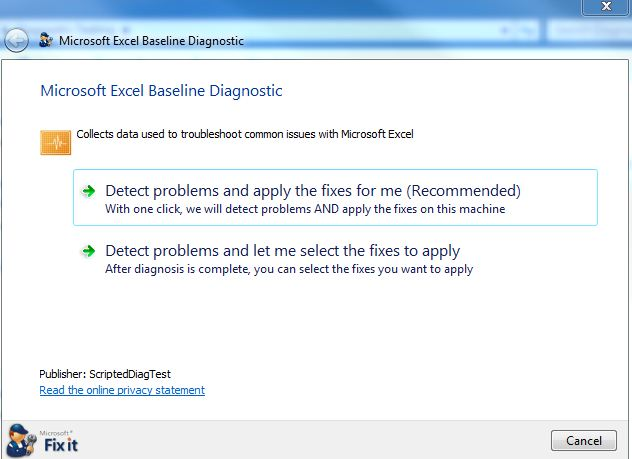
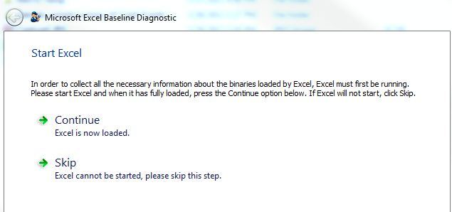

# [SDP 3][7b5791e2-2449-4351-867a-a22d34449d15] Data that is collected by the Excel Support Diagnostic

## Summary

This Support Diagnostics Platform (SDP) manifest file collects relevant log files, registry keys, client networking configuration, application event logs, and important file details that are used by the following Microsoft Office applications: 

- Microsoft Excel 2013   
- Microsoft Excel 2010   
- Microsoft Office Excel 2007   
- Microsoft Office Excel 2003   

Also, to help troubleshoot common support issues, a series of configuration checks are run to check whether you may be encountering the condition that is specified by the check.

This article discusses the data that is collected by the Microsoft Excel Baseline Diagnostic.

## More Information

When you run the Excel Baseline Diagnostic, you receive a message that resembles the following. The message asks whether you want to have fixes applied automatically or by selecting them yourself: 

You see several items that are running, and then you see a prompt that resembles the following. The prompt lets you know that the Excel application will have to be open to continue. 

You should click **Skip** only if you are experiencing startup issues (for example, crashes) with the selected application. 

> [!NOTE]
> - All file names in the data collection are prefaced by <**ComputerName**>. This placeholder represents the name of the computer on which the Microsoft Support Diagnostic Tool is run.    
> - Some file names in the data collection include <**full path**>. This placeholder represents the full path of the file on the hard disk.

### Data that is collected for all Office applications

#### Add-ins that are installed for the Office application 

|Description|File Name|Formats|
|---|---|---|
|List of third-party add-ins|<**ComputerName**>_3rd_party_addins.*|.txt|
|List of Microsoft add-ins|<**ComputerName**>_msft_addins.*|.txt|

#### Third-party modules that are running under the Office application 

|Description|File name|Formats|
|---|---|---|
|List of third-party modules running under the selected process|<**ComputerName**>_3rd_party_Modules.*|.txt|

#### Autorun information

For more information about the Autoruns utility that is used to collect this information, see [Autoruns for Windows v13.96](https://docs.microsoft.com/sysinternals/downloads/autoruns).

|Description|File name|Formats|
|---|---|---|
|Autorun information|<**ComputerName**>_Autoruns.*| .xml, .htm|

#### Application and System logs

Events from the last 15 days are recorded in the full

|Description|File name|Formats|
|---|---|---|
|Event log - Application|<**ComputerName**>_evt_Application.*|.txt, .csv, .evtx|
|Event log - System|<**ComputerName**>_evt_System.*|.txt, .csv, .evtx|
|Event log - OAlerts|<*ComputerName*>_evt_OAlerts.*|.txt, .csv, .evtx|
 - File created from the Application event logs: <ComputerName>_crash_events_applog.csv

#### Environment variables

This set of environment variables is a subset of those that are displayed by running the Setcommand at a command prompt.

|Description|File name|Formats|
|---|---|---|
|List containing environment variables and their values|<**ComputerName**>_EnvironmentVariables.*|.txt|

#### Uploaded files

|Description|File name|Formats|
|---|---|---|
|File containing any additional file(s) that you elected to upload to Microsoft|<**ComputerName**>_File.*|.zip|

#### Updates Installed 

|Description|File name|Formats|
|---|---|---|
|List of updates that are installed on the client|<**ComputerName**>_Hotfixes.*|.txt, .htm, .csv|

#### Software Installed

|Description|File name|Formats|
|---|---|---|
|List of software products that are installed on the client|<**ComputerName**>_Installed_Products.*|.csv|

#### List of processes that are running on the computer

|Description|File name|Formats|
|---|---|---|
|List of processes and related services running on the computer|<**ComputerName**>_Processes.*|.txt|
|List of non-Microsoft processes and services running on the computer|<*ComputerName*>_Non_Microsoft_Services_Running.*|.csv|
|List of Enabled Startup Items|<*ComputerName*>_Startup_Items_Enabled.*|.csv|

#### Windows registry keys

Windows registry locations below are exported in full .reg files. Text files are then created from these files. 

|Description|File name|Formats|
|---|---|---|
|HKEY_CURRENT_USER\Software\Microsoft\Office|<**ComputerName**>_reg_HKCU_Office.*|.txt|
|HKEY_CURRENT_USER\Software\Policies|<**ComputerName**>_reg_HKCU_Policies.*|.txt|
|HKEY_LOCAL_MACHINE\Software\Microsoft\Windows NT\CurrentVersion\Image File Execution Options, HKEY_LOCAL_MACHINE\Software\Wow6432Node\Microsoft\Windows NT\CurrentVersion\Image File Execution Options|<**ComputerName**>_reg_HKLM_IFEO.*|.txt|
|HKEY_LOCAL_MACHINE\Software\Microsoft\Office, HKEY_LOCAL_MACHINE\Software\Wow6432Node\Microsoft\Office|<**ComputerName**>_reg_HKLM_Office.*|.txt|
|HKEY_CLASSES_ROOT (filtered)|<*ComputerName*>_HKCR_XLnExtsFiltered.*|.txt, .reg|
|HKEY_CURRENT_USER\Software\Microsoft\Windows\CurrentVersion\Explorer\FileExts|<*ComputerName*>_HKCU_FileExts.*|.txt, .reg|

#### Networking details

|Description|File name|Formats|
|---|---|---|
|List with network-related parameters|<**ComputerName**>_SMB-Info.*|.txt|
|List with TCP/IP-related information from the computer|<**ComputerName**>_TcpIp-Info.*|.txt|

#### Robust Office Inventory Scan output

|Description|File name|Formats|
|---|---|---|
|List of installed applications of the supported Office families|<**ComputerName**>_ROIScan.*|.xml, .log|

### Excel data

In addition to the data that is listed in the "Data that is collected for all Office applications" section, the following files are collected specifically for Microsoft Office Excel when you run this diagnostic.

#### Information about the XLStart folder

|Description|File name|Formats|
|---|---|---|
|Summary of files found in the folder and subfolders: C:\Users\{username}\AppData\Roaming\Microsoft\Excel|<**ComputerName**>_dir_Contents_AppData-Microsoft-Excel.*|.txt|
|Summary of files that are found in the folder: \\{Office Install folder}\XLStart|<**ComputerName**>_dir_Contents_XLStart.*|.txt|
|Summary of Excel specific information|<**ComputerName**>_Excel_Configuration_Summary.*|.txt|
|Additional Configuration Information that may affect Excel|<*ComputerName*>_Excel_Additional_Summary.*|.txt|

#### File information for important Excel files

Text and .csv files contain details about important files that are used by Excel. 

File details include: Version, Location, Description, Size, Date, Company

|Description|File name|Formats|
|---|---|---|
|Common Office program file information|<**ComputerName**>_sym_CommonProgramFilesOffice.*|.csv, .txt |
|32-bit Common Office program file information|<**ComputerName**>_sym_CommonProgramFilesx86Office.*|.csv, .txt |
|Common System program file information|<**ComputerName**>_sym_CommonProgramFilesSystem.*|.csv, .txt |
|32-bit Common System program file information|<**ComputerName**>_sym_CommonProgramFilesx86System.*|.csv, .txt |
|Common VBA Program file information|<**ComputerName**>_sym_CommonProgramFilesVBA.*|.csv, .txt |
|32-bit Common VBA Program file information|<**ComputerName**>_sym_CommonProgramFilesx86VBA.*|.csv, .txt |
|Common VSTO Program file information|<**ComputerName**>_sym_CommonProgramFilesVSTO.*|.csv, .txt |
|32-bit Common VSTO Program file information|<**ComputerName**>_sym_CommonProgramFilesx86VSTO.*|.csv, .txt |
|Office Program information|<**ComputerName**>_sym_ProgramFilesOffice.*|.csv, .txt |
|Office Addins Program information|<*ComputerName*>_sym_ProgramFilesOfficeAddins.*|.csv, .txt|
||||
|System 32 information|<**ComputerName**>_sym_System32.*|.csv, .txt |
|System 32 (64-bit) information|<**ComputerName**>_sym_Syswow64.*|.csv, .txt |
||||
|64-bit Click-to-Run Program File Information|<*ComputerName*>_sym_C2R_ProgramFilesCommonx64.*|.csv, .txt |
|32-bit Click-to-Run Program File Information|<*ComputerName*>_sym_C2R_ProgramFilesCommonx86.*|.csv, .txt |

|Description|File name|Formats|
|---|---|---|
|.DLL files currently running under the Excel.exe process|<**ComputerName**>_sym_excel_Process.*|.csv, .txt |

#### Other

|Description|File Name|Formats|
|---|---|---|
|Resultant set of policy (RSoP) generated by gpresult.exe|<*ComputerName*>_GPResult.*|.htm, .csv|
|List of modules and the status of their signature|<*ComputerName*>_Module_Signature_Status.*|.txt|
|List of Printers|<*ComputerName*>_Printers.*|.txt|
|List of Video Driver Information|<*ComputerName*>_VideoDriverInformation.*|.txt|
|Click-to-Run Configuration Information|<*ComputerName*>_Click-To-Run_Details.*|.txt|
|Summary of File Association information most relevant to Excel|<*ComputerName*>_Excel_File_Associations.*|.txt|

Reports created for the Office Configuration Analyzer Tool (OffCAT)

|Description|File Name|Formats|
|---|---|---|
|Summary of OffCAT Information|<*ComputerName*>_OffCAT_Report.*|.html|
|OffCAT results|<*ComputerName*>_OffCAT_Results.*|.xml, .xml.log|

Related article:

[Office Configuration Analyzer Tool (OffCAT) information](https://support.microsoft.com/help/2812744)

### Fixes Offered

Fixes are offered for known issues while running this utility. Knowledge Base articles are provided for more information with each fix offered. You may choose to apply the fix automatically or opt-out. If choosing to opt-out, please review the articles and apply the fixes manually as you choose. 

#### Known issue 

If the tool offers you only one opportunity to "fix" an issue and you opt out, the tool may appear to run successfully. However, results will not be uploaded. 

To work around this issue, run the diagnostic package by using the **Additional Methods** option. 

## References

[Information about Microsoft Automated Troubleshooting Services and Support Diagnostic Platform](https://support.microsoft.com/help/2598970)
