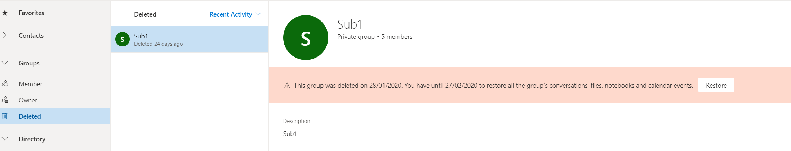
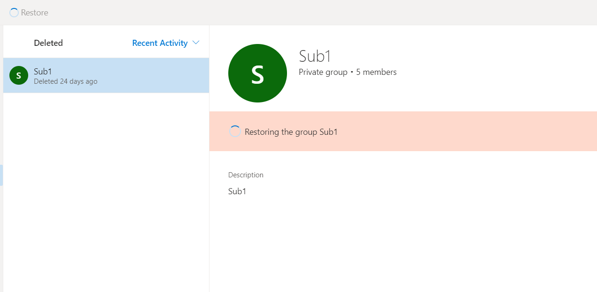
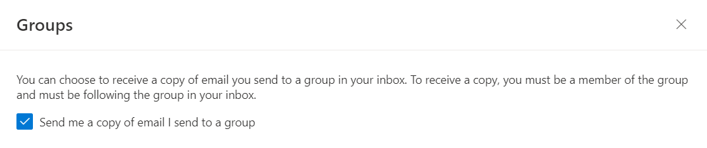
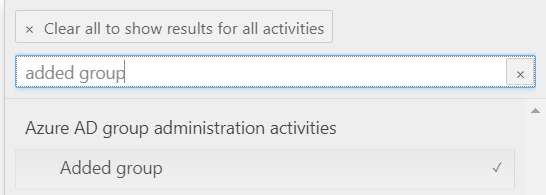

# O365 Groups - common tasks

## Office 365 Groups and Teams

### Display an Office 365 group associated with a team in Outlook and OWA clients or in the address list

All new teams have an associated Office 365 group. By default, this Office 365 group is hidden from Exchange clients (Outlook and OWA) and is also hidden from the global address list (GAL). You can unhide the group by using Exchange Online PowerShell.

#### Unhide the Office 365 group from the Outlook/OWA address list

1. [Connect to Exchange Online PowerShell](/powershell/exchange/exchange-online/connect-to-exchange-online-powershell/connect-to-exchange-online-powershell?view=exchange-ps).
2. Run the following command and specify the required value:

   ```powershell
   Set-UnifiedGroup -Identity <UnifiedGroupIdParameter> -HiddenFromAddressListsEnabled $false
   ```

   > [!NOTE]
   > The value **$false** unhides the group from the address list, and **$true** hides it.

#### Unhide the Office 365 group from the Outlook/OWA client

1. [Connect to Exchange Online PowerShell](/powershell/exchange/exchange-online/connect-to-exchange-online-powershell/connect-to-exchange-online-powershell?view=exchange-ps).
2. Run the following command and specify the required value:

   ```powershell
   Set-UnifiedGroup -Identity <UnifiedGroupIdParameter> -hiddenFromExchangeClientsEnabled $false
   ```

   > [!NOTE]
   > The value **$false** unhides the group from the address list, and **$true** hides it.

## Control Office 365 group creation

By default, all users of the tenant are allowed to create Office 365 groups. However, this can leave you with unaccounted, orphaned, and inactive office 365 groups. To avoid this problem, you can control how users create Office 365 Groups. There is a [documented](/microsoft-365/admin/create-groups/manage-creation-of-groups?view=o365-worldwide) way to do this.

Here are some other tools that you can use to control Office 365 group creation:

1. Office 365 Groups expiration policy

   This feature makes life easier for users, including admins, group owners and members. It automates the expiration and renewal process by tracking groups for user activity across different apps, such as Teams, SharePoint, and Outlook, that are associated with the group.

   Resources:

   [User Activity based Expiration Policy for Office 365 groups is now generally available!](https://techcommunity.microsoft.com/t5/office-365-blog/user-activity-based-expiration-policy-for-office-365-groups-is/ba-p/942877)

   [Office 365 group expiration policy](/microsoft-365/admin/create-groups/office-365-groups-expiration-policy?view=o365-worldwide)

2. Office 365 group naming policy

   Worried that users might give offensive names to the Office 365 groups that they create? You can use the Office 365 Groups naming policy to block specific words and limit group names certain criteria, such as department names.

   Resources:

   [Office 365 Groups naming policy](/microsoft-365/admin/create-groups/groups-naming-policy?view=o365-worldwide)

## Office 365 groups delegation

### Enable specific users to Send As an Office 365 group

You can assign **Send As** permissions to allow specific users to send messages on behalf of an Office 365 group:

1. [Connect to Exchange Online PowerShell](/powershell/exchange/exchange-online/connect-to-exchange-online-powershell/connect-to-exchange-online-powershell?view=exchange-ps).
2. Run the following command:

   ```powershell
   Add-RecipientPermission <GroupName> -Trustee <MailboxName> -AccessRights SendAs
   ```

See [Allow members to send as or send on behalf of a Group](/microsoft-365/admin/create-groups/allow-members-to-send-as-or-send-on-behalf-of-group?view=o365-worldwide).

### Restrict user access to only a group calendar

An Office 365 group has the following resources:

- Inbox
- Calendar
- SharePoint site
- OneNote

A user must be the member of the Office 365 group to access any of these resources. You can't delegate access to a group resource individually.

However, you can grant guests access to group conversations, files, calendar invitations, and notebooks individually. See [Adding guests to Office 365 Groups](https://support.office.com/article/adding-guests-to-office-365-groups-bfc7a840-868f-4fd6-a390-f347bf51aff6).

### Prevent group members from changing a group calendar

Set read-only calendar permissions to the group members by specifying the `CalendarMemberReadOnly` parameter.

For example, the following command makes the calendar read-only for all members in Group1.

```powershell
Set-UnifiedGroup Group1 -CalendarMemberReadOnly
```

## Office 365 group limits

The following table indicates the size and membership limits that apply to Office 365 groups.

|Maximum|Value|
|-----|-----|
|Owners per group|100|
|Groups a user can create|250|
|Groups that an admin can create|Up to default tenant limit of 500,000|
|Number of members|More than 1,000, though only 1,000 can access the Group conversations concurrently.<br/>Users might notice delays when they access the calendar and conversations in very large groups in Outlook.|
|Number of Groups a user can be a member of|1,000|
|File storage|1 Terabyte + 10 GB per subscribed user + any additional storage purchased. You can purchase an unlimited amount of additional storage.|
|Group Mailbox size|50 GB|
|Maximum email send/receive size|35/36 MB is the default maximum send/receive limit, respectively. This can be increased by using the [Set-UnifiedGroup](/powershell/module/exchange/users-and-groups/set-unifiedgroup?view=exchange-ps) command, as necessary.|
|Distribution Group as a member of an Office 365 group|A distribution group that has more than 1,000 members cannot be added to an Office 365 group. This also includes the nested distribution group members.|

## Office 365 Groups email address management

### Remove the onmicrosoft.com email address

The *\<domain>.onmicrosoft.com* email address is a Microsoft Online Email Routing Address (MOERA). At least one MOERA must be attached to a group at any one time. Therefore, you can't remove onmicrosoft.com from a group. However, you can change the MOERA domain to be a secondary email address of the group.

Example:

Assume that *contoso.com* is your primary email domain and contoso.onmicrosoft.com is your MOERA domain. To make contoso.com the primary email address for the *Marketing* group and set the MOERA as a secondary address, run the following command:

```powershell
Set-UnifiedGroup Marketing -PrimarySmtpAddress marketing@contoso.com
```

To learn more about MOERA addresses, see [How the proxyAddresses attribute is populated in Azure AD](https://support.microsoft.com/help/3190357/how-the-proxyaddresses-attribute-is-populated-in-azure-ad).

### Customizing email addresses stamped on new Office 365 groups

You can create an email address policy to automatically stamp customized email addresses on Office 365 groups. See [Choose the domain to use when creating Office 365 Groups](/microsoft-365/admin/create-groups/choose-domain-to-create-groups?view=o365-worldwide).

> [!NOTE]
> The email address policy will not change email addresses of the Office 365 groups that was created before the policy is created.

### Change email addresses of existing groups after adding a domain to a tenant

Assume that you add an accepted domain, contoso.com, and you want to make it the primary SMTP address for all Office 365 groups that were created before the domain is added to the tenant.
 
You can use the `Set-UnifiedGroup` command to update the email address of the existing group.

Here is an example of adding a domain to all Office 365 groups that exist in your tenant:

```powershell
$domain = "@groups.contoso.com"
$O365Groups = Get-UnifiedGroup -ResultSize Unlimited
 
foreach ($O365Group in $O365Groups)
{
$NewEmailid = $O365Group.alias + $Domain
Set-UnifiedGroup -Identity $O365Group.identity -EmailAddresses @{add=$Newemailid}
}
```

> [!NOTE]
> Replace *groups.contoso.com* with the domain name that you want to add, and make sure that the new name exists in the accepted domains.

## Restoring Office 365 groups

Deleted Office 365 groups will be retained for 30 days. Within this period, the group owner or tenant admin can restore the group. After 30 days, the group and its associated contents are permanently deleted and cannot be restored.

Restoring an Office 365 group restores any services that are related to the group, such as Planner, Teams, and SharePoint sites.

You can use different methods to restore a group.

> [!NOTE]
> It may take several hours to restore all the associated content for a group.

### Method 1: For group owner

1. Open the [deleted groups](https://outlook.office.com/people/group/deleted) page, select **Manage groups** under the **Groups** node, and then select **Deleted**.

   

2. Select the **Restore** tab next to the group that you want to restore.

   

   

### Method 2: For tenant admin

Tenant admin can restore the deleted group by using Exchange admin center or by using Azure Active Directory (AAD) PowerShell. For detailed steps, see [Restore a deleted Office 365 Group](/microsoft-365/admin/create-groups/restore-deleted-group?view=o365-worldwide).

## Office 365 Group subscription

To control whether new members of a group receive group email messages, run the following Exchange Online command:

```powershell
Get-UnifiedGroup <GroupName> -AutoSubscribeNewMembers
```

> [!NOTE]
> The `AutoSubscribeNewMembers` parameter takes effect for new members of a group after the change is made. Existing members are not affected.

Individual users can start and stop receiving email messages by selecting the **Follow in inbox**/**Stop following in Inbox** option on the group. See [Follow a group in Outlook](https://support.microsoft.com/en-us/office/follow-a-group-in-outlook-e147fc19-f548-4cd2-834f-80c6235b7c36).
 
### Send group messages to your own Inbox

By default, when you send an email message to an Outlook group that you're a member of, you don't receive a copy of that message in your Inbox. You can change this setting.

1. Sign in to your mailbox by using Outlook Web Access (OWA), and then select **Settings** > **view all Outlook settings**.
2. Select **Mail** > **Groups**.
3. Select the **Send me a copy of email I send to a group** checkbox.

   

> [!NOTE]
> - This setting takes up to an hour to become effective.
> - There is no admin control or command to push this setting to the users. The setting must be enabled individually.

## Office 365 Group conversion

Microsoft provides no tools to convert a shared mailbox to an Office365 group, or vice versa.
However, you can upgrade distribution lists to Office 365 groups. This is a great way to give your organization's distribution lists all the features and functionality of Office 365 groups. See [Why you should upgrade your distribution lists to groups in Outlook](https://support.microsoft.com/en-us/office/why-you-should-upgrade-your-distribution-lists-to-groups-in-outlook-7fb3d880-593b-4909-aafa-950dd50ce188).

You can upgrade distribution lists one at a time, or several at the same time. If the distribution list can't be upgraded, a dialog box opens to indicate this. See [Which distribution lists cannot be upgraded?](/microsoft-365/admin/manage/upgrade-distribution-lists?view=o365-worldwide#which-distribution-lists-cannot-be-upgraded).

## Office 365 Groups clients access

For the best Office 365 group user experience, use the latest version of Outlook from the Office 365 suite or OWA.

The following Outlook clients can access Office 365 groups:

- Outlook for Office 365
- Outlook 2016 MSI and later versions
- Outlook for Mac 2016 (version 16.9 and later)
- [Outlook for Android and Outlook for iOS](https://support.microsoft.com/en-us/office/use-groups-in-the-outlook-mobile-app-7804076e-0acc-48f6-87a1-083b98a5ffa2)
- Outlook on the web (OWA)

## Office 365 group migration

Office 365 Group is the foundational membership service that drives teamwork across Microsoft 365. Currently, there is no default tool or method available to migrate Office 365 groups between tenants.

## Office 365 group deletion

Deleted office 365 groups and related services (such as Teams, SharePoint sites, and so on) are retained in a soft-deleted state for 30 days. You can permanently delete an Office 365 group without waiting for 30 days, follow these steps.

1. Connect to Azure AD PowerShell.
2. Get the ID of the group by running the following command:

   ```powershell
   Get-AzureADMSDeletedGroup
   ```
3. Purge the group by running the following command:

   > [!CAUTION]
   > Purging the group removes the group and its data permanently.

   ```powershell
   Remove-AzureADMSDeletedDirectoryObject -Id <objectId>
   ```

## Email issues in Office 365 Groups

### Issue 1: Messages sent from external users to an Office 365 group are not received

If your sender receives a non-delivery report (NDR) that has the status code 550 5.7.193, make sure that the Office 365 group is enabled to receive messages from external users.

#### For Office 365 group owner

1. Open the [groups hub](https://outlook.office365.com/people/group/owner).
2. Edit the group that's not receiving email messages from external users.
3. Make sure that you select the **Let people outside the organization email the group** checkbox.

   

4. Save the group.

#### For tenant admin

1. Open Exchange Online PowerShell.
2. Run the following command:

   ```powershell
   Set-UnifiedGroup <GroupName> -RequireSenderAuthenticationEnabled $false
   ```

### Issue 2: Messages sent to an Office 365 group are not received by all members

Make sure that all group members have subscribed to the desired messages. See [Follow a group in Outlook](https://support.microsoft.com/en-us/office/follow-a-group-in-outlook-e147fc19-f548-4cd2-834f-80c6235b7c36).

To check the message status of members who have subscribed to group email tenant, an admin can run the following command:

```powershell
Get-UnifiedGroup <GroupName> | Get-UnifiedGroupLinks -LinkType Subscribers
```

See [Message trace in the Security & Compliance Center](https://docs.microsoft.com/microsoft-365/security/office-365-security/message-trace-scc?view=o365-worldwide).

## Export Office 365 Groups information

You can export the membership list of an Office 365 group by running the following PowerShell command:

```powershell
Get-UnifiedGroup <GroupName> | Get-UnifiedGroupLinks -LinkType Members | Export-CSV '.\GroupMembers.csv' -NoTypeInformation -Encoding UTF8
```

To list all groups (including deleted groups) and group owners, run the following command:

```powershell
Get-UnifiedGroup -IncludeSoftDeletedGroups |?{$_.ManagedBy -ne $null} | ft displayname,managedby
```

To list all groups (including deleted groups) that don't have assigned owners, run the following command:

```powershell
Get-UnifiedGroup -IncludeSoftDeletedGroups |?{$_.ManagedBy -eq $null}
```

To list all Office 365 groups together with tracking information about the group creator, you have to use the [auditing](https://protection.office.com/unifiedauditlog) information. [Search](/microsoft-365/compliance/search-the-audit-log-in-security-and-compliance?view=o365-worldwide) the unified audit log for the **Added Group** activity.



## Useful scripts for Office 365 Groups management

### Sample 1: See all the groups together with created date, owner, and membership count

```powershell
Get-UnifiedGroup | Select-Object Id, DisplayName, ManagedBy, Alias, AccessType, WhenCreated, @{Expression={([array](Get-UnifiedGroupLinks -Identity $_.Id -LinkType Members)).Count }; Label='Members'} | Sort-Object whencreated | Format-Table displayname, alias, managedby, Members, accesstype, whencreated
```

### Sample 2: Create a report for users in a group

```powershell
$Groups = Get-UnifiedGroup -ResultSize Unlimited
$Groups | ForEach-Object {
$group = $_
Get-UnifiedGroupLinks -Identity $group.Name -LinkType Members | ForEach-Object {
    New-Object -TypeName PSObject -Property @{
        Group = $group.DisplayName
        Member = $_.Name
        EmailAddress = $_.PrimarySMTPAddress
        RecipientType= $_.RecipientType
        }
    }
} | Export-CSV ".\Office365GroupMembers.csv" -NoTypeInformation -Encoding UTF8 
```

### Sample 3: Assign Send As permissions on a group

```powershell
$groupAlias = "group1"
$userAlias = "john"
$groupsRecipientDetails = Get-Recipient -RecipientTypeDetails groupmailbox -Identity $groupAlias
Add-RecipientPermission -Identity $groupsRecipientDetails.Name -Trustee $userAlias -AccessRights SendAs
```
