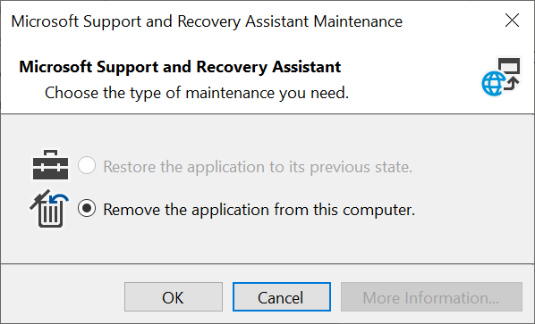

# How to deploy the Microsoft Support and Recovery Assistant (SaRA) using Microsoft Intune

## Summary

The Support and Recovery Assistant (SaRA) tool can be manually installed on one computer at a time by using either the [internet download](https://aka.ms/SaRA_Home) or a [network installation](./install-sara-from-network-share.md). However, you can also get SaRA deployed to users more efficiently as a Win32 app by using Microsoft Intune. To deploy SaRA as a Win32 app by using Microsoft Intune, use the steps in the following sections.

For complete information about app deployment by using Microsoft Intune, see the following articles:

- [Add apps to Microsoft Intune](/mem/intune/apps/apps-add)
- [Intune Standalone - Win32 app management](/mem/intune/apps/apps-win32-app-management)

## More information

1. **Get a copy of SaraSetup.exe**

   To download a copy of SaraSetup.exeby, follow these steps:

    1. Go to [About the Microsoft Support and Recovery Assistant](https://aka.ms/SaRA_Home).
    2. Select **Download**.
    3. Save the file to your local hard disk.

    The steps to save the download will vary based on your browser.

2.	**Prepare SaraSetup.exe as a Win32 app for upload to Microsoft Intune**

    Convert SaraSetup.exe to the .intunewin format by using the **Microsoft Win32 Content Prep Tool**. (See [Intune Standalone - Win32 app management](/mem/intune/apps/apps-win32-app-management) for complete details about this process.)

    The following figure shows an example PowerShell session by using an interactive session in the Microsoft Win32 Content Prep Tool (IntuneWinAppUtil.exe) to create the Sarasetup.intunewin file.

    :::image type="content" source="media/install-sara-from-intune/install-sara-from-intune-1.png" alt-text="Install SaRA using PowerShell.":::

3.	**Add the app to Microsoft Intune**

    After you create the Sarasetup.intunewin file, use the following steps to add your app in the Microsoft Intune **Apps** dashboard.
    1.	In **Client apps** section of Microsoft Intune dashboard, beneath **Manage**, select **Apps**.
    2.	Select **Add**.

        :::image type="content" source="media/install-sara-from-intune/install-sara-from-intune-2.png" alt-text="Select Add.":::
 
    3.	Under **Select app type**, select **Windows app (Win32)**.

        :::image type="content" source="media/install-sara-from-intune/install-sara-from-intune-3.png" alt-text="Select Windows app (Win32).":::
    4.	Select **Select app package file**.

        :::image type="content" source="media/install-sara-from-intune/install-sara-from-intune-4.png" alt-text="Select app package file.":::

    5.	Browse and select the Intunewin file that you created, and then select **OK**.
 
        :::image type="content" source="media/install-sara-from-intune/install-sara-from-intune-5.png" alt-text="Select the Intune file you created":::

        :::image type="content" source="media/install-sara-from-intune/install-sara-from-intune-6.png" alt-text="Select the Intune file you created.":::
 
    6.	Enter the name for the **Publisher** (required) and update the **Name** of the app (optional), and then select **Next**.

        :::image type="content" source="media/install-sara-from-intune/install-sara-from-intune-7.png" alt-text="Enter the publisher name and select Next":::
 
    7.	For **Program** settings, enter the **Install command** (required), select **User** for **Install behavior**, and then select **Next**.
    
        Use the following program values for SaRA:
        - **Install command:** sarasetup.exe /q
        - **Uninstall command:** rundll32.exe dfshim.dll,ShArpMaintain Microsoft.Sara.application, Culture=neutral, PublicKeyToken=1f16bd4ec4c2bb19, processorArchitecture=msil
        - **Install behavior:** User
 
        :::image type="content" source="media/install-sara-from-intune/install-sara-from-intune-8.png" alt-text="Enter the publisher name and select Next.":::

        > [!NOTE]
        > The uninstall command provided above requires user interaction to complete the removal of SaRA. This user interaction is shown in the following screenshot. 
        > 
 
    8.	For **Requirements**:
        1. Select both **32-bit** and **64-bit** in the **Operating system architecture** list.
        
            :::image type="content" source="media/install-sara-from-intune/install-sara-from-intune-10.png" alt-text="Select both 32-bit and 64-bit.":::
        1. Select **Windows 10 1809** (at a minimum) in the **Minimum operating system** list, and then select **Next**.

            :::image type="content" source="media/install-sara-from-intune/install-sara-from-intune-11.png" alt-text="Select Windows 10 1809.":::

    9.	For **Detection rules**:
        1. Select **Manually configure detection rules** in the **Rules format** list, and then select **Add**.
    
            :::image type="content" source="media/install-sara-from-intune/install-sara-from-intune-12.png" alt-text="Select Manually configure detection rules.":::
        1. For **Rule type**, select **Registry**.
 
            :::image type="content" source="media/install-sara-from-intune/install-sara-from-intune-13.png" alt-text="Select Registry.":::
        1. Use the following values for the **Detection rule** settings: 
            - **Rule type**: Registry
            - **Key path**: Computer\HKEY_CURRENT_USER\Software\Microsoft\Windows\CurrentVersion\Uninstall\339020b868450372
            - **Value name**: SaraInstalled
            - **Detection method**: Integer comparison
            - **Operator**: Equals
            - **Value**: 1
 
            :::image type="content" source="media/install-sara-from-intune/install-sara-from-intune-14.png" alt-text="Enter values.":::
    10.	For **Dependencies**, select **Next** without adding any dependencies.
 
        :::image type="content" source="media/install-sara-from-intune/install-sara-from-intune-15.png" alt-text="Select Next without entering dependencies.":::
    11.	No **Scope tags** are required. Select **Next**.
 
        :::image type="content" source="media/install-sara-from-intune/install-sara-from-intune-16.png" alt-text="No Scope tags are required.":::
    12.	For **Assignments**, see [Assign apps to groups with Microsoft Intune](/mem/intune/apps/apps-deploy) for information about how to assign the app to users or devices.
 
        :::image type="content" source="media/install-sara-from-intune/install-sara-from-intune-17.png" alt-text="Add Assignments":::
        Once you have made your assignments, select **Next**.

    13.	On the **Review + create** section, review your settings, and then select **Create**.
 
        :::image type="content" source="media/install-sara-from-intune/install-sara-from-intune-18.png" alt-text="Review your settings and select Create.":::
    14.	Review your **Notifications**.
 
        :::image type="content" source="media/install-sara-from-intune/install-sara-from-intune-19.png" alt-text="Review Notifications.":::
        After you see the SaRA upload finished notification, the app is ready for deployment.
 
        :::image type="content" source="media/install-sara-from-intune/install-sara-from-intune-20.png" alt-text="Add Assignments.":::
        You can now review the **Device install status** or **User install status** reports to see the status of your app deployment.
 
        :::image type="content" source="media/install-sara-from-intune/install-sara-from-intune-21.png" alt-text="Review status reports.":::
    On the computers on which SaRA has been installed, follow these steps to verify that the software is installed.
    1.	Select **Settings** > **Apps** > **Apps & features**.
 
        :::image type="content" source="media/install-sara-from-intune/install-sara-from-intune-22.png" alt-text="Select Apps & features.":::
    2.	In the **Search this list** box, type **Support**.
 
        :::image type="content" source="media/install-sara-from-intune/install-sara-from-intune-23.png" alt-text="Type support.":::
        > [!NOTE]
        > The SaRA tool requires access to network endpoints needed for connectivity from a user of Office 365 across an enterprise perimeter network. The current list of endpoint is provided in [Additional endpoints not included in the Office 365 IP Address and URL Web service](/microsoft-365/enterprise/additional-office365-ip-addresses-and-urls?view=o365-worldwide&preserve-view=true).

Still need help? Go to [Microsoft Community](https://answers.microsoft.com/).