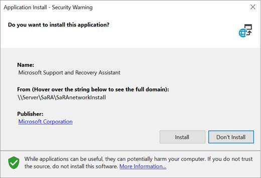
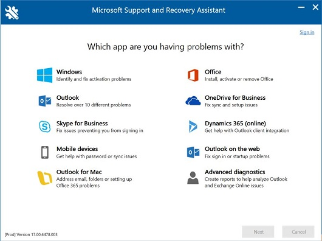
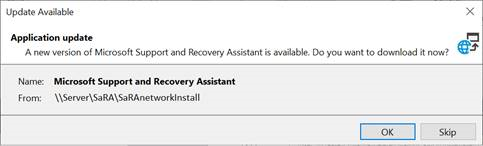
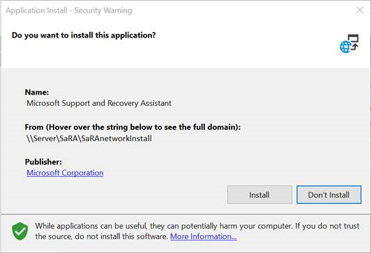
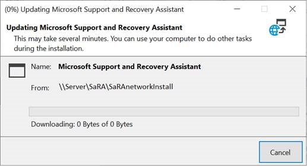
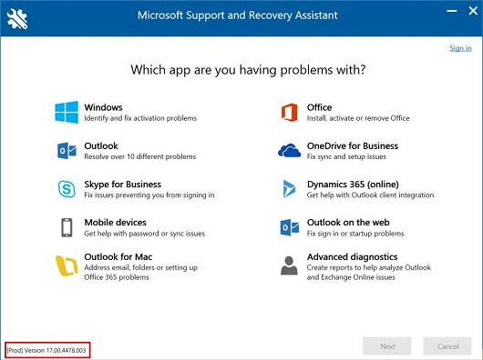

# How to install and maintain Microsoft Support and Recovery Assistant (SaRA) from a network share

[!INCLUDE [Branding name note](../../../includes/branding-name-note.md)]

If you want to install and start Microsoft Support and Recovery Assistant (SaRA) from a shared location on a network instead of the default internet location, don't use the download link in the [About the Microsoft Support and Recovery Assistant](https://support.office.com/article/about-the-microsoft-support-and-recovery-assistant-e90bb691-c2a7-4697-a94f-88836856c72f) article. Instead, follow these steps.

## Installing SaRA

1. Download SaRA by using the following link:  

   [SaRA Network Installation Files](https://aka.ms/SaRANetworkInstallFiles)

2. After the file is downloaded, extract the files from the ClickOnce folder to a shared network folder.
3. On the computer on which you want to install SaRA, browse to the shared folder.
4. Double-click **Setup.exe**.
5. Select **Install**.

   

6. When the Microsoft Services Agreement is displayed, select **I agree**.

SaRA is now installed and ready to run troubleshooting scenarios.

## Maintaining the SaRA installation folder

The files for SaRA are updated regularly. You should update the SaRA files on the network share so that SaRA installations use the latest files. To keep your SaRA files up-to-date, follow these steps:

1. Download SaRA by using the link that is provided in the "Installing SaRA" section.
2. Extract the program files from the ClickOnce folder.
3. Replace the existing program files in your shared network folder with the new extracted files.

Any computer that has SaRA already installed can now be updated by using the following steps. New installations of SaRA will also use the version that is available on the network share.

1. Start SaRA on a computer on which it's already installed.
2. Select **OK**.

   

3. Select **Install**.

   

   

4. Select **I agree**.

   

SaRA is now updated and ready to run troubleshooting scenarios.

## SaRA version history

On or about every second Tuesday of every month, a new build of SaRA is available through the link that is provided at the beginning of this article. To keep SaRA updated to have the latest version, we recommend that you follow the steps in the "Maintaining the SaRA installation folder" section every month.

The following table provides the versions of SaRA that were made available on the specified date.

|Release date|SaRA version|
|--------|--------|
|June 11, 2020|17.00.4840.008|
|May 28, 2020|17.00.4732.006|
|April 23, 2020|17.00.4589.001|
|April 6, 2020|17.00.4478.003|
|March 20, 2020|17.00.4376.007|
|March 11, 2020|17.00.4376.002|
|February 27, 2020|17.00.4304.006|
|February 5, 2020|17.00.4163.010|
|January 14, 2020|17.00.4058.000|
|December 9, 2019|17.00.3891.009|
|December 2, 2019|17.00.3711.012|
|||
