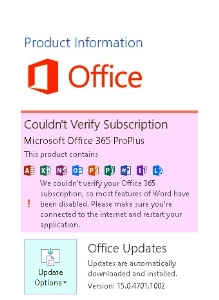

# Office 365 subscription automatic license renewal fails when sppcext.dll is missing

## Symptoms

When O365 paid subscription tries to renew, the license fails and eventually displays a red bar stating that the subscription is unlicensed.

```adoc
Message 1:Couldn't Verify Subscription

We couldn't verify your Office 365 subscription, so most features of <application> have been disabled. Please make sure your're connected to the internet and restart your application.
```



```adoc
Message 2: Application (Unlicensed Product)
```


## Cause

A component of the Windows SPP Service is missing from the computer.  

## Resolution

Run the System File Checker to repair any missing files. Follow the steps in the following article.

[Use the System File Checker tool to repair missing or corrupted system files](https://support.microsoft.com/help/929833)
