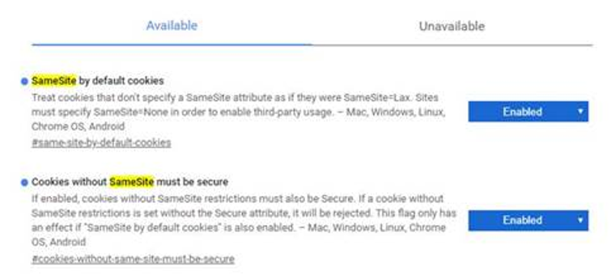
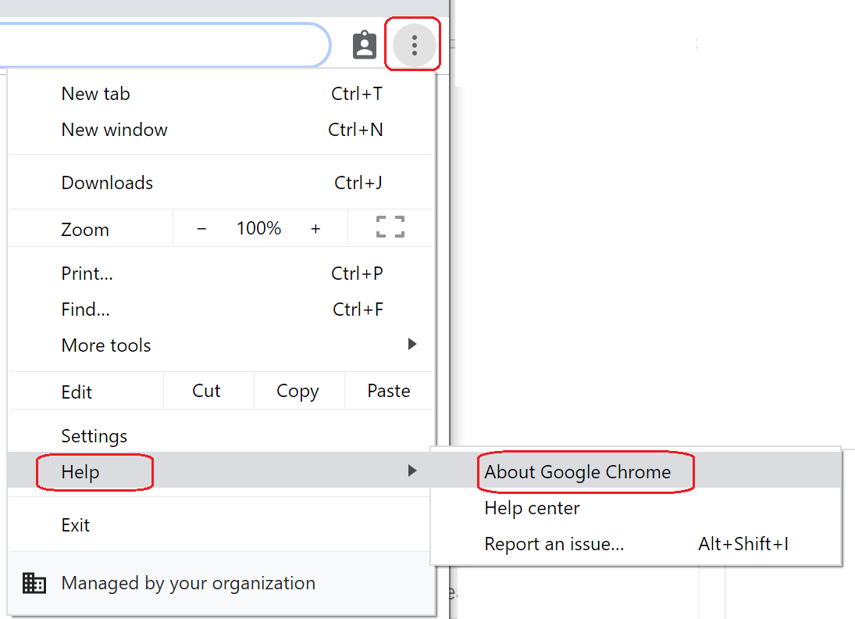

# Effect on customer websites and Microsoft services and products in Chrome version 80 or later

> [!NOTE]
> Previously, this article referenced Google Chrome Beta version 79. Google is scheduled to release a cookie behavior in Chrome Stable version 80.
> Chrome has updated their [rollout timeline](https://www.chromium.org/updates/same-site) to indicate that this change will be rolled out in Chrome 80 starting the week of February 17. Chrome 80 will ship on February 4 and have this feature disabled by default. The feature will be enabled on a graduated schedule starting February 17. 

## Summary

The Stable release of the Google Chrome web browser (build 80, scheduled for release on February 4, 2020) will roll out a change to the default cookie behavior starting the week of February 17. Although the change is intended to discourage malicious cookie tracking and protect web applications, it's also expected to affect many applications and services that are based on open standards. This includes Microsoft cloud services.

Enterprise customers are encouraged to make sure that they're prepared for the change and are ready to implement mitigations by testing their applications (whether custom-developed or purchased). For more information, see the "[Recommendations](#recommendations)" section.

Microsoft is committed to addressing this change in behavior in its products and services before the Chrome 80 release date. This article discusses the guidance from both Microsoft and Google for installing the various updates that are required for products and libraries, and the guidance for testing and preparation. However, it's equally important that you test your own applications against this change in Chrome behavior and prepare your own websites and web applications as necessary.

## Effect on customer applications

All Microsoft Cloud services are updated to comply with the new requirements made by Chrome, but some other applications may still be affected. Check the "[Recommendations](#recommendations)" section for some server products that will require updating by customers.

You should thoroughly test all applications by using Chrome Beta version 80 to verify the effect of this change. We expect that problems similar to the problems that this article describes will affect your applications. This is especially true for applications that use any web platform or technology that relies on cross-domain cookie sharing, such as apps that are embedded in other apps.

Chrome versions 78 and 79 betas have an improvement that delays the **SameSite:Lax** attribute enforcement for two minutes. However, using these versions for testing may mask other problems. Therefore, we recommend that you test by using Chrome version 80 by having specific flags enabled. Doing this can, at least, help you discover the effect so that you can determine your best plan. For more information, see the "[Testing guidelines](#testing-guidelines)" section.

Microsoft Edge browser on Chromium (version 80) will not be affected by these SameSite changes. You can [read the Edge documentation](https://docs.microsoft.com/microsoft-edge/web-platform/site-impacting-changes) to see the current plan for adapting this change. 

## Recommendations

Microsoft customers who use Active Directory Federation Services (AD FS) or Web Application Proxy must deploy one of the following Windows Server updates:

 - Windows Server 2019: [4534273](https://support.microsoft.com/help/4534273/windows-10-update-kb4534273)
 - Windows Server 2016: [4534271](https://support.microsoft.com/help/4534271/windows-10-update-kb4534271)
 - Windows Server 2012 R2: [4534309](https://support.microsoft.com/help/4534309/windows-8-1-kb4534309)

The following Microsoft server or client products must also be updated. The updates will be added to this article when they're available. We recommend that you revisit this article regularly for the latest updates.

- Exchange Server - March update
- Sharepoint Server 2019 – February PU
- Sharepoint Server 2016 – March PU
- Skype for Business Server 2019 – March CU (CU 3)
- Skype for Business Server 2015 – April CU (CU 11)

You must test your applications for all the following scenarios, and determine the appropriate plan based on the outcome of the tests:

- Your application is unaffected by the **SameSite** changes. In this case, there's no action to take.
- Your application is affected, but your software developers can make the change in time to use the **SameSite:None** cookie settings. In this case, you should change your application by following the developer guidance in the "[Testing guidelines](#testing-guidelines)" section.
- Your application is affected but can't be changed in time. For internal sites, the application can be excluded from the **SameSite** enforcement behavior in Chrome by using the **LegacySameSiteCookieBehaviorEnabledForDomainList** setting.

If enterprise customers learn that most of their apps are affected, or if they do not have enough time to test their apps before the graduated release of the feature starting on February 18, they're encouraged to disable the **SameSite** behavior in computers they govern. They can do this by using Group Policy, System Center Configuration Manager, or Microsoft Intune (or any Mobile Device Management software) until they can verify that the new behavior doesn't break basic scenarios in their apps.

Google has released the following [enterprise controls](https://www.chromium.org/administrators/policy-list-3/cookie-legacy-samesite-policies) that can be set to disable the **SameSite** enforcement behavior in Chrome:
- [LegacySameSiteCookieBehaviorEnabled](https://cloud.google.com/docs/chrome-enterprise/policies/?policy=LegacySameSiteCookieBehaviorEnabled), which enables or disables this change. 
- [LegacySameSiteCookieBehaviorEnabledForDomainList](https://cloud.google.com/docs/chrome-enterprise/policies/?policy=LegacySameSiteCookieBehaviorEnabledForDomainList), which allows Chrome to disable this policy on specific domains. 

For enterprise customers who develop their applications on .NET Framework, we recommend that they update libraries and set the **SameSite** behavior intentionally to avoid unpredictable results that are caused by the change in the cookie behavior. To do this, see the guidance in the following Microsoft ASP.NET Blog article:

[Upcoming SameSite Cookie Changes in ASP.NET and ASP.NET Core](https://devblogs.microsoft.com/aspnet/upcoming-samesite-cookie-changes-in-asp-net-and-asp-net-core/)

Also, see the following Google Chromium Blog article for developer guidance about this issue:

[Developers: Get Ready for New SameSite=None; Secure Cookie Settings](https://blog.chromium.org/2019/10/developers-get-ready-for-new.html)

Customers who have affected sites that impact consumers or users who are not covered under their Enterprise policies must instruct those users to use a different browser (Edge, Firefox, Internet Explorer) or walk those users through how to disable the settings in Chrome (as shown in the next section) while they fix their applications. 

## Testing guidelines

Google has published [this guidance](https://blog.chromium.org/2019/10/developers-get-ready-for-new.html) for developers to prepare for the SameSite changes. Additionally, we recommend that you test your websites and apps by using the following approach.

Use Chrome Beta version 80 to test the scenarios:

1. Download Chrome Beta version 80:
   - For Windows 64-bit: [Beta channel for Windows (64-bit)](https://www.google.com/chrome/browser/beta.html?platform=win64)
   - For Windows 32-bit: [Beta channel for Windows (32-bit)](https://www.google.com/chrome/browser/beta.html?platform=win)

2. Start Chrome by using the following additional command line flag:
   `--enable-features=SameSiteDefaultChecksMethodRigorously`

3. Enable the **SameSite** flags. To do this, type **Chrome://flags** in the **Address** bar, search for **SameSite**, and then select **Enabled** for the following options.
 

## More information

The web community is working on a solution to address the abusive use of tracking cookies and cross-site request forgery through a standard that's known as [SameSite](https://web.dev/samesite-cookies-explained).

The Chrome team had announced plans to roll out [a change in the default behavior](https://groups.google.com/a/chromium.org/forum/#!topic/blink-dev/AknSSyQTGYs/discussion) of the SameSite functionality starting in a release of Chrome version 78 Beta on October 18, 2019. This rollout will be moved to Chrome version 80 release on February 4, 2020. This change helps improve web security. However, it also breaks authentication flows that are based on the OpenID Connect standard. Therefore, well-established patterns of authentication won't work.

## Checking the Chrome version

If you suspect that your users are using a Chrome version 76 or a later version that has SameSite enabled, you can check the version number by navigating to [chrome://settings/help](chrome://settings/help) or by selecting the Chrome settings icon, and then selecting **Help** > **About Google Chrome**.

For the 77–79 versions of Chrome, check the [Chrome://flags](Chrome://flags) in the browser to see whether they have the flags enabled. The setting default will begin to change in Chrome version 80 on a graduated release.

**Third-party information disclaimer**

The third-party products that this article discusses are manufactured by companies that are independent of Microsoft. Microsoft makes no warranty, implied or otherwise, about the performance or reliability of these products.

Microsoft provides third-party contact information to help you find additional information about this topic. This contact information may change without notice. Microsoft does not guarantee the accuracy of third-party contact information.
