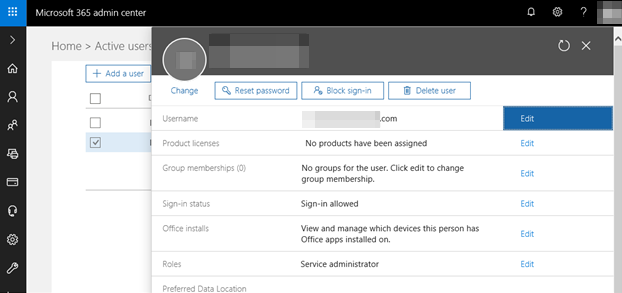
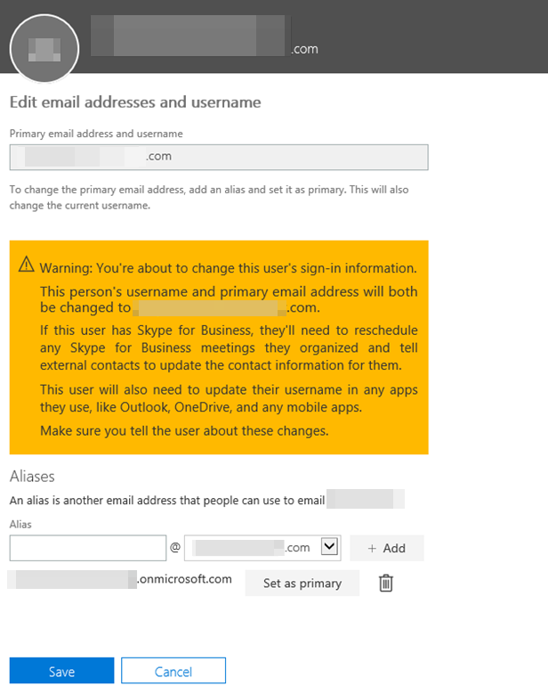
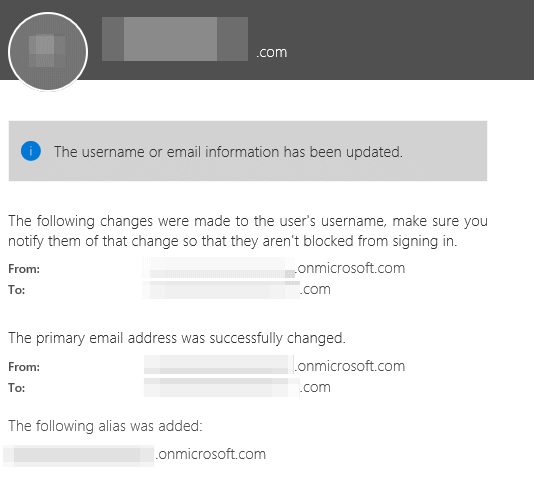
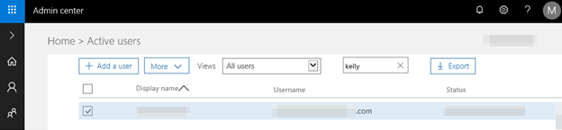
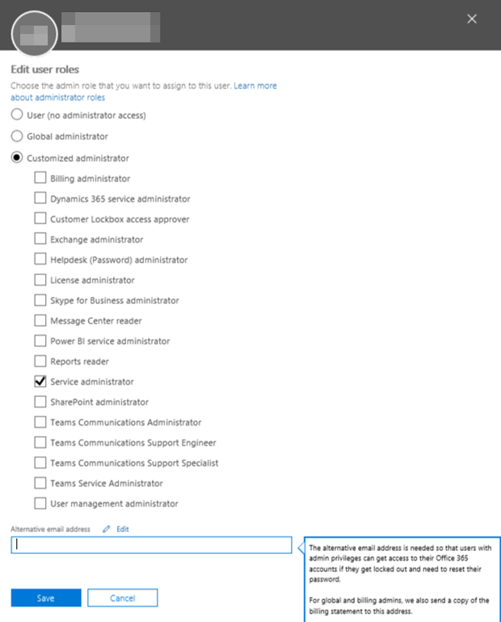

# How to open Support cases for GCC High and DoD

[!INCLUDE [Branding name note](../../../includes/branding-name-note.md)]

## Summary

Office 365 Support is available only to users with Administrator roles associated with a valid email address.  Therefore, only user accounts marked in the Office 365 admin center as an administrator will be able to contact support and/or create a support incident.  Visit your Office 365 admin center to manage your user accounts and define who has permissions to contact support.

If a user does not need any specialized administrative access you can grant them the role of Service Administrator, which will provide them view-only access and the ability to contact support to create an incident.

To create a new service request, browse to [https://portal.office365.us/adminportal](https://portal.office365.us/adminportal). After login, navigate to **Show all** > **Support** > **New Service Request**, and use the subject to briefly describe the problem for the new service request.

> [!NOTE]
> Users cannot change their own account permissions and their account needs to be updated by another administrator.

For more details and step-by-step guidance on how to assign administrative roles to users, please see [https://docs.microsoft.com/office365/admin/add-users/assign-admin-roles?view=o365-worldwide.](/office365/admin/add-users/assign-admin-roles)  

For more details on administrator roles, please see [https://docs.microsoft.com/office365/admin/add-users/about-admin-roles](/office365/admin/add-users/about-admin-roles).  

For more information on how to populate a valid email address for a user account, see the "More Information" section below.  A valid email address is necessary for the following situations: 

1. You will be informed of support incident progress and updates through email. 
2. Your identity might be challenged/verified through email or a valid phone number listed in your user's properties. 

## More information

Options and steps to populate a valid email address for an Office 365 user account -

**Option 1 - Update the UserPrincipalName/Username value in the Office 365 admin center** 

1. Log into the Office 365 admin center and look up the user.

   

1. Next to Username select Edit. 

    

1. Under Aliases, type in a new email address and use the drop-down to select the desired domain. Click Add. Then select Set as primary. 

   

1. This may bring up the following message for your confirmation. 

   

1. A summary of changes may be provided. 

   

1. The desired address will now show here. 

    

**Option 2 - Add an alternate email address to the existing administrator user** 
1. Log into the Office 365 admin center and look up the user.  
1. Edit the user and go the Roles section. Select Edit. 

    

1. Scroll down and under Alternative email address, input the desired address. 

   

1. The address added will not be listed on the Active user's page, but it will appear in Microsoft's system as an alternate email address, which can used to validate the caller during the creation of a support case.