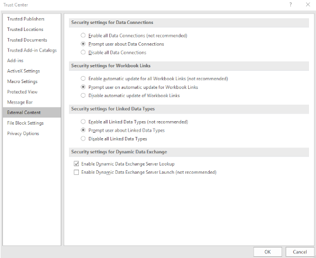

# Security settings for Dynamic Data Exchange in Excel Trust Center in Office 365

## Summary

Two new security options are now included in the Excel Trust Center in Office 365 under the **Security Settings for Dynamic Data Exchange** heading:

- Enable Dynamic Data Exchange Server Lookup
- Enable Dynamic Data Exchange Server Launch (not recommended)

These new options are intended to help protect users from attackers who use Dynamic Data Exchange (DDE) to spread malware.

  

## More Information

These new options are located in the Excel Trust Center (**File** > **Options** > **Trust Center** > **Trust Center Settings** > **External Content**). They're listed as follows.

**Enable Dynamic Data Exchange Server Lookup**

Select this option if you want to enable DDE server lookup. If this option is selected, DDE servers that are already running will be visible and usable. By default, this option is selected.

**Enable Dynamic Data Exchange Server Launch (not recommended)**

Select this option if you want to enable DDE server startup. If this option is selected, Excel starts DDE servers that are not already running, and enables data to be sent out of Excel. For security, we recommend that you leave this check box cleared. By default, this option is not selected.

For more information about what DDE is, see [About Dynamic Data Exchange](https://docs.microsoft.com/windows/desktop/dataxchg/about-dynamic-data-exchange).
