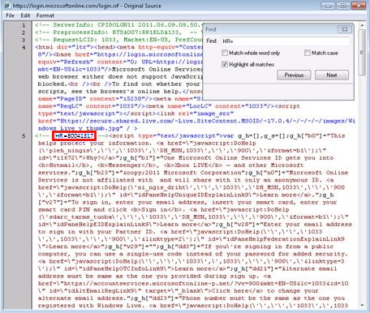

# "Sorry, but we're having trouble signing you in" when a user signs in to Office 365, Azure, or Intune

## Problem

When a user tries to sign in to a Microsoft cloud service such as Office 365, Microsoft Azure, or Microsoft Intune from a sign-in webpage whose URL starts with "https://login.microsoftonline.com/login.srf," the user receives a sign-in error message and can't sign in.

The following is an example of an error message that the user may receive:

```adoc
Sorry, but we're having trouble signing you in.

Please try again in a few minutes. If this doesn't work, you might want to contact your admin and report the following error:
<error code>
```

## Solution

To troubleshoot this issue, identify the error code, and then contact technical support. To identify the error code, follow these steps:

1. View the source code of the "login.microsoftonline.com" webpage that shows the error message. 

   For example, in Internet Explorer, press the ALT key to display the menu bar (if it isn't already displayed), and then click **Source** on the **View** menu. 

      
2. Search the source code for the HR=string, and then note the numeric code that follows the HR=string.

   

### List of known error codes

The following table lists known error codes for the “Sorry, but we're having trouble signing you in” error message. The table also contains information about how to troubleshoot the issue.

|Error code|More information|Resource|
|---|---|---|
|8004786C|This issue may occur in scenarios where you pilot Active Directory user accounts as Office 365 single sign-on (SSO)-enabled user IDs, and then the user account is piloted incorrectly.|[2392130 ](https://support.microsoft.com/help/2392130) Troubleshoot user name issues that occur for federated users when they sign in to Office 365, Azure, or Intune |
|80041034|This issue may occur when the UPN has been changed from its original value.||
|80041317 or 80043431|This issue may occur if the configuration settings of the Office 365 federated domain for the on-premises Active Directory Federation Services (AD FS) 2.0 service and for the Azure AD authentication system are mismatched.|[2647020](https://support.microsoft.com/help/2647020) "80041317" or "80043431" error when federated users sign in to Office 365, Azure, or Intune|
|80048163|This issue occurs if unsupported characters are used in the user’s sign-in name.||
|80045C06|This issue may occur if the time setting in the on-premises environment doesn't match the time setting of the Office 365 service.|[2578667 ](https://support.microsoft.com/help/2578667) "Sorry, but we're having trouble signing you in" and "80045C06" error when a federated user tries to sign in to Office 365, Azure, or Intune|
|8004789A||[2635357 ](https://support.microsoft.com/help/2635357) "Sorry, but we're having trouble signing you in" and "8004789A" error when a federated user tries to sign in to Office 365, Azure, or Intune|

## More information

This issue occurs if user authentication is interrupted after a Azure Active Directory (Azure AD) authentication system error state is detected.

Still need help? Go to [Microsoft Community](https://answers.microsoft.com/) or the [Azure Active Directory Forums](https://social.msdn.microsoft.com/forums/azure/home?forum=windowsazuread) website.
